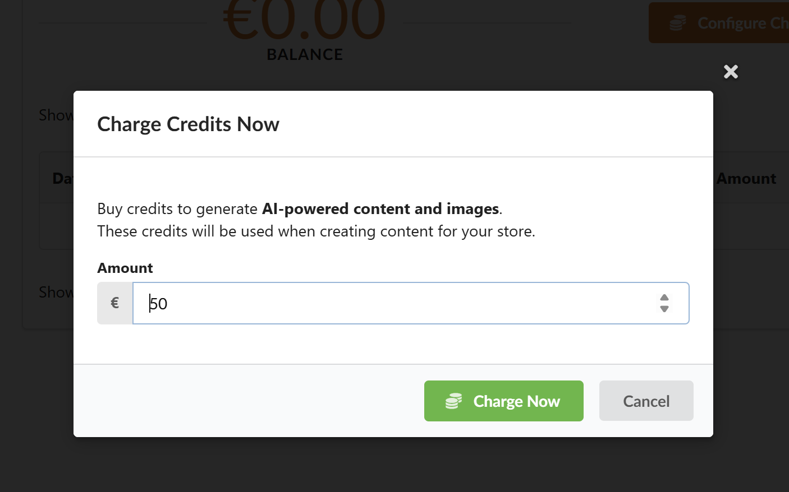
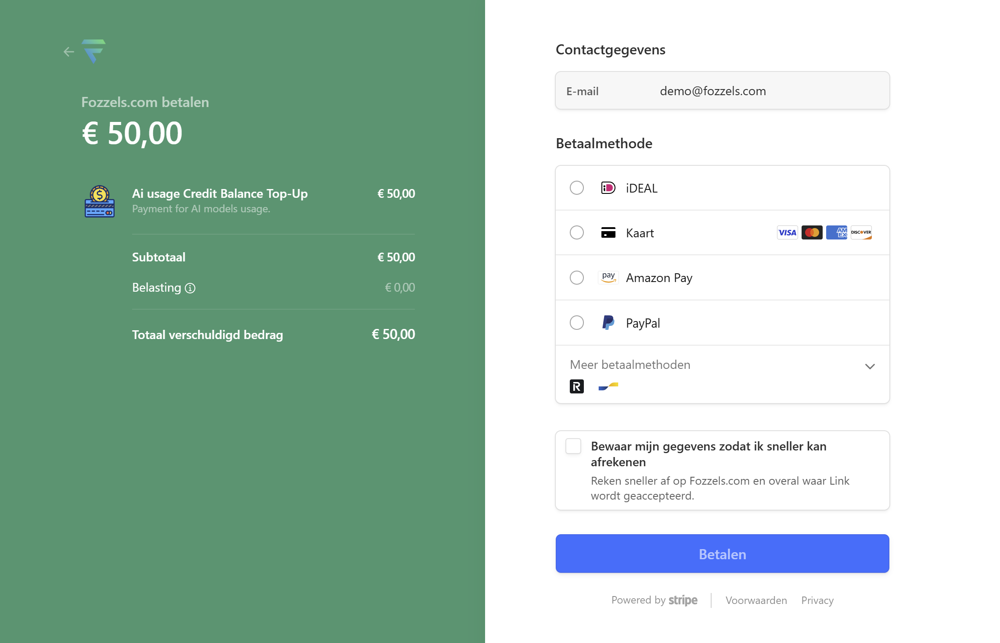
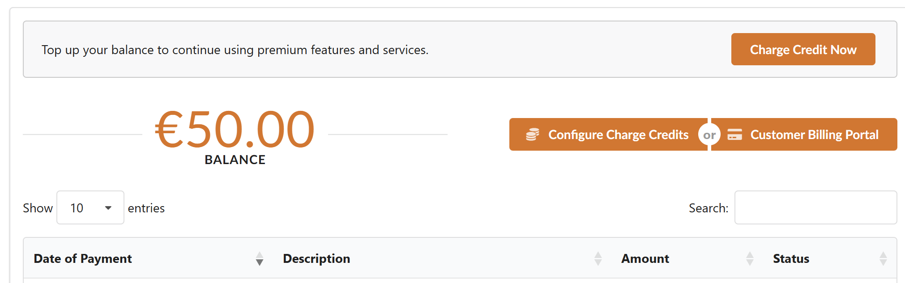
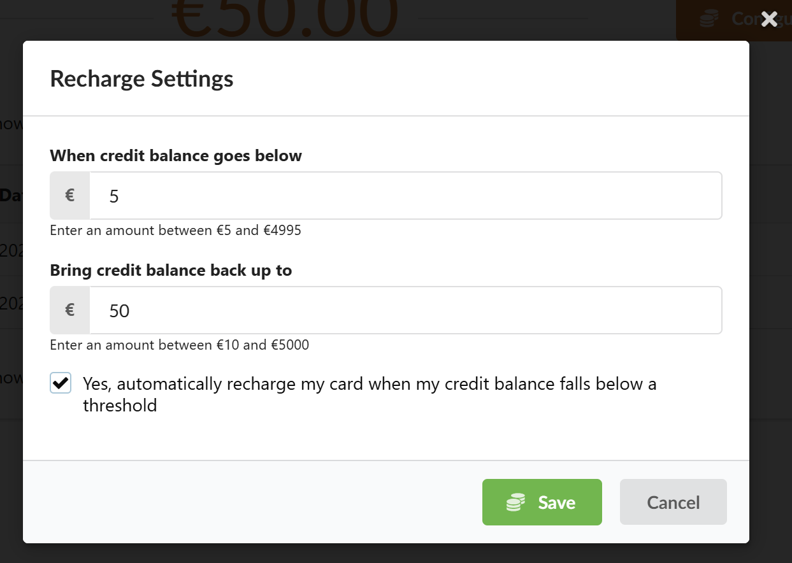
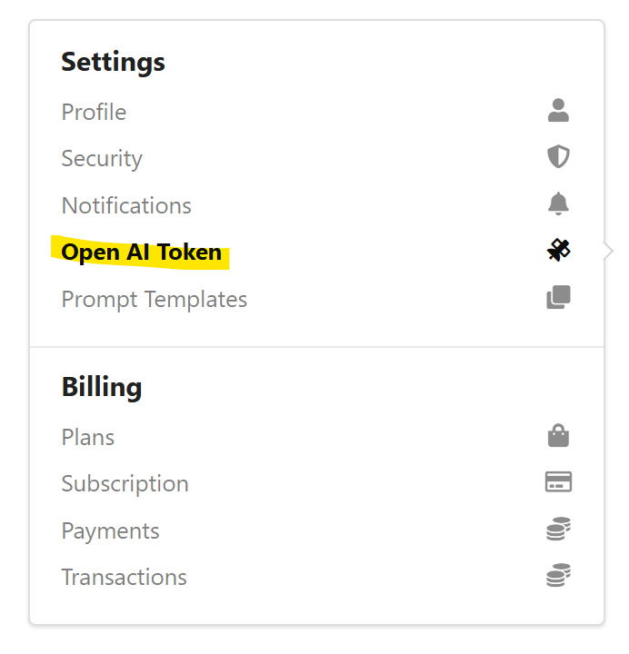

We hebben de manier waarop Fozzels betalingen voor “tokens” van de AI-modellen verwerkt, gewijzigd.

We vragen al onze gebruikers om deze instelling vóór 1 augustus 2025 te wijzigen.

Neem alstublieft ongeveer 10 minuten de tijd om deze instelling in uw Fozzels-account te wijzigen.

Inhoud:

1.  Waarom?
2.  Wijziging
3.  Voordelen
4.  ## Wat te doen, stap voor stap

    -   ### Betaling inrichten via Stripe

    -   ### Huidige OpenAI key verwijderen

5.  ### Klaar!

## Waarom?

Fozzels is begonnen met het automatisch genereren van content voor u met behulp van de taalmodellen van OpenAI (momenteel GPT-4o). Na het aanmaken van een nieuw Fozzels-account vroegen we onze gebruikers eerst om ook een OpenAI-account aan te maken, dan daar hun creditcardgegevens toe te voegen, dan een OpenAI API-key aan te maken en die key in Fozzels te kopiëren en te plakken.

Dat werkte allemaal heel goed -- maar had enkele nadelen:

1.  Het duurde langer voordat gebruikers aan de slag konden, omdat ze ook een account bij OpenAI moesten openen en “iets ingewikkelds” moesten doen met het kopiëren en plakken van API-keys.
2.  Nieuwe OpenAI-accounts zijn beperkt in gebruik ("rate limits" etc.), waardoor Fozzels-gebruikers niet altijd konden profiteren van het in grote hoeveelheden batchgewijs aanmaken van product content.

3.  Nieuwe OpenAI-accounts zijn beperkt in hun AI modellen, dus gebruikers konden Fozzels niet altijd gebruiken om bijvoorbeeld AI-foto's te genereren.

4.  We konden onze gebruikers niet gemakkelijk toegang bieden tot AI-modellen van andere leveranciers, zoals Google (Gemini), Anthropic (Claude) of xAi (Grok).

## Wijziging

Om deze uitdaging op te lossen, heeft Fozzels de manier waarop we betalingen voor AI-tokens afhandelen, gewijzigd.

In plaats van afzonderlijk aan alle AI-leveranciers te betalen, betaalt u nu rechtstreeks aan Fozzels voor uw AI-gebruik. Fozzels betaalt vervolgens namens u aan de AI-leveranciers voor uw AI-gebruik. Fozzels maakt gebruik van Stripe, een van de grootste online betalingsproviders ter wereld, voor het afhandelen van financiële transacties.

## Voordelen

Dit heeft de volgende voordelen:

1.  Een snellere en eenvoudigere **onboarding** voor nieuwe Fozzels-gebruikers;
2.  U kunt **altijd content genereren** voor veel producten (**geen limieten** meer op accounts), omdat Fozzels “onbeperkte” accounts heeft bij de AI-leveranciers;
3.  U kunt beeld (**foto**) generatiemodellen gebruiken in Fozzels;
4.  U kunt kiezen uit **meer AI-modellen** dan OpenAI (Google Gemini 2.5 Flash; xAi Grok 3; Anthropic Claude 4 Sonnet - en er volgen er nog meer);
5.  U kunt nu **“web search”** inschakelen, wat betekent dat u de AI op internet kunt laten zoeken naar bijvoorbeeld ontbrekende gegevens, en die kunt gebruiken om productgegevens of beschrijvingen te genereren.

U kunt momenteel kiezen uit de volgende AI-modellen:
_(klik om te vergroten)_

## Wat te doen, stap voor stap

### A) Betaling inrichten via Stripe

1.  Log in op uw Fozzels-account en klik rechtsboven op uw **gebruikersafbeelding**.
2.  Klik in het dropdownmenu op **Settings**.
3.  Klik in het menu Instellingen aan de linkerkant op **[Payments](https://app.fozzels.com/user/settings/payments)**.
4.  U ziet het volgende scherm. Klik op de knop “**Charge Credit Now**”.
    

5.  Er verschijnt een pop-upvenster waarin u een bedrag moet invoeren. Voer het bedrag in dat u aan uw saldo wilt toevoegen. De standaardinstelling is € 50, maar u kunt dit naar wens wijzigen. Klik vervolgens op de knop **‘Charge Now'**.

    

6.  U wordt doorgestuurd naar de betaalpagina van Stripe, waar u uw betalingsgegevens kunt invoeren. Voor de veiligheid worden er geen betalingsgegevens worden opgeslagen bij Fozzels, alleen bij Stripe. U kunt de volgende betaalmethoden gebruiken: iDEAL, creditcards (VISA, American Express, Mastercard, Discover), Amazon Pay, Paypal, Revolut Pay en Bancontact.

    

7.  Vergeet niet om, als deze betaling voor uw bedrijfsaccount is, ook uw bedrijfsnaam en **BTW-nummer** in te voeren.

    

8.  Na een succesvolle betaling wordt u teruggeleid naar Fozzels en ziet u uw huidige saldo op de pagina **Payments**.

    

9.  Vervolgens gaat u uw account instellen dat wanneer uw saldo onder een bepaald bedrag komt, deze automatisch wordt "opgeladen". Dit kunt u instellen door op de knop ‘**Configure Charge Credits**’ te klikken. Op deze manier wordt het genereren van content via de Flows die u hebt ingesteld nooit onderbroken.
    Voer de bedragen in die u wilt instellen, vink het selectievakje “_Yes, automatically recharge my card when my credit balance falls below a threshold_ ” aan en klik op de knop **Save**.

    

### B) Uw huidige OpenAI-key verwijderen

Nadat u uw betalingsgegevens hebt ingesteld, moet u de huidige OpenAI API-key uit uw account verwijderen.

Op deze manier gebruikt Fozzels onze eigen API-keys voor alle AI-leveranciers.

1.  Om dit te activeren, klikt u op **“Open AI-token”** in het linkermenu.
    

2.  Selecteer uw token in het veld Token, **verwijder alles in het veld** en klik op de knop **Opslaan**.

    

U bent nu klaar!

Tada!

Hartelijk dank en succes met het gebruik van Fozzels.
