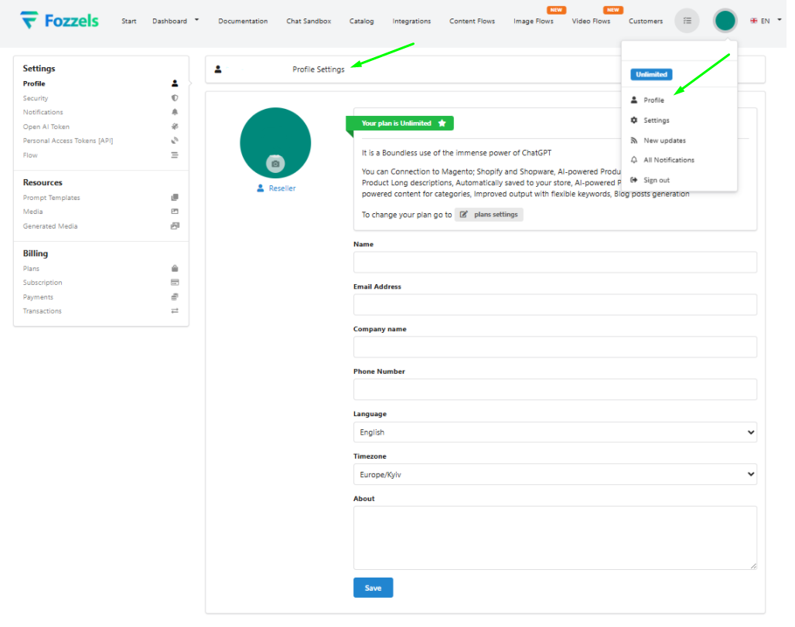
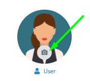
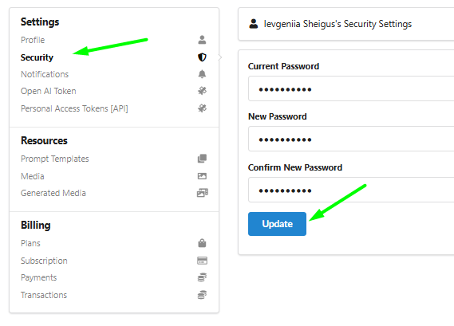
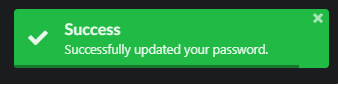
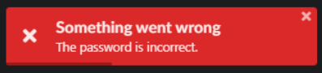
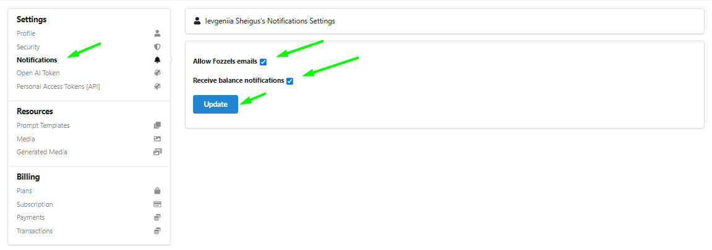
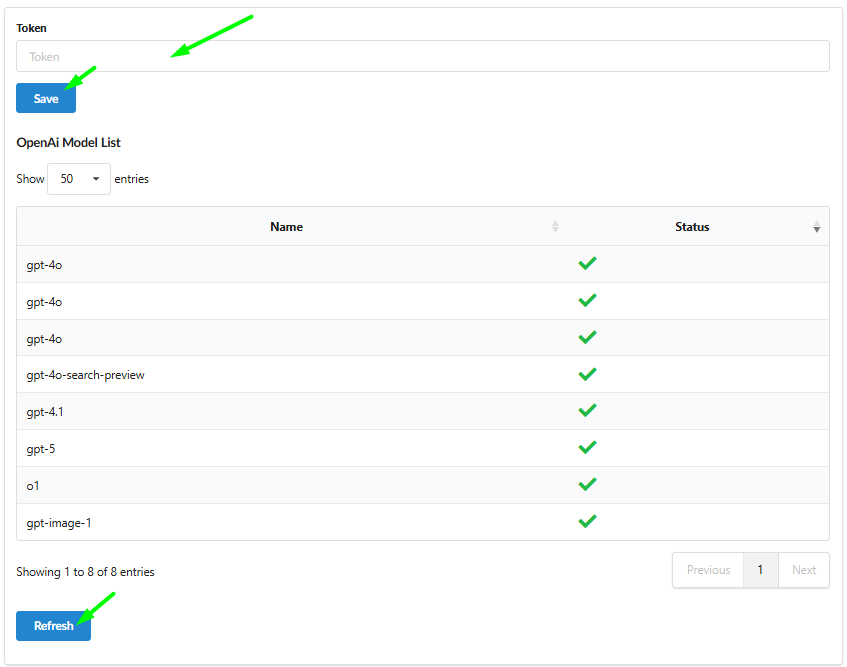
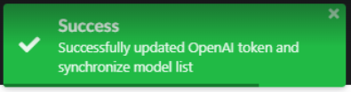
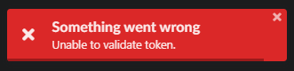

This section details the functions for managing the user account, security preferences, notification behavior, and personal API key configuration within Fozzels.
To open the Settings section, use the link: `https://app.fozzels.com/user/settings/profile`.

### 1.1. User Settings

The Settings section provides access to key configuration options that allow users to manage their personal account, security preferences, and features that support collaborative workflows.

#### 1.1.1. Profile Settings

Menu → Settings → Profile. This page opens by default when accessing the Settings menu. It allows users to edit their basic profile and company information.

Editable Fields include: the user's display Name, Email Address, Company Name, Phone Number (optional), and a short description in the About field.
To apply any changes, click Save.
The system applies all changes at once. It is important to note that the system does not provide a warning if navigating away with unsaved changes, so users must save manually.
The Email must be in a valid format.
To update the Profile Picture, click the avatar image to open the upload window. Supported formats are JPG and PNG.

#### 1.1.2. Security Settings

Menu → Settings → Security.
This page is used to update the account password.

The editable fields are Current Password, New Password, and Confirm New Password.
Input Behavior: All input values are masked (shown as dots), and field values are not stored or cached.
**Click Update** to apply the changes.

Successful Update: If the new password is accepted, a green success notification will be shown at the top of the screen, and the password is immediately updated for future logins.

Error Handling: If the current password is incorrect, or the new password and confirmation do not match, an error message will appear. In this case, all password fields will be automatically cleared, and the user must re-enter the information from scratch.

#### 1.1.3. Notification Settings

Menu → Settings → Notifications. Use this section to manage email notifications.

This section contains two checkboxes:

-   Allow Fozzels emails: When unchecked, no product-related email communication (e.g., updates, system alerts) will be sent. When checked, the user agrees to receive these emails.

-   Receive balance notifications: When unchecked, no email communication will be sent. When checked, the user agrees to receive notifications when their balance reaches 0 or less, with a reminder to top up to continue work.
**Click Update** to save preferences.

1.1.4. Open AI Token Settings

Menu → Settings → Open AI Token. This section is used to connect and manage the OpenAI API key for text and image generation.

The editable field is Token, where you enter your personal or company OpenAI API key.
Only one token can be stored per account at a time.
The input field is plain text, meaning the token is visible as typed and remains visible after saving.
Model List: After saving a valid token, the list of available OpenAI models appears below.
Each model includes its Name and Status (e.g., enabled, disabled, invalid).
**Use** the **Refresh** button to update this list if needed.

Successful Save: Click Save to submit the token. If the token is valid, a green notification confirms the update, and the model list will load accordingly.

Token Validation Notes: Various issues may occur when entering a token, including invalid format, expired or revoked tokens, or backend validation errors. If the token is not valid or cannot be verified, the system shows an appropriate error notification (e.g., "Unable to validate token").

In all error cases, the token is not saved, and the input field is automatically cleared.
