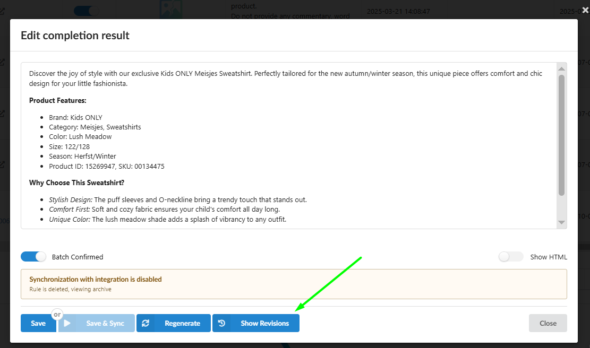
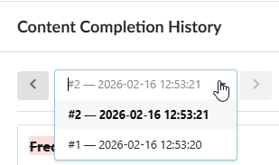
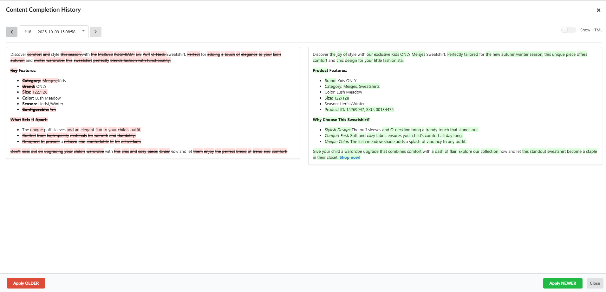

###### Gemini said

Never fear losing a great idea or your original product description again. With the **Content Completion History**, you have total control over the evolution of your content.

## What is Content Completion History?

Fozzels now automatically archives every iteration of your text - whether generated by AI or manually edited by your team. It’s a professional version control system designed specifically for product data.

### Key Features:

-   **Source of Truth:** The very first version in your history is always the original attribute value pulled from your store. Your "baseline" content is always just one click away.

-   **Unlimited Versions:** You can have as many iterations as you need. Use the **version dropdown** to navigate through every state the content has ever been in.

-   **GitHub-Style Comparison:** Changes are highlighted (red for removed, green for added). See exactly what was modified between any two selected versions in real-time.

-   **Suspicious Words Support:** Even in the revision history, the system highlights "suspicious" terms, helping you identify which version contained potential AI artifacts or technical notes.

-   **Two Rendering Modes:**

    1.  **Rendered (Show HTML):** See exactly how the content will look on your live website front-end.

    2.  **Raw Tags:** View the text with HTML tags for precise technical control over the formatting.

## How to Restore and Save Versions?

1.  Open the editing window (**Edit completion result**).
    

2.  Click the **"Show Revisions"** button in the bottom panel.

3.  In the **Content Completion History** window, use the dropdown menus to select the versions you want to compare. Toggle **Show HTML** to check the visual layout vs. raw code.

4.  Found the version you like best from the dropdown.
    

5.  Hit **"Apply OLDER"** or **"Apply NEWER"**. The pop-up will close, and the selected text will fill the main editor.
    

6.  **⚠️ Crucial Step:** Once the pop-up closes, the chosen version is loaded into the editor but **not yet saved** to the database. You **MUST click SAVE** to store the changes or **SAVE & SYNC** to push them to your website immediately.
