The Content Flow is the core of automation within Fozzels. It is an instruction set that defines how the system should use the selected AI model to automatically generate, update, and synchronize texts for your products.

## 1\. Creating a New Content Flow

1.  **Log in** to your Fozzels account.

2.  **Go** to the **Content Flows** section in the header menu.

3.  **Select** the desired store from the **"Choose store"** dropdown list.

4.  **Click** the **"New Product Flow"** button.
    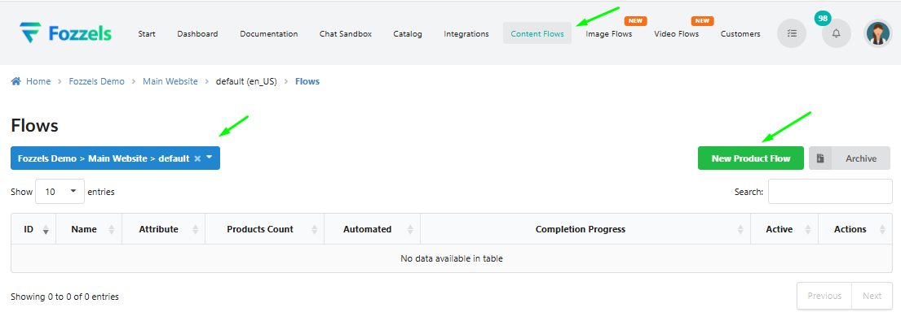

5.  **Enter** the flow name in the **Name** field (e.g., _My First Content flow_).

6.  **Select** the attribute to be updated from the **Attribute** dropdown list (e.g., _Description_).

7.  **Click** the **Save** button.
    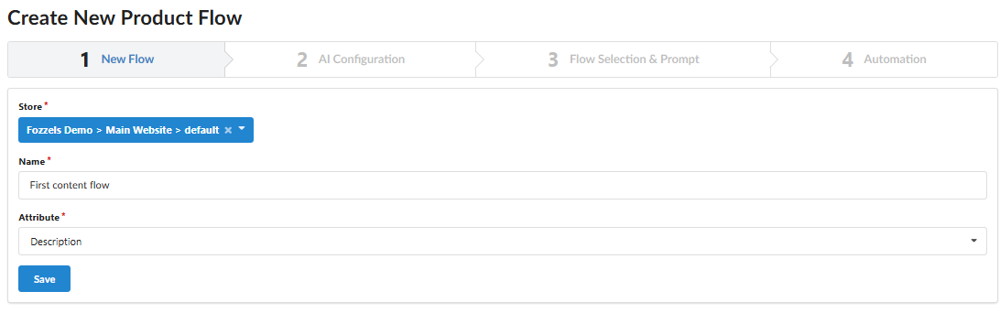

8.  **Verify** that the new flow appears in the Flows list.
    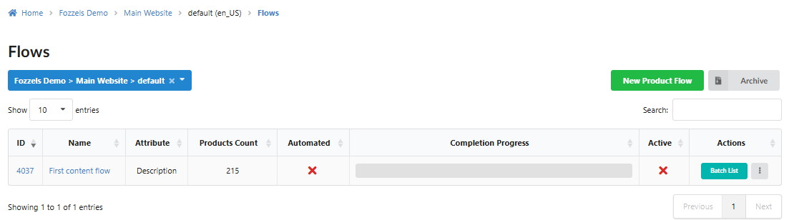

## 2\. AI and Model Configuration (Tab 2: AI Configuration)

1.  **Navigate** to the **AI Configuration** tab (Or **Next step**).

2.  **Choose** the AI provider (e.g., _OpenAI | ChatGPT_ or _Google | Gemini_).
    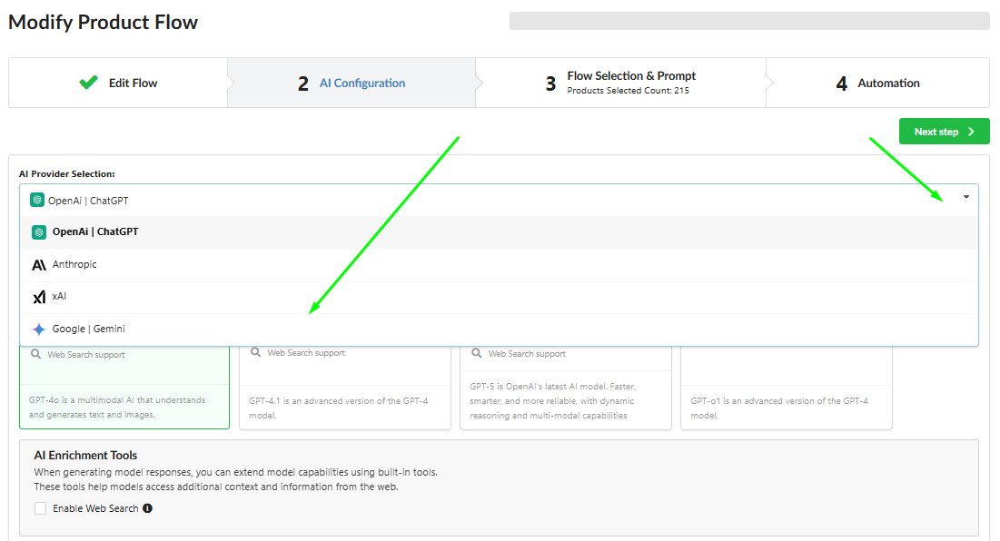

3.  **Select** the desired AI model (e.g., _GPT-4o (new)_ or _Gemini 2.5 Flash Preview_) by clicking the corresponding tile.
    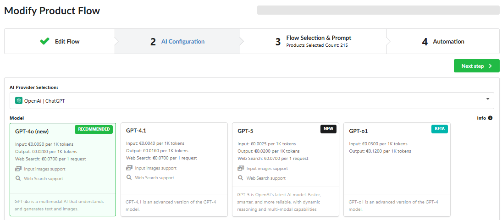

4.  **Enable** optional enrichment features, such as **Enable Web Search**, if necessary.
    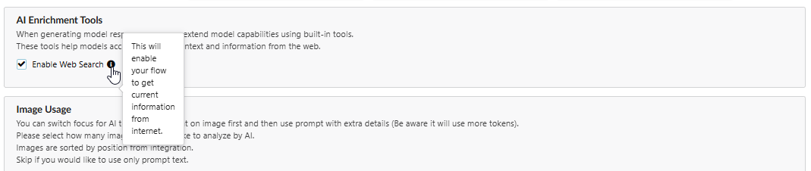

5.  **Set** the number of images (from 1 to 5) in the **Image count** field that the AI will use for analysis and content generation (optional).
    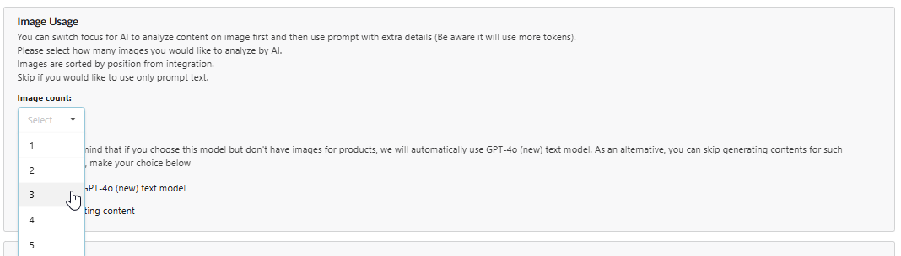

6.  **Ensure** the **Image Resize** feature is enabled (recommended to prevent errors with large files, read more about Image resize [here](https://fozzels.freshdesk.com/a/solutions/articles/103000367979)).
    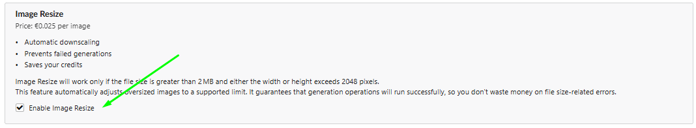

7.  **Set** the maximum token value (**Max tokens**) for generation.
    **_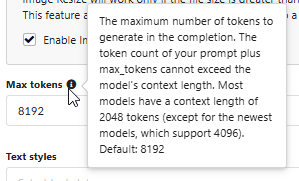_**

8.  **Select** the desired text style (**Text styles**) from the dropdown list (e.g., _Advertising_ or _Creative_)**.**
    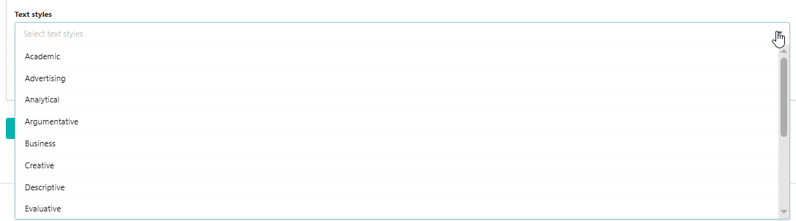

9.  **Select** the desired text tone (**Text tones**) from the dropdown list (e.g., _Formal_ or _Excited_).
    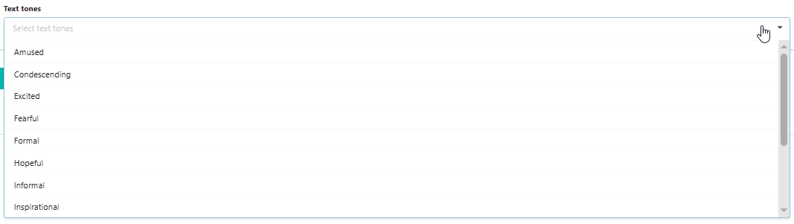

10.  **Click** the **Save** button to save the configuration.

## 3\. Product Selection and Prompt Creation (Tab 3: Flow Selection & Prompt)

1.  **Navigate** to the **Flow Selection & Prompt** tab.

2.  **Activate** the flow by **checking** the **Active flow** checkbox.

3.  **Select** the attribute for generation in the **Attribute** field (it should match step 1.6).
    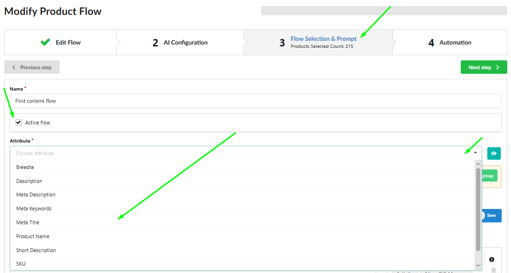

4.  Apply filtering:
    4.1. **Use** the filters section to limit the products for which content will be generated.
    4.2. **Select** an attribute (e.g., _Color_ or _SKU_), define the operator (Equal, Contains, Is empty, etc.), and enter the value. 4.3. Caution: If filters are not applied, content will be generated for **ALL** products currently in your store.
    **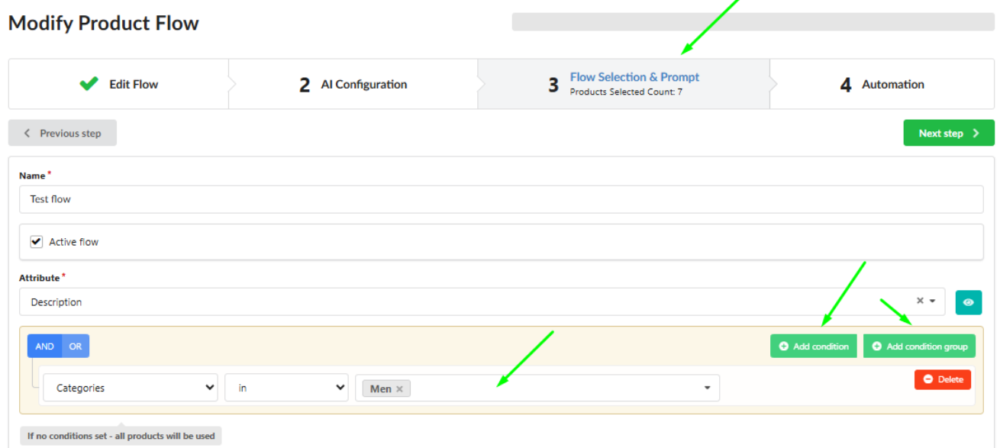**

5.  **Create** the instruction (prompt) for the AI:
    5.1. **Write** the core prompt text in the central Prompt field. _The prompt field cannot be empty._
    5.2. **Insert** static product data (e.g., _Product Name_ or _SKU_) by clicking or dragging elements from the Attributes section.
    5.3. **Add** dynamic logic (e.g., _IF Color is Blue_) for conditional content generation by using the Attributes (if filled) section.
    5.4. **Prioritize** elements with a high Data Density percentage to ensure successful content generation across most products.
    5.5 Read more about creating a prompt and using the Drag and drop tool [here](https://fozzels.freshdesk.com/a/solutions/articles/103000367983).
    5.6 Read more about saving and loading a created prompt as a template [here](https://fozzels.freshdesk.com/a/solutions/articles/103000367846).
    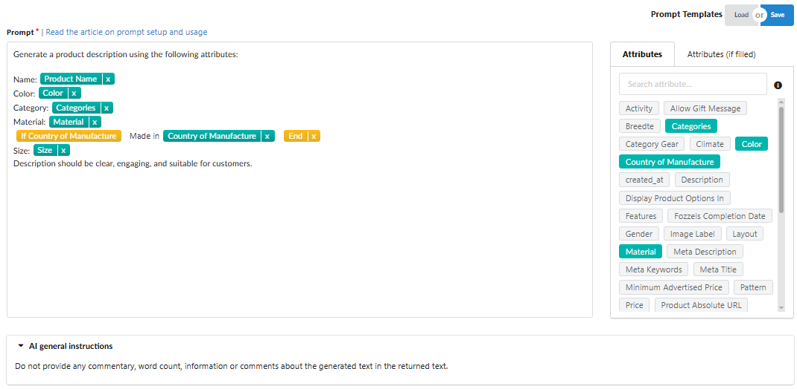

6.  **Click** **"Save and Preview"** to view the products that meet the conditions (you will see the total product count).
    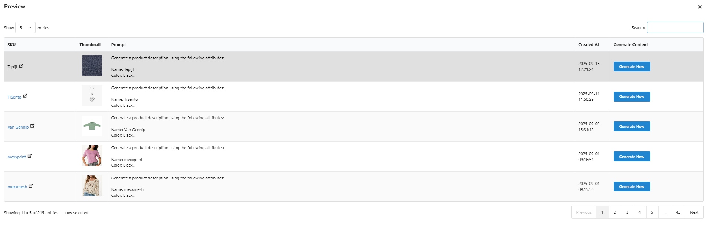
    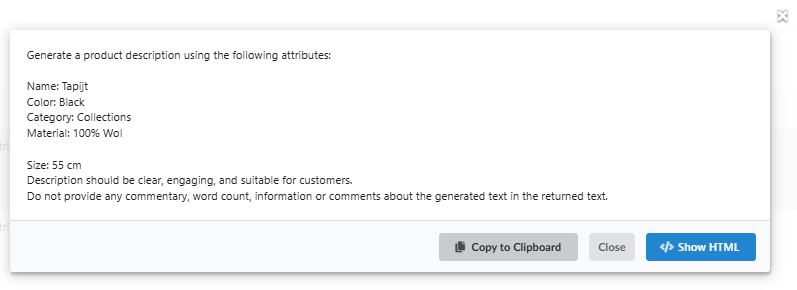

7.  **Click** the **Generate Now** button in the preview pop-up to run a test generation.
    _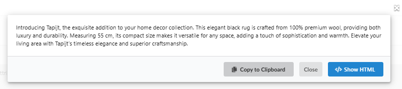_

## 4\. Automation Settings (Tab 4: Automation)

1.  **Navigate** to the **Automation** tab.
    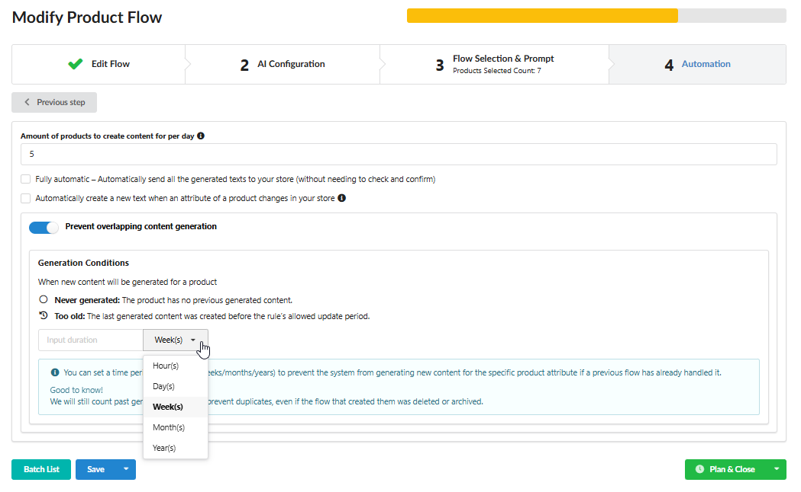

3.  **Set** the number of products for which content will be created per run in the **Amount of products to create content per day** field (e.g., 10).

4.  **Check** the **Fully automatic** checkbox if you want the generated text to be **immediately** sent to your store without confirmation. _Most users initially keep this option disabled for manual review._

5.  **Check** the **Automatically create a new text when an attribute of a product changes in your store** checkbox to ensure regeneration when source data is updated.
    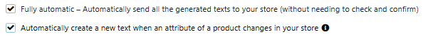

6.  **Enable** the content overlap prevention feature (if it's not your first content flow) (optional)

    -   You can set a time period (**hours, days, weeks, months, or years**) to prevent the system from generating new content for the specific product attribute if a previous flow has already handled it.

    -   **Good to know:** We will still count past generation results to prevent duplicates, even if the flow that created them was deleted or archived.
        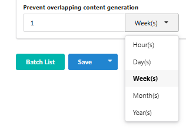

7.  **Click** the **Save** button.

8.  **Run** the flow:

    -   **Plan & Close:** The generation will be added to the queue and will launch the next day, after the automatic nightly product pool.

    -   **Run Now:** The generation will start immediately (for the number of products specified in the _Amount of products to create content per day_ field).
        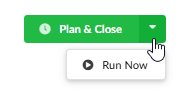

## 5\. Reviewing Results (Batch List)

1.  **Click** the **Batch List** button in the current Flow to view the generated batches.
    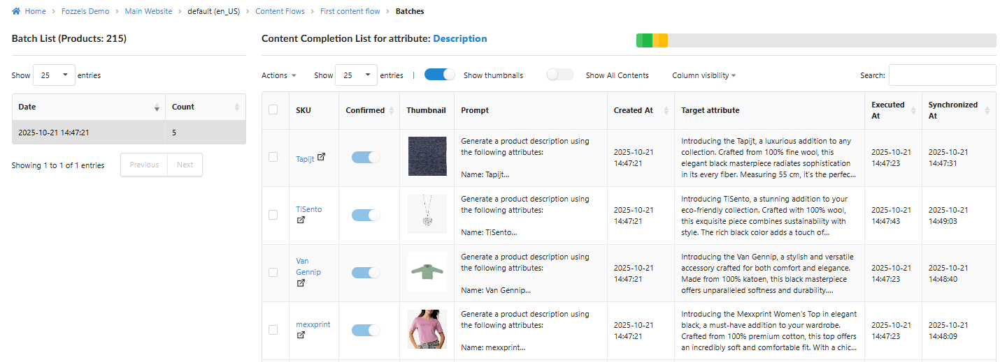

2.  **Review** the generated data in the **Target attribute** column.
    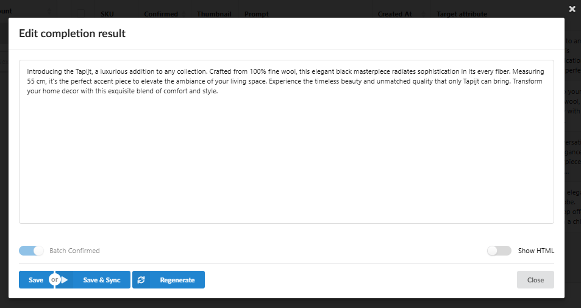

3.  **If necessary**, **edit** the generated text by clicking on it (in Show HTML mood).
    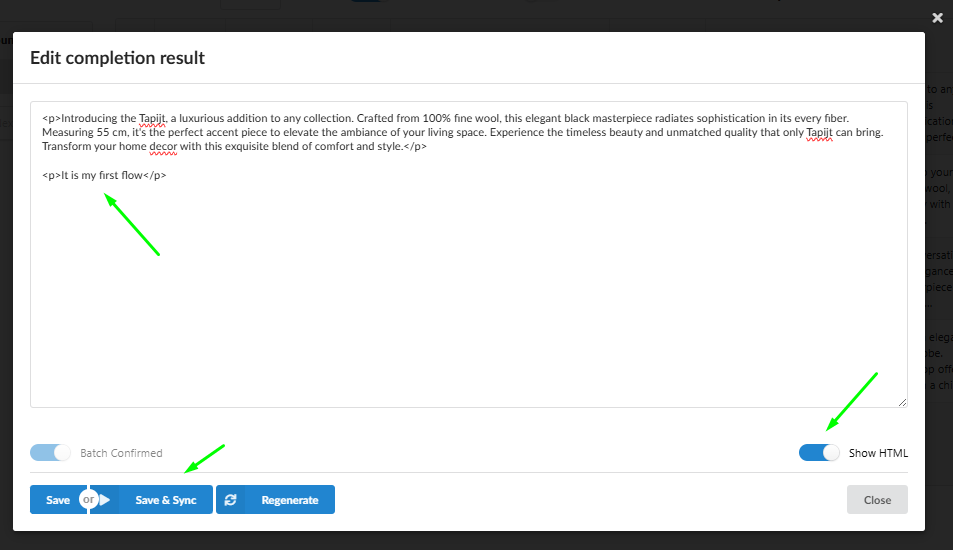

4.  **Click** **"Save & sync"** to manually send the confirmed content to your store.

5.  **Note:** If Fozzels flags the content as **"suspicious,"** it cannot be synchronized without prior regeneration. **Regenerate** the content until it meets verification requirements.
    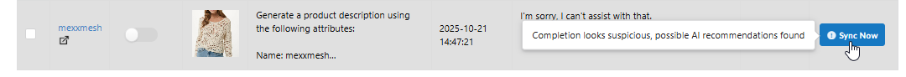

    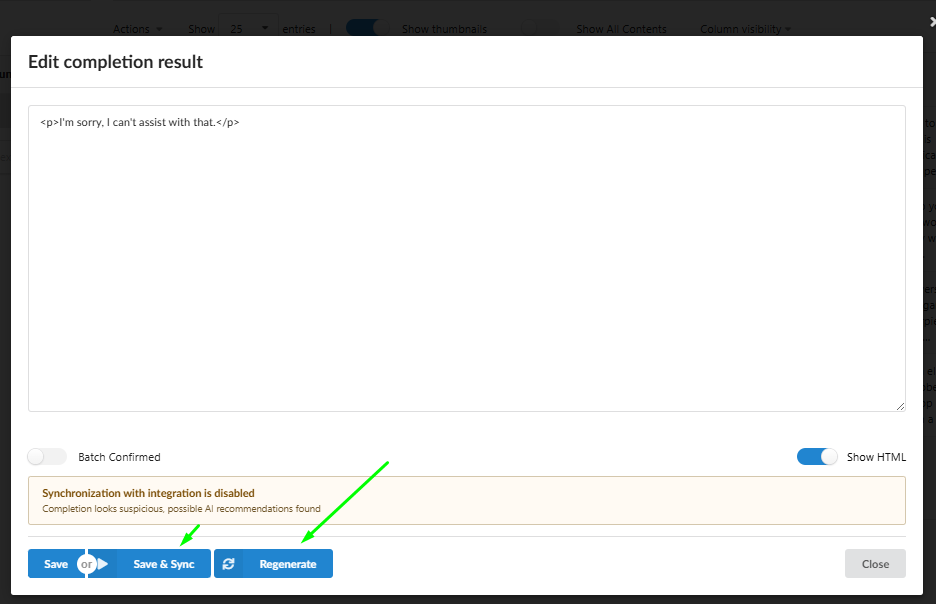

    6\. **Read** more about reviewing results, manual synchronization, and handling errors in the generated content [here](https://fozzels.freshdesk.com/a/solutions/articles/103000369091).
