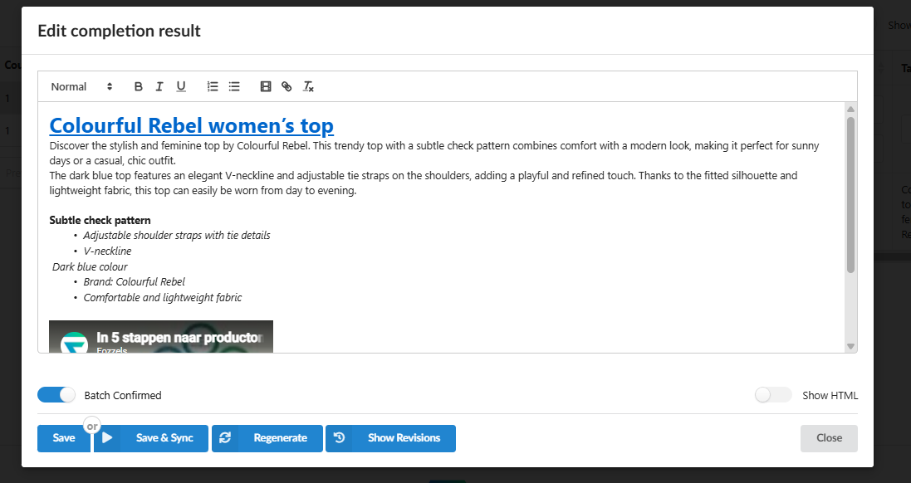
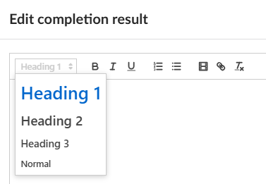
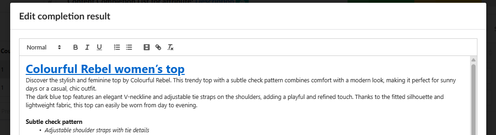
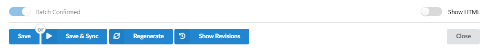

The Batch List is where you review, edit, and approve the content generated by your flows before it is synchronized to your store. In addition to viewing the raw result, Fozzels now provides a built-in **Text Editor** - a formatting toolbar that allows you to structure and style the generated text.

###
1\. Accessing the Editor

1.  **Navigate** to the **Content Flows** section in the header menu.
2.  **Open** the desired flow and click the **Batch List** button ( or daily report)
3.  **Locate** the product you want to edit in the batch.
4.  **Click** on the generated content in the **Target attribute** column to open the editing panel

###
2\. Overview of the Text Editor Toolbar

Once the editing panel is open, you will see a formatting toolbar at the top of the content field. It contains the following controls: The toolbar includes the following options:

-   **Text Style Selector** (leftmost dropdown, showing "Normal" by default) - allows you to apply a heading style to the selected text. Available options are **Heading 1**, **Heading 2**, **Heading 3**, and **Normal** (body text).
-   **B** - applies **Bold** formatting to the selected text.
-   **I** - applies _Italic_ formatting to the selected text.
-   **U** - applies Underline formatting to the selected text.
-   **Ordered list** - inserts a numbered list.
-   **Unordered list** - inserts a bullet-point list.
-   ****Insert video link** —** allows you to embed a link to a video (e.g., YouTube) directly into the content. The video will be displayed as an embedded player in your product description.
-   **Insert link** - wraps selected text in a hyperlink. You will be prompted to enter the destination URL.
-   **Clear formatting** - removes all formatting from the selected text and resets it to plain body text.

3\. Applying Headings to the Text

Headings allow you to create a clear content hierarchy inside your product description. This is especially useful for longer texts, SEO descriptions, or structured content with multiple sections.

-   **Select** the text you want to turn into a heading by clicking and dragging over it.
-   **Click** the **Style dropdown** on the left side of the toolbar (it shows "Normal" by default)
-   **Choose** the appropriate heading level:
    -   **Heading 1** — used for the main title or the most prominent section.
    -   **Heading 2** — used for major subsections.
    -   **Heading 3** — used for nested subsections within a Heading 2 block.
    -   **Normal** — standard body paragraph text.
-   **Verify** that the selected text changes its visual appearance in the editor to reflect the chosen style
    
    4\. Inserting a Link into the Content
    -   **Select** the word or phrase you want to turn into a clickable link.
    -   **Click** the **link icon** (chain icon) in the toolbar.
    -   **Enter** the destination URL in the dialog that appears.
    -   **Confirm** the link. The selected text will now be displayed as a hyperlink in the editor

### 5\. Saving and Synchronizing the Edited Content

After making your edits:

1.  **Click** **Save** to save the changes locally without synchronizing them to your store yet.
2.  **Click** **Save & Sync** to save the changes and immediately push the updated content to your store.
3.  **Click** **Regenerate** if you want to discard your manual edits and have the AI generate a new version of the text from scratch.
4.  **Click** **Show Revisions** to view the history of previously generated or saved versions of this content and restore an earlier version if needed
    

**Note:** The **Show HTML** toggle switches the view from the visual rich text mode to the raw HTML source. Use this option if you need to verify or manually adjust the HTML markup of the content.
