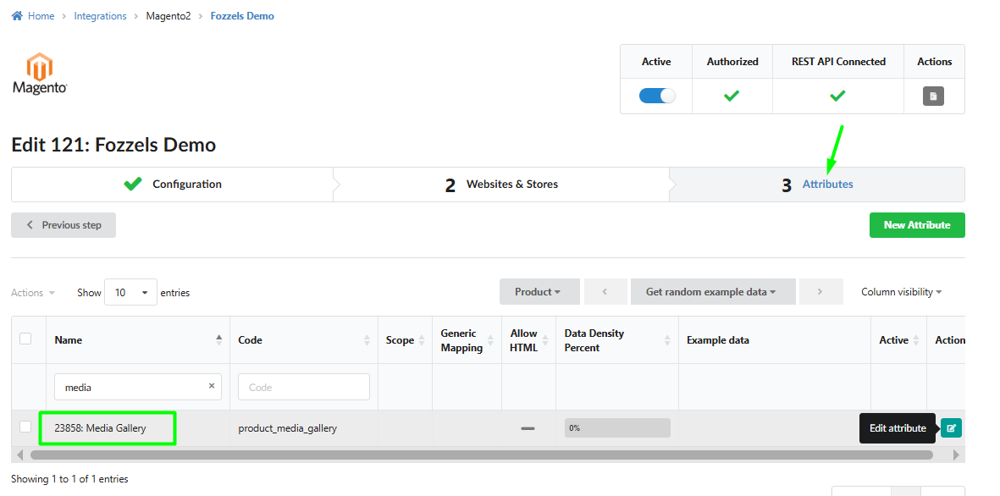
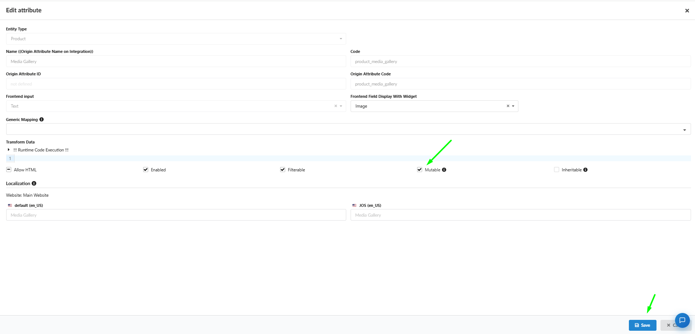
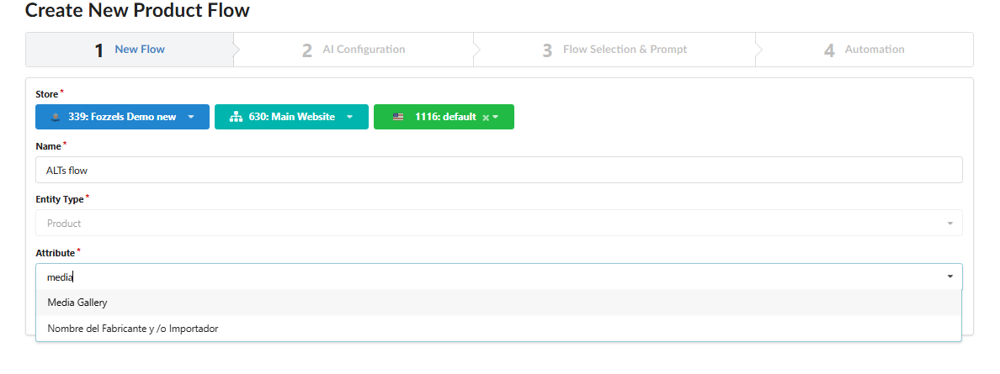
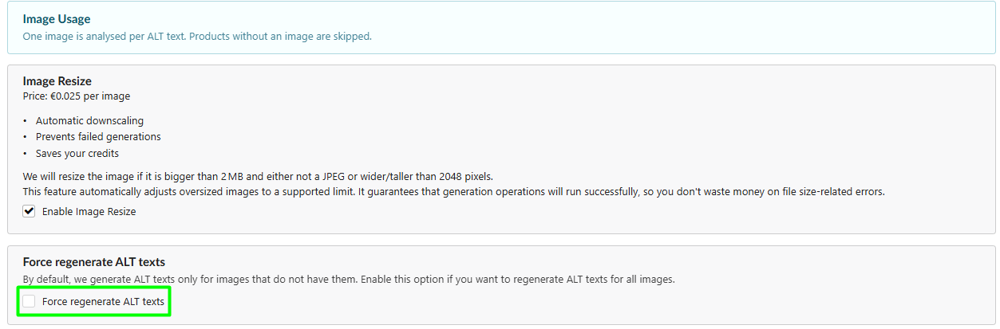

Since you are already familiar with the foundational mechanics of configuring Product Content Flows in Fozzels, this technical manual focuses exclusively on the unique architecture of Magento 2: interacting with the system's `product_media_gallery` attribute and optimizing token consumption during bulk media-gallery processing loops.

## Step 1. Configuring Write Permissions for Media Gallery (Prerequisite)

Unlike standard text fields (e.g., product descriptions, names), Alt texts in Magento live inside the image gallery infrastructure and are written directly into the system attribute `product_media_gallery`. By default, Fozzels treats this attribute as read-only, using it strictly as a marker to filter the product catalog by image presence.

To grant the system permission to overwrite and inject data into this slot, you must change its status to **Mutable**:

1.  Navigate to the main top menu: **Integrations** → select your active **Magento 2** instance.

2.  Open **Tab 3: Attributes**.

3.  In the search/filter bar, type `media`. Locate the row with the code `product_media_gallery` (Media Gallery) and click the turquoise **\[Edit attribute\]** button.

4.  Inside the settings overlay, look under the _Transform Data_ section, find the **Mutable** checkbox, and check it (**\[v\] Mutable**).

5.  Click the blue **Save** button in the bottom right corner.

##
Step 2. Flow Initialization & Attribute Mapping

1.  Go to the **Content Flows** section and click the **Create** **Flow** button (or select target products directly from your catalog view and click **Actions → Create Flow**).

2.  Inside **Tab 1: New Flow**, configure your environment parameters:

    -   **Store / Integration:** Select your specific Magento instance, website setup, and target Store View from the dropdowns.

    -   **Name:** Provide a clear, technical title for your flow.

    -   **Entity Type:** This defaults automatically to `Product`.

3.  **Target Attribute:** Click into the **Attribute\*** selection dropdown, type `media`, and select the system attribute **Media Gallery**. This safely pipes the upcoming AI-generated strings directly into the image gallery database schema rather than standard description blocks.

## Step 3. Selecting the Vision Model & Scanning Mode (Delta vs. Full Overwrite)

In **Tab 2: AI Configuration**, select your underlying provider and model (e.g., GPT or Gemini tiers featuring multi-modal Vision capabilities to analyze image assets), then define how the execution runner should interact with your live Magento storefront database:

-   **Delta Mode (Checkbox "Force regenerate ALT texts" is UNCHECKED):** The default scenario. The background runner scans your Magento catalog and requests AI completions **only for image assets where the Alt text field is currently empty**. This preserves your existing manual SEO work and saves your API credits.

-   **Full Overwrite Mode (Checkbox "Force regenerate ALT texts" is CHECKED):** The comprehensive rewrite scenario. The engine completely bypasses the current metadata states on the storefront, clearing out old Alt texts within the selected batch and replacing them all with new AI-generated strings.

> ? **Technical Recommendation:** Leave the **Enable Image Resize** checkbox enabled. If an image file in Magento is larger than 2MB or exceeds a resolution of 2048px, Fozzels will automatically downscale it to standard vision model input constraints. This actively safeguards your pipeline against payload errors (Failed generations) and optimizes token credits.

## Step 4. Prompt Engineering

Inside **Tab 3: Flow Selection & Prompt**, you craft the explicit instructions for the AI model. Because the pipeline operates in an asset-centric mode (1 image asset = 1 prompt completion), your prompt must instruct the vision model to merge visual elements with your product's textual context.

1.  In the **Prompt** workspace, type out your foundational technical rules (e.g., character constraints—industry standard is under 125 characters for screen-readers—and a ban on generic introductory stop-phrases like _"image of"_).

2.  Use the **Attributes** sidebar on the right to search and **drag-and-drop** dynamic Magento tokens directly into your prompt body (e.g., `{name}`, `{color}`, `{material}`, `{brand}`).

### **Prompt Templates:**

> **Option 1: E-commerce Fashion & Apparel Standard** `"Write a concise, natural SEO Alt text for an e-commerce website accessibility tag. Describe the visual details, style, and cut of the item shown in the image. Integrate these attributes naturally if they are visible: {color} {name} from {brand}, made of {material}. Keep the output under 125 characters, strictly avoid keyword stuffing, and do not start with phrases like 'photo of' or 'image of'. Only describe what is actually present in the photo."`

> **Option 2: Minimalist & Product Detail Focused** `"Generate a clean, professional Alt tag for a screen reader. Focus purely on the product design, layout, and distinct visual features. Use the provided metadata to ensure accuracy: {brand} {name} in {color}. Keep the description realistic, factual, and under 120 characters. Avoid marketing fluff and do not use 'photo of' or 'image of'. Just return the description string."`

## Step 5. Processing Volume Limits & Batch List Layout

In **Tab 4: Automation**, the **"Amount of products to create content for per day"** configuration field calculates processing thresholds based on parent Product entities, not individual image files. Because Fozzels evaluates every single media asset inside a product's gallery, setting a limit to 10 products where each contains 5 images will result in 50 distinct, billed AI vision completions. However, even with this processing structure, all generated results will remain cleanly organized in your **Batch List**, visually grouped by product SKU so you can easily review, edit, or mass-approve them before pushing the metadata live.
