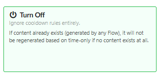
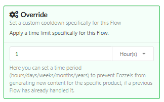
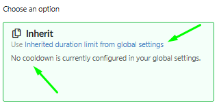
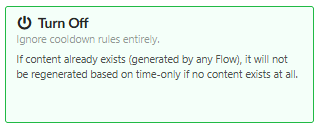

The **"Prevent double content generation with other Flows"** feature is crucial for ensuring you do not generate content twice for the same product when it might belong to multiple Flows. This helps optimize your AI usage (tokens) costs .

## 1\. The Main Standard (Global Setting)

This is the **Global setting** that applies to all your Flows unless otherwise specified. You set it once under: `Profile` → `Settings` → `Content Flow`.

-   **Content was not generated yet:** Generation is allowed **only if** content for this product has not been created by **any** other Flow previously. This is the strictest check.

-   **Older than:** You set a **time limit** (e.g., 1 week). Generation is allowed **if** the existing content was already created once before by another Flow, but **before** the set duration.
    

    

## 1.1. Managing the Global settings (Setup Steps)

**Your Goal:** To set or modify the Main Standard that all Flows set to `Inherit` will follow.

**Steps:**

1.  Navigate to **Global Settings** (`Profile` → `Settings` → `Content Flow`).

2.  You control the Global Rule using the **"Use duration limit"** toggle:

    -   **To engage the duration rule (Older than):** **Turn the "Use duration limit" toggle ON**, **enter the required period value** (e.g., 1 week), and **Save**.

    -   **To set the strictest rule (Content was not generated yet):** **Turn the "Use duration limit" toggle OFF** and **Save**.

    -   _Result:_ All Flows using the **Inherit** option will automatically apply this new restriction.

##
2\. Overriding the Rule for a Specific Flow (Practical Scenarios)

In the settings of each individual Flow (section **4 Automation**), you decide whether it will adhere to the Global Settings or have an exception:

-   If you want the Flow to ignore all duplication rules (even if the Global Rule is active), see A.

-   If you want to set a Custom Time Limit (Override), see B.

-   If you want to completely turn off all global duplication rules, see C.

####
**Scenario A: Full Generation Permission (No Restrictions) (Turn Off)**

**Your Goal:** You want the Flow to ignore all duplication rules (even if the Global Rule is active).

**Steps:**

1.  Go to the settings of the desired Flow (e.g., `Modify Product Flow`).

2.  Navigate to section **4 Automation**.

3.  In the **"Prevent double content generation with other Flows"** block, select the **Turn Off** option.

4.  Save changes.

    -   _Result:_ This Flow will generate content regardless of whether content already exists from other Flows.

####
**Scenario B: Setting a Custom Time Limit (Override)**

**Your Goal:** You want this Flow to have a time limit **different** from the Global Setting.

**Steps:**

1.  Go to the settings of the desired Flow.

2.  In section **4 Automation**, select the **Override** option.

3.  Enter the required time limit value (e.g., 1 hour) in the field that appears.

4.  Save changes.

    -   _Result:_ The Flow will use **only** this new, individual rule.

**Scenario C: Starting Over (Removing All Restrictions)**

**Your Goal:** You have decided to completely turn off all global duplication rules, allowing all Flows to create content without period-based restrictions.

**Steps:**

1.  Navigate to **Global Settings** (`Profile` → `Settings` → `Content Flow`).

2.  **Deactivate the "Use duration limit" toggle**.

3.  Click the **Save** button.

4.  _Result:_ All Flows set to **Inherit** will begin running **without duplication restrictions**, as the Global Rule is effectively disabled. If you want a Flow set to **Override** to also run without restrictions, **change it to Inherit** or **disable the restriction using Turn Off**.

or

