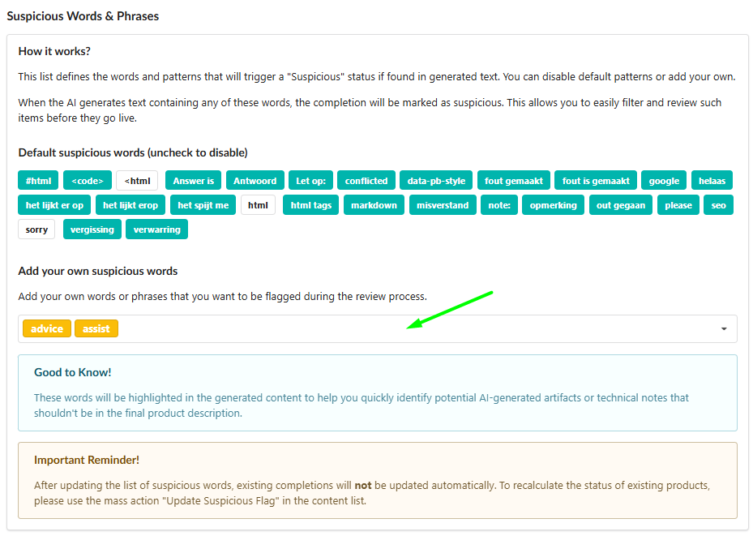
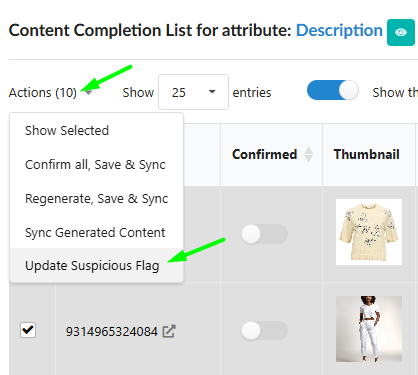

The **Suspicious Words & Phrases** feature is more than just a simple validation filter - it is a sophisticated tool for managing high-volume content workflows. It ensures your product descriptions remain professional by flagging AI hallucinations, technical artifacts, or unwanted terms across multiple languages simultaneously.

## Configuration: Global & Multilingual Control

To manage your word list, navigate to **Settings** > **Flow** > **Suspicious Words & Phrases** tab.

### 1\. Managing the Word List

Fozzels comes pre-configured with common AI artifacts (`#html`, `note:`, `sorry`, etc.). You can:

-   **Toggle terms on/off:** Simply uncheck the tags you don’t need.

-   **Add custom terms:** Type any word or phrase (e.g., competitor names, brand-specific sensitive terms) and press **Enter**.

-   **Multilingual Support:** You can add "stop-words" in any language. This is incredibly useful for international stores where you need to track specific errors for different localizations (e.g., English "sorry" vs. Dutch "let op") at the same time.

## How It Works: Dynamic Status Management

The system operates in **real-time**. As soon as a term from your list appears in a generated text:

-   The product is marked with a **"Suspicious" status**.

-   The flagged words are **highlighted directly in the text editor**.

-   This gives you the choice: **manually edit**, **regenerate** the content, or **adjust your settings** to clear the flag.

### Instant Mass Corrections

The true power of this feature lies in its dynamic nature. If a "Suspicious" status was triggered by mistake (e.g., you added "sorry" as a stop-word, but then launched a brand named _"Sorry Boy"_), you don’t have to edit hundreds of descriptions:

1.  **Disable or remove** the word from your Suspicious list in Settings.

2.  The system **instantly updates the status** for all existing completions. They will lose the "Suspicious" flag and become ready for mass synchronization immediately.

##
Efficiency in the Daily Total Batch List

We’ve optimized your workspace with a dedicated filter to streamline your daily checks:

-   **Show only suspicious:** Use this toggle in the **Daily Total Batch List** to instantly isolate every result that needs your attention.

-   Instead of reviewing the entire batch, you can focus specifically on flagged items, see the highlighted words, and decide whether to fix the text or refine your global word list to clear the entire batch at once.

## Forcing an Update (Update Suspicious Flag)

While the status updates dynamically, you can always manually trigger a recalculation for your broader catalog. In your **Content List**, select the products and use the **Mass Action: "Update Suspicious Flag"** to re-scan them against your most current settings.

### Summary

This feature acts as your "command center" for content quality. Whether you are catching technical glitches or managing brand safety across international borders, you are always in total control of what gets published to your store.
