The Dashboards (or Daily total batch list) serves as your command center, providing a complete overview of all content generation and synchronization processes. This interface allows you to proactively track status, diagnose errors, and efficiently manage all generated data.

1\. Dashboard Overview

The main view is a data table grouped by the date of content generation.

    1.1 Key Metrics

The main table displays six key metrics that help monitor content status for a specific day:

        **Date**: The date on which the content was generated.
        **Product Count**: The total number of products scheduled for content generation.

        **Completion Count**: The number of content units that have been successfully generated.

        **Synchronized Count**: The number of content units that have been successfully synchronized.

        **Warning Count**: The number of content units with remarks that may require user attention.

        **Failed Count**: The number of content units that failed to generate or synchronize due to critical errors.

Users can click on the date or the Completion Count to access a detailed view of all completions for that specific day.
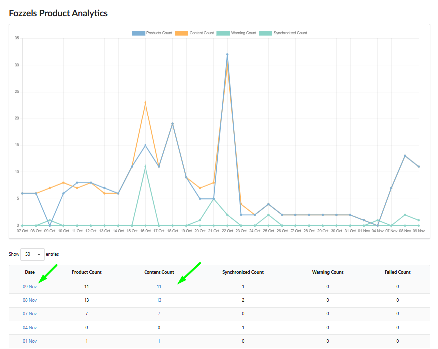

1.2. Detailed View and Display Configuration

Clicking on a date opens a detailed table view containing specific information about each content unit.

1.2.1. Mandatory Columns

The detailed table includes nine mandatory columns: Flow, SKU, Confirmed, Thumbnail, Prompt, Created At, Target Attribute, Executed At, and Synchronized At.
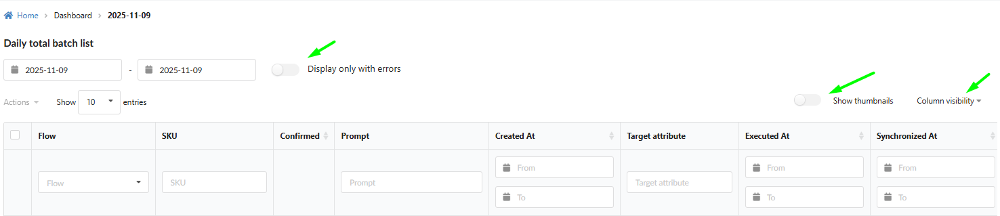

1.2.2. Display Configuration Tools

Tools above the table allow you to customize your data view for efficiency:

**Display only with errors.** This toggle quickly filters the table to show only records where generation or synchronization problems occurred.
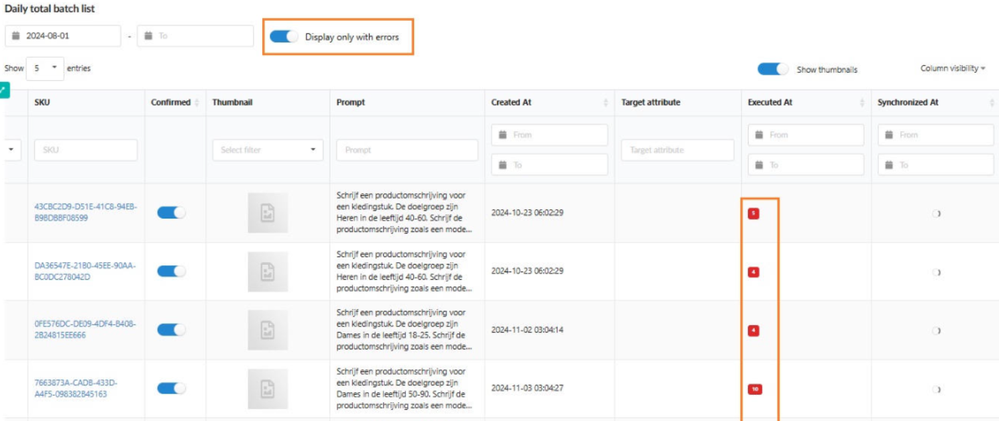

**Column visibility.** This dropdown allows the user to hide or show specific columns in the table, focusing on relevant information.
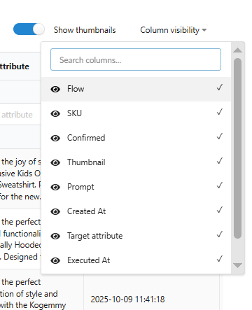

**Pagination.** The "Show \[number\] entries" option allows customization of the number of rows displayed per page (5, 10, 25, 50, or 100).
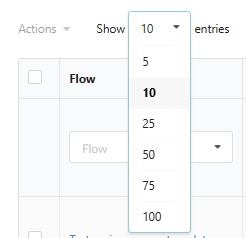

**Date Range Filter.** Allows selection of a specific date or date range for viewing results.
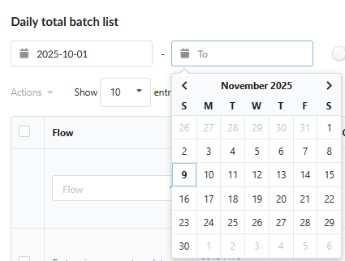

1.2.3. Column Filters

Each column incorporates a built-in filtering tool for rapid search and sorting:

**Flow**: Filters products by one or more selected Flows (selection from a list).

**SKU**: Used for searching for a specific product by its SKU (text search).

**Thumbnail**: Filters products based on image presence ("Image Missing" or "Image Exists") (toggle/selection).

**Date Columns**: Date columns (Created At, Executed At, Synchronized At) feature "From" and "To" fields for selecting a date range.

1.3. Column Detail and Interaction

This section describes single-item interactions, which serve as an alternative to mass actions for granular control.

SKU: Displays the product SKU, which is a clickable link to the product page within Fozzels. Also includes an icon that links to the product page in the integrated store.
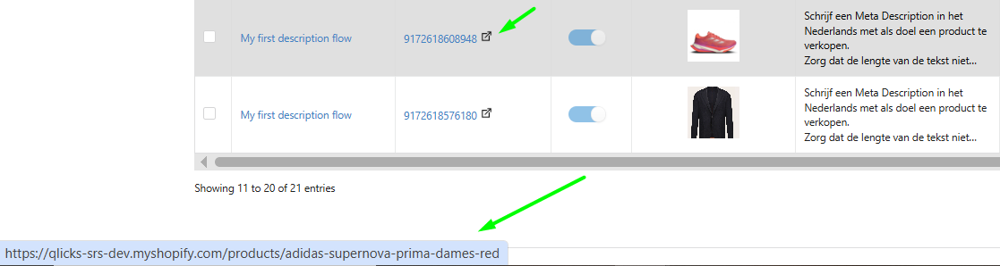

Confirmed: Indicates the status when content has been approved and is ready for synchronization.

Target Attribute: Clicking on the cell opens the "Edit completion result" window, allowing content review and editing.
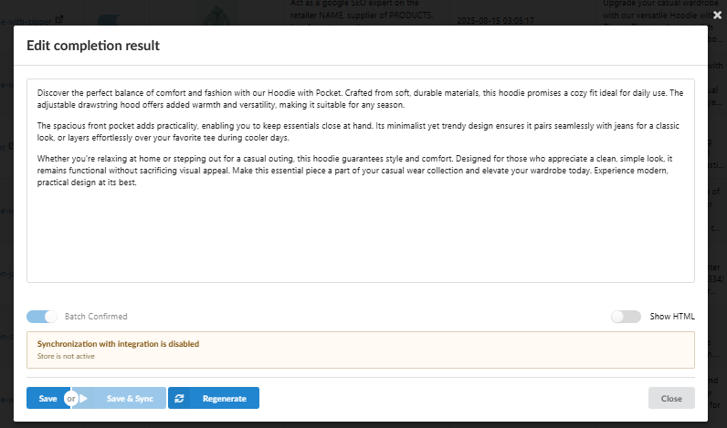

Prompt: Clicking opens a pop-up to view and copy the full Prompt text.
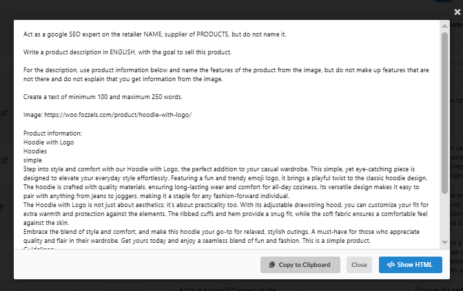

Regenerating Content: The "Regenerate" button within the "Edit completion result" window is used to initiate content re-generation.
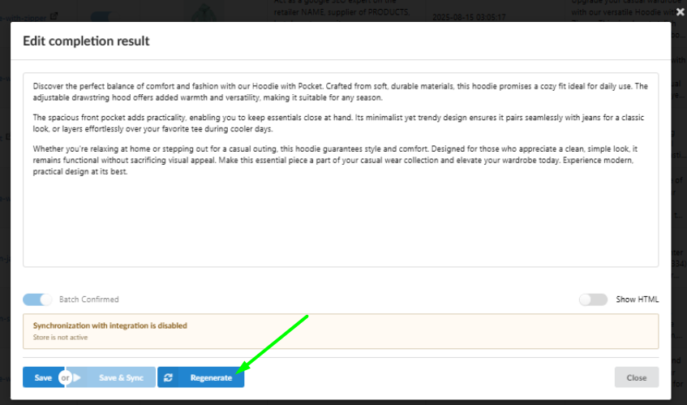

1.4. Mass Actions and Operational Control

The Dashboards provides robust functionality for efficiently managing content through Mass Actions, solving the pain point of tedious individual confirmations.

1.4.1. Performing Mass Actions

Selection Mechanism: Users select items using checkboxes or the Select All on This Page function.
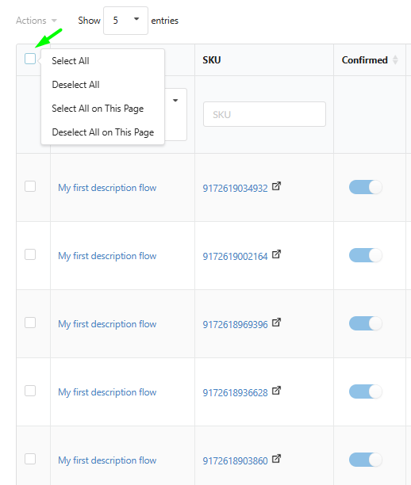

Available Actions: The Actions menu offers the following functions for batch processing:
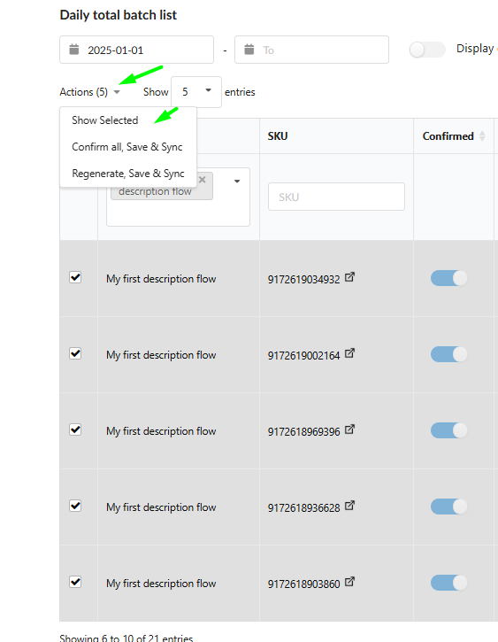

**Confirm all, Save & Sync**: Approves and initiates synchronization for the selected content.

**Regenerate, Save & Sync**: Initiates content re-generation for the selected products and their subsequent synchronization.

1.4.2. "Show Selected" Functionality

Targeted Workspace: The "Show Selected" function isolates selected items into a separate table for a focused workspace.

Full Functionality Retention: In this mode, the user retains all functions of the standard table: filtering, detail viewing, and executing Mass Actions on the selected subset of data.
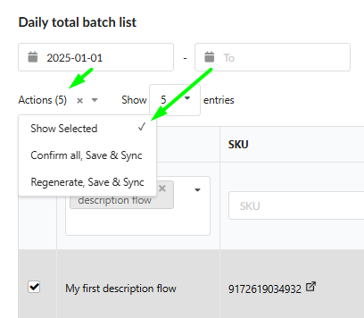

1.4.3. Operation Safeguards

A multi-stage control system is implemented to ensure accuracy and prevent unintended expenditures:

Mandatory Confirmation: A warning pop-up appears before executing any resource-intensive mass action ("**Confirm & Synchronize**", "**Regenerate & Synchronize**").
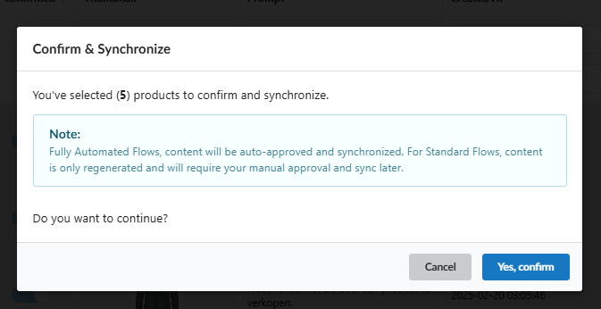

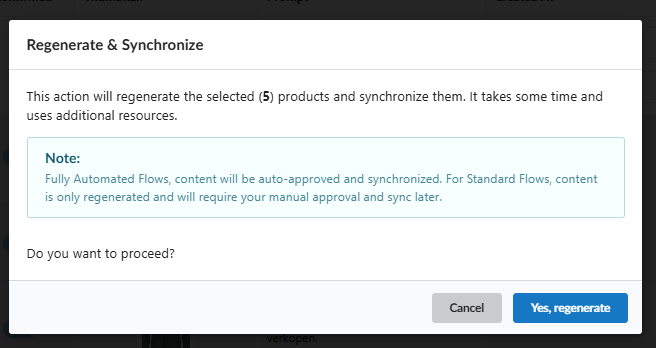

Flow Logic Control: These pop-ups include a note regarding the expected synchronization behavior:

Content from Fully Automated Flows will be auto-approved.
Content from Standard Flows will only be regenerated, requiring subsequent manual approval.

Resource Check: The system verifies status before starting any operation: generation will not initiate if the Flow is inactive, and synchronization will not execute if the target integration is inactive.

1.5. Diagnostics and Warnings (Troubleshooting)

The Dashboard provides clear messages and tools for diagnostics:

Error Details (Tooltips): In cases of synchronization or generation failures, tooltips are available to provide the detailed message explaining the cause of the error.
"Completion looks suspicious": A warning indicating unnatural content (bot-like responses, HTML, or Markdown). This content will not synchronize and requires user intervention.
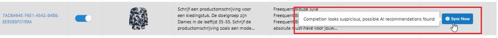
"Double HTML entities encode detected": This warning appears when the text has been encoded more than once, which can cause the text to appear incorrectly.
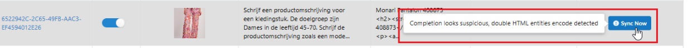
"Product completion result is empty. Try to regenerate content." The result is empty.
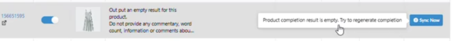

"Product is deleted on integration": Indicates that the product no longer exists in the integrated store.
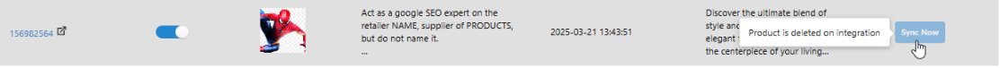
"Rule is disabled": Indicates that the content was generated by a Flow that is no longer active.
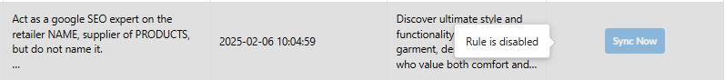
