This document provides both a conceptual overview and detailed practical instructions on the complete lifecycle of product **Attributes** within the Fozzels platform: from initial import and analysis to advanced configuration, transformation, and custom field creation.

Attributes are the **Single Source of Truth** for AI content generation. Managing them involves controlling **Data Density**, **mapping**, and **localization**, which is critical for creating high-quality, relevant, and factually accurate product descriptions. Setting up the attribute collection before starting work (reviewing and deactivating non-relevant/empty fields) is essential work that significantly eases subsequent operations.

### Part 1: Import and Basic Analysis

#### 1.1. What are Fozzels Attributes?

Attributes are structured data points (e.g., `color`, `price`, `material`) imported from your integrated platform. They serve as input variables for the **Prompt Field**, allowing the generation of unique content for each product.

#### 1.2. Initiating the Pull

The data import process begins with the **Pull Products** command.

1.  **Go to** your integration settings and **select** the **Websites & Stores** tab.

2.  **Click** the **“Pull Products”** button for the active store.

3.  **Monitoring:** Progress is shown via a progress bar. The process can be managed using the **Stop**, **Pause**, and **Resume** buttons.
    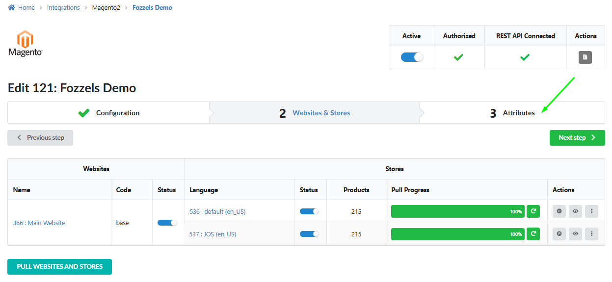

4.  **Logs:** Detailed reports on product and attribute import are available via **“View Product Logs”** and **“View Attribute Logs”** in the Actions column.
    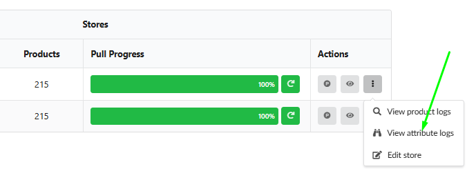

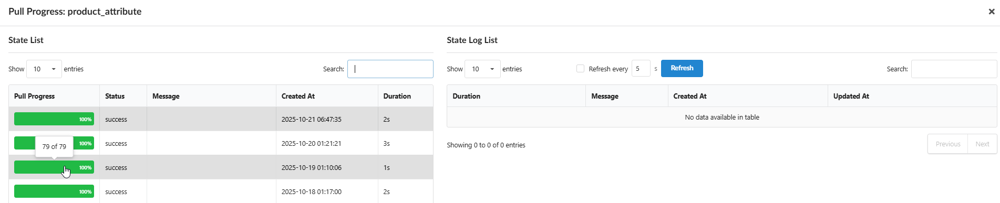

####
1.3. Quality Analysis: Data Density Percent

On the **Attributes** tab, Fozzels automatically calculates the quality of each field.

-   **Definition:** **Data Density** is the percentage of products in the catalog for which this attribute has a non-empty, usable value.

-   **Usage:** Attributes with low density should only be used within **conditional logic** (`if` blocks) to avoid generating content with factual gaps or empty spaces.

-   **Management:** You can **disable** attributes with 0% density or those you do not plan to use, simplifying the **Flow Builder** interface.

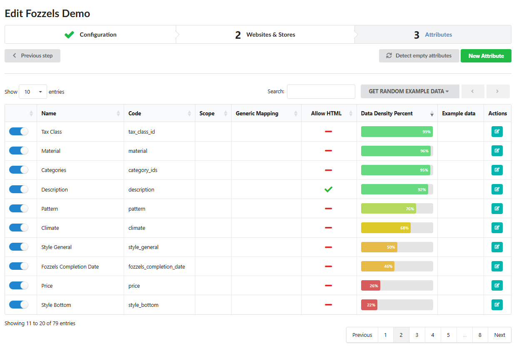

###
Part 2: Review and Configuration

#### 2.1. Reviewing Example Data (Get Random Example Data)

To verify the imported values and their localization, use the example data function.

1.  **Click** the **"Get random example data"** function on the Attributes tab.
    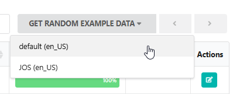

2.  **Select** a store/locale from the dropdown menu. This allows you to see how values look for a specific language market (e.g., the color "zwart" for a Dutch store versus "black" for an English store).
    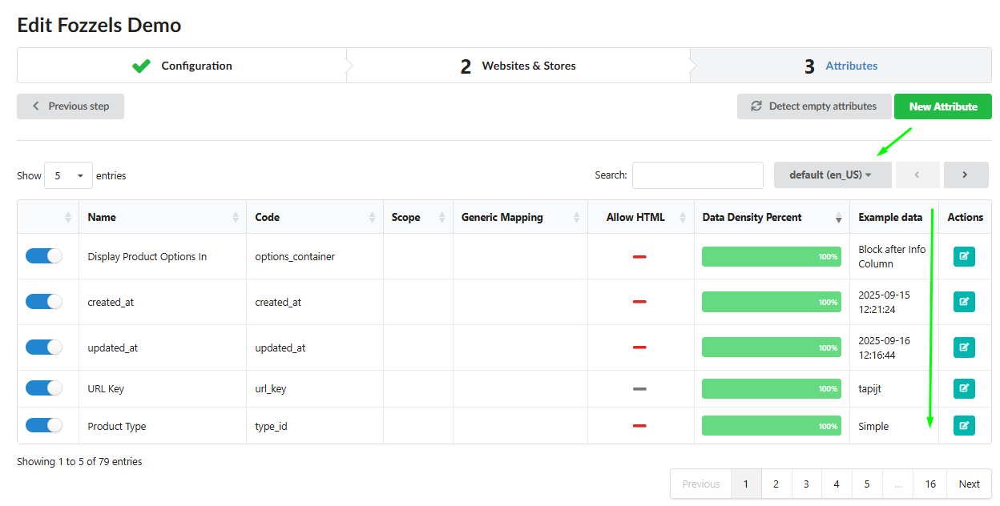

3.  **Use** the **forward/back arrow** buttons to view different attribute values from various random products.

#### 2.2. Advanced Attribute Editing (Edit Attribute Window)

Clicking the **Edit icon** (pencil) on an attribute opens the window for advanced configuration.
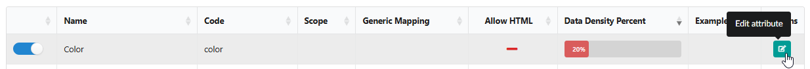

##### Data Transformation

-   **Transform Data:** Allows **Runtime Code Execution** (custom code) on the imported value before it is stored.

##### 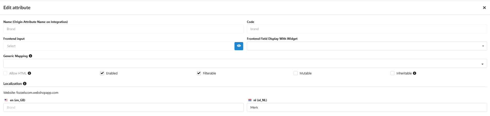
Technical Flags

-   **Filterable:** If enabled, this attribute can be used to filter products in the Catalog/Batch List by its value.
    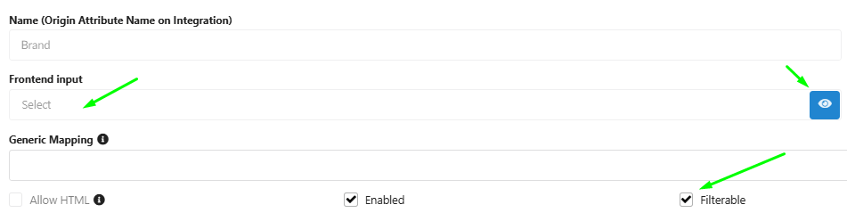
    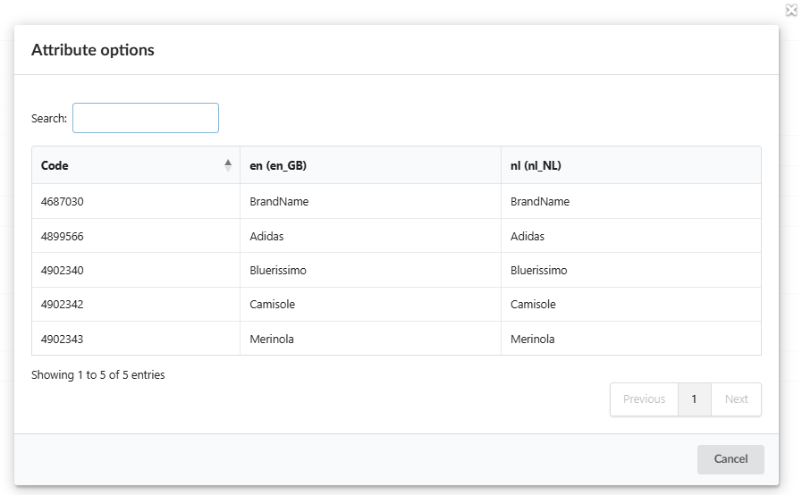

-   **Mutable:** If enabled, Fozzels has permission to **write** (export) data back to this field on the source platform.

-   **Inheritable:** Determines whether the attribute value of a **parent** product should automatically be copied to its **child** variants.
    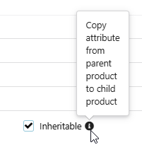

-   **Allow HTML:** Allows the attribute to contain and display HTML tags.

##### Attribute Name Localization

-   On the **Localization** tab, you can **enter** the desired localized name for the attribute for each connected store version.

-   **Result:** The entered localized names will be displayed in the column headers of tables and in the **Flow Prompt** window, helping the AI understand the attribute in the context of the store's language.
    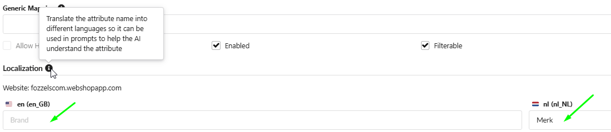
    _for EN store:_
    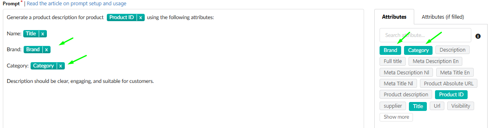

   _for NL store:_
    _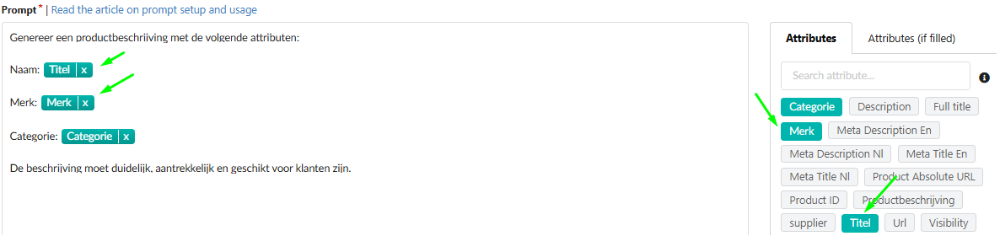_

### Part 3: Creating Custom Attributes

#### 3.1. Purpose of Custom Attributes

**Custom Attributes** are fields created directly within Fozzels. They may serve as the target field for saving generated content or for calculated values.

#### 3.2. New Attribute Creation Process

1.  **Click** the **"New Attribute"** button on the Attributes tab.
    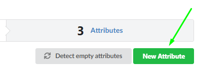

2.  In the **"Create New Attribute"** pop-up window, define:
    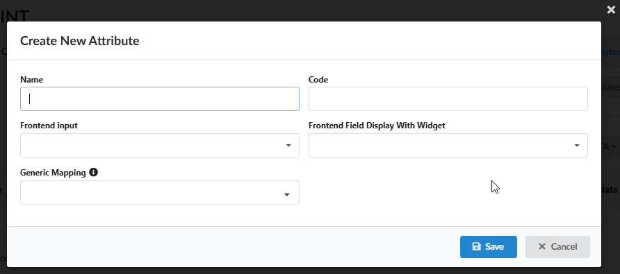

-   **Name:** A descriptive name for the interface.

    -   **Code:** A unique technical identifier.
        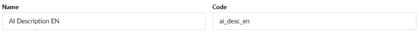

    -   **Frontend Input:** The data type the attribute will hold (**Text**, **Textarea**, **Select**, **Multiselect**, **Date**, **Boolean**, **Weight**, etc.).
        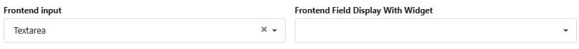

    -   **Generic Mapping:** Standardize the attribute according to the Fozzels internal structure (e.g., select **Description**).
        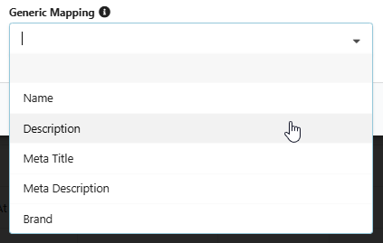

3.  **Frontend Field Display With Widget:** Optionally, select a widget for how the field is displayed in the Catalog (e.g., **Category Tree, Image, Product ID**).

4.  **Click** **“Save”**.
    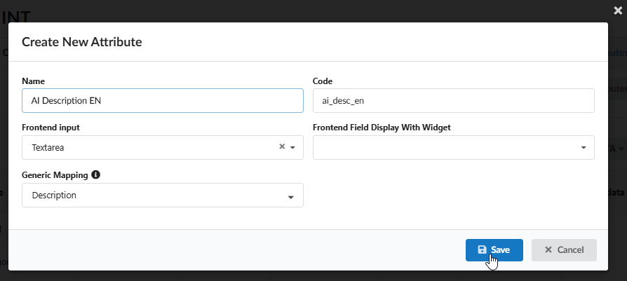

5\. Check the created attribute in the "**Edit attribute**" popup and configure it if necessary.
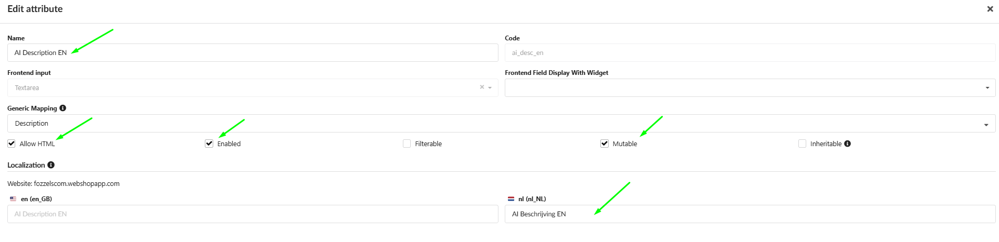
6\. Check the result in the general **Attribute list**.
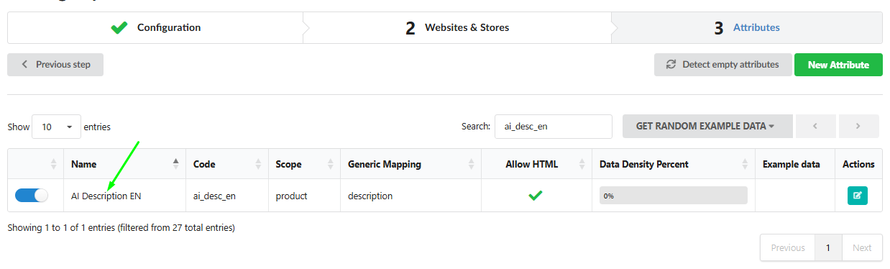
