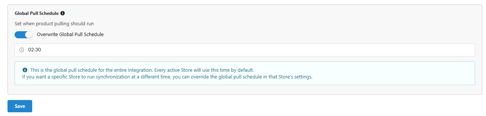
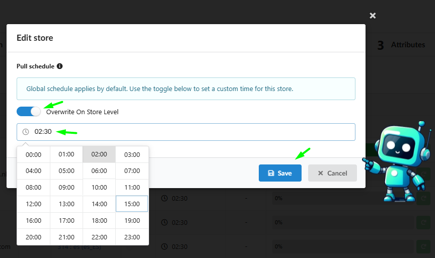
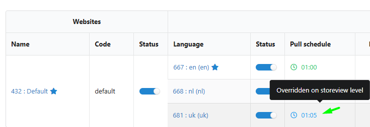

We have updated the Fozzels platform to align with your local business rhythm. You now have total control over when your content update cycle begins, allowing you to synchronize AI operations with your stock updates and server capacity.

## Custom Pull Schedules

You are no longer restricted to a single system cycle that previously started at **00:30 UTC** for everyone. Now, you define the start time for each integration or individual store.

### 1\. Configuration Levels:

-   **Global Integration Level:** Set a single schedule for the entire integration (configured in the **Configuration** tab).
    

-   **Individual Store Level:** Set a unique schedule for a specific store (configured in the **Websites & Stores** tab via the **"Overwrite On Store Level"** option).
    

##
How It Works: The Automation Chain Reaction

It is important to understand that the scheduled Pull time is the **trigger** for an entire chain of processes. Once the **Pull** successfully imports your data, the system automatically executes the following steps:

### Data Journey: From Pull to Generation (Step-by-Step)

**Stage**

**What Happens**

**Result**

**1\. Product Pull**

Fozzels connects to your site via API and downloads updated data.

The system has an up-to-date list of products and characteristics.

**2\. Flow Sync**

The system "sifts" the catalog through your active Flow filters.

New products are added to the queue; irrelevant ones are removed.

**3\. Attribute Refresh**

Values (price, category, custom fields) are updated for every product in the Flow.

The AI receives the freshest context for generation.

**4\. AI Generation**

The generation queue starts based on your specific prompts.

Texts, SEO tags, and translations are created.

**5\. Data Export**

Completed content is automatically sent back to your site.

Your customers see the updated product page.

**Example:** If you set your pull time to **17:00 (5 PM)**, the AI generation will start immediately after the data import and flow checks are complete (e.g., around **17:20** or **17:45**), rather than waiting until the middle of the night.

## Localized Interface: Setting Your Time Zone

To make scheduling intuitive and eliminate UTC mental math, you can set your local time zone directly in your profile.

### How to configure your timezone:

1.  Navigate to **Settings** > **Profile**.

2.  Find the **Timezone** field and select your region from the dropdown menu.

3.  **Crucial:** Click the **SAVE** button to apply the changes.

### Why this matters:

-   **No UTC Calculations:** If you schedule a pull for 17:00 in your timezone, it will start exactly at 17:00 according to your local clock.

-   **Transparent Logs:** Every activity log and generation status will be displayed in your local time, making monitoring effortless.

## Key Benefits

-   **Freshness Control:** AI generation happens immediately after product data is updated on your site.

-   **Server Optimization:** Stagger pull times for different stores to prevent your API from being overwhelmed by simultaneous requests.

-   **Predictability:** Know exactly when your new arrivals will be processed by AI and ready for review.
