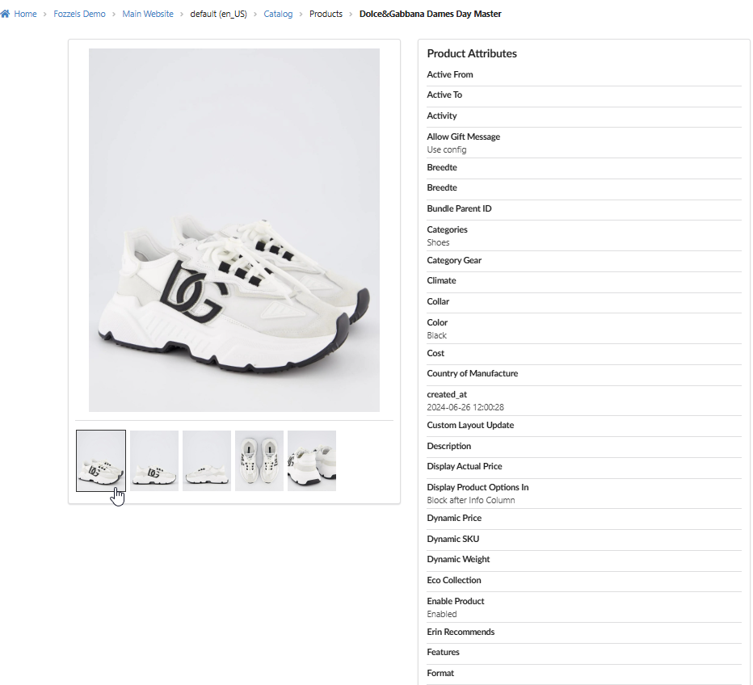
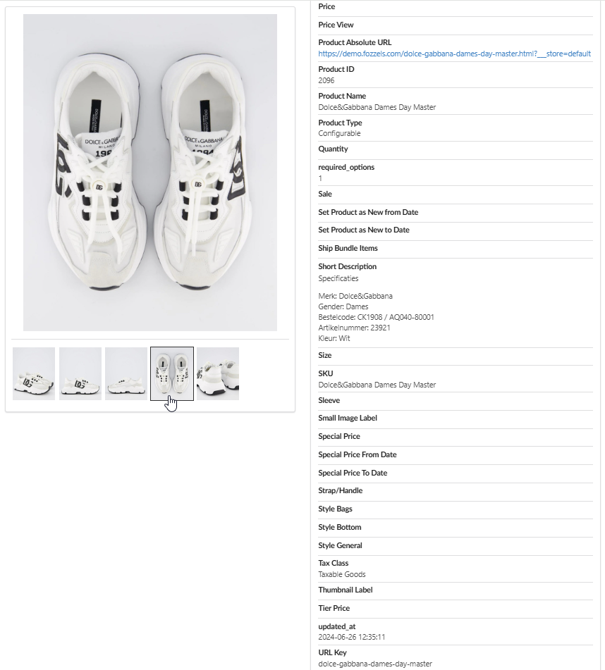
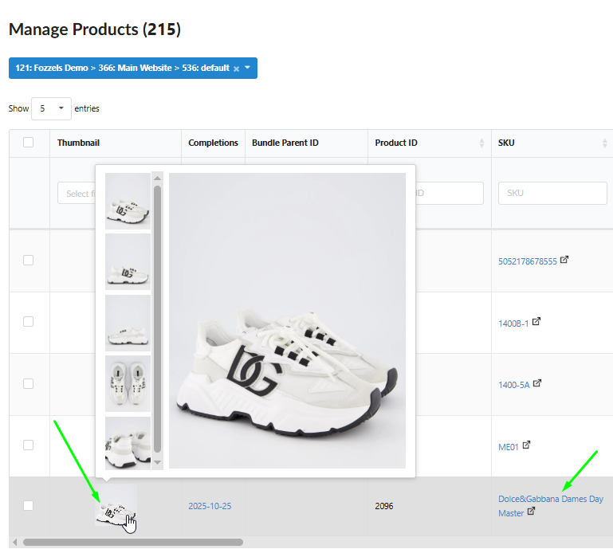
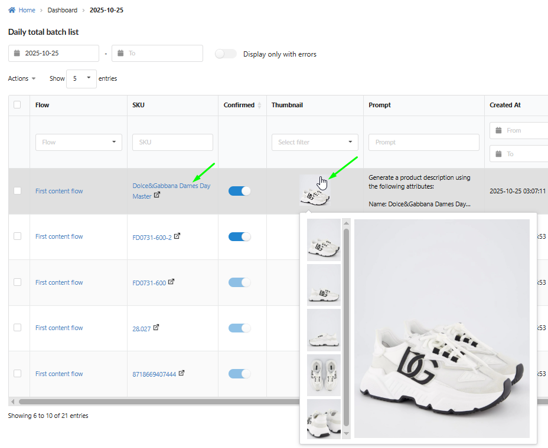

The **Detailed Product View** offers a dedicated, consolidated interface for reviewing all metadata associated with a single product. This feature is designed to eliminate the complexity of the main Catalog, where some attributes might be hidden or the table structure is too cumbersome for quick reference.
The Detailed View presents a clear, comprehensive data source and a full image gallery, accessible from almost anywhere in the Fozzels application.

###
Accessing the Detailed View

The Detailed Product View is strategically accessible across multiple locations within the Fozzels platform to ensure rapid access to core product data:

1\. Catalog and Dashboards: Users can open the view directly from the main product Catalog or the Flow Dashboards.

2\. Direct Navigation: Access is typically initiated by clicking on a unique product identifier (such as the SKU or Product ID) or by simply clicking on the product's image thumbnail.

###
Value Proposition for the User

The Detailed Product View provides two primary benefits: data clarity and visual completeness.

1\. Unified Attribute Information. The view replaces the need to navigate the wide, complex columns of the main Catalog table. It presents a clean, vertically scrollable list of all active attributes and their current values, ensuring users can quickly verify every data point available for a product. This list is restricted only to attributes currently active in the integration, minimizing visual clutter.

2\. Visual Asset Verification. The right side of the view prominently features all images associated with the product in a dedicated gallery block. This section allows for rapid visual inspection:

Image Preview: The main photo in the preview block changes dynamically when the cursor hovers over any image in the gallery strip, immediately displaying the asset in full size.
Usability Indicator: A clear visual cue, such as a thick border, appears around the image being hovered over, confirming which asset is currently in the main preview area.

3\. External Linkage. For practical external verification, the view includes a direct hyperlink within the "Product Absolute URL" attribute, allowing the user to open the product's live web page on the integrated e-commerce store with a single click.
