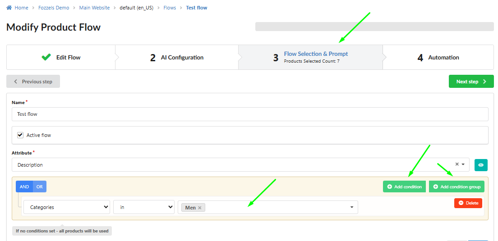
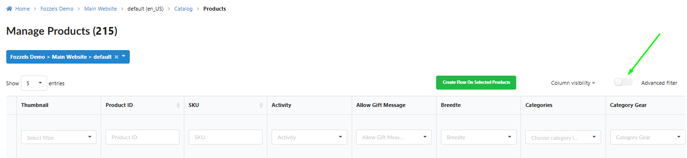
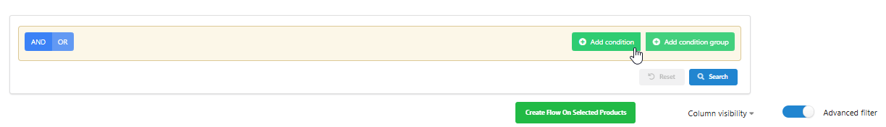
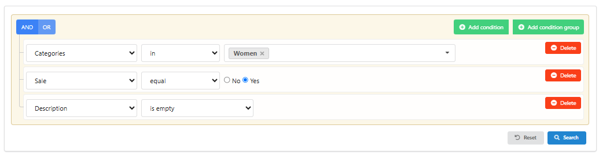
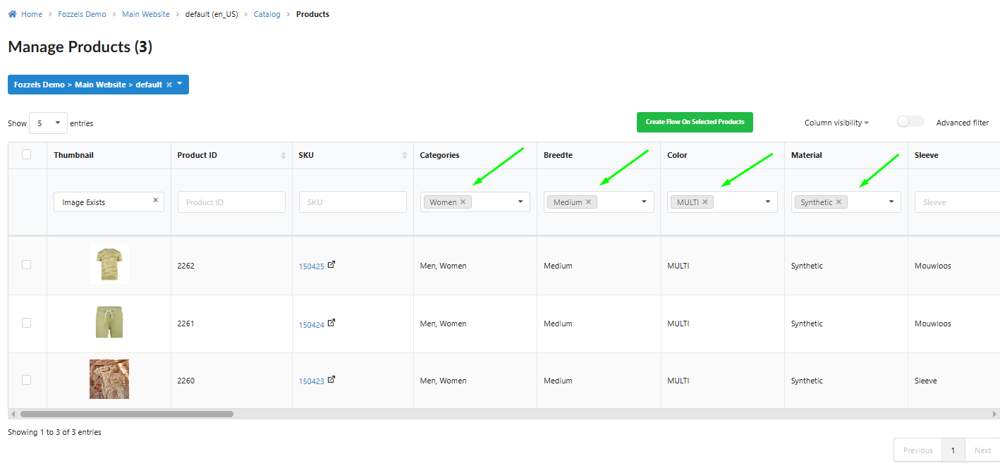
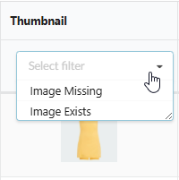

This guide explains how to effectively use the filtering mechanism within Fozzels to precisely select a subset of products based on attribute values, ensuring content generation is targeted and efficient.

### 1\. Accessing the Filtering Options

Filtering options are available in two primary locations:

1.  **Content Flow Creation:** To define the specific product batch a flow will process, **edit** an existing flow (or create a new one) and **go to** the **"Flow Selection & Prompt"** tab.
    

2.  **Product Catalog:**
    2.1 Enable the **"Advanced filter"** toggle. This opens a panel where you can add **"Add condition"** and **"Add condition group"** for complex logic.
    
    
    
        2.2 **Inline Filtering:** Filter products using input fields or dropdown lists located directly in the column headers of the product table (available for attributes with the **Filterable** flag enabled).
    

3.  _**Crucially:** In the Catalog, you can combine inline filters by applying conditions to multiple columns simultaneously (e.g., filtering by **SKU** **AND** by **Brand**)._

### 2\. Filtering by Value Conditions

This filtering type applies to text, numerical, and multi-select attributes.

1.  **Equal:** The attribute value must exactly match the entered value. _Example: Show only products where_ `Color` _equals_ `Blue`.

2.  **Not equal:** Show all products except those that exactly match the entered value. _Example: Show all products where_ `Material` _is not_ `Cotton`.

3.  **Is empty:** Show only products where the selected attribute has no value (is blank). _Example: Find products with an empty_ `Short Description`.

4.  **Is not empty:** Show only products where the selected attribute contains a filled value. _Example: Find products that have a filled_ `Manufacturer` _name_.

5.  **Contains:** The attribute value must contain the entered fragment of text or number. _Example: Find all products where_ `Name` _contains the word_ `Summer`.

6.  **Doesn't contain:** The attribute value must not contain the entered fragment of text. _Example: Exclude products whose_ `SKU` _does not contain_ `DISCOUNT`.

7.  **In / Not in:** The attribute value must match one of the multiple values entered (separated by commas) or must not match any of them. _Example (In): Show products where_ `Size` _is_ `S, M, L`.

8.  **Begins with / Ends with:** Find products by the starting or ending characters of the value. _Example: Find products whose_ `SKU` _begins with_ `P_`.

9.  **Is null / Is not null:** Technical conditions to correctly handle system-level empty or non-empty values.

### 3\. Filtering by Date Conditions

This type applies to attributes with a date format, allowing you to filter based on chronology (e.g., `created_at`, `updated_at`).

1.  **Is empty / Is not empty:** Shows records where the date field is absent or filled. _Example: Find all products without an_ `update date`.

2.  **Equal:** Shows records where the value exactly matches the entered date. _Example: Find all products created on_ `2024-01-01`.

3.  **Less:** Shows records where the date value is chronologically before the entered date. _Example: Find all products updated before_ `last month`.

4.  **Greater:** Shows records where the date value is chronologically after the entered date. _Example: Find all new products updated after_ `yesterday`.

5.  **Less or equal / Greater or equal:** Includes the entered date in the result set. _Example: Find all products updated on or after_ `01-01-2024`.

### 4\. Filtering by Product Images

This special filtering type is available in the **Catalog** via the inline filter in the **Thumbnail** column. It is critically important for content generation initiatives that use multimodal models.

1.  **Image Exists:** Show only those products that have an attached image.

2.  **Image Missing:** Show only those products for which an image is missing.

### 5\. Grouping Conditions (Advanced Logic)

You can build highly specific product batches using multiple conditions and groups.

1.  **Adding Multiple Conditions:** To filter by several attributes (e.g., `Color = Blue` **AND** `Size = M`), simply **click "Add condition"** multiple times.

2.  **Condition Group:** Clickin **“Add condition group”** allows you to combine conditions using complex logic (e.g., (`Category = Shirts` **AND** `Price > 50`) **OR** (`Category = Jackets`)).
