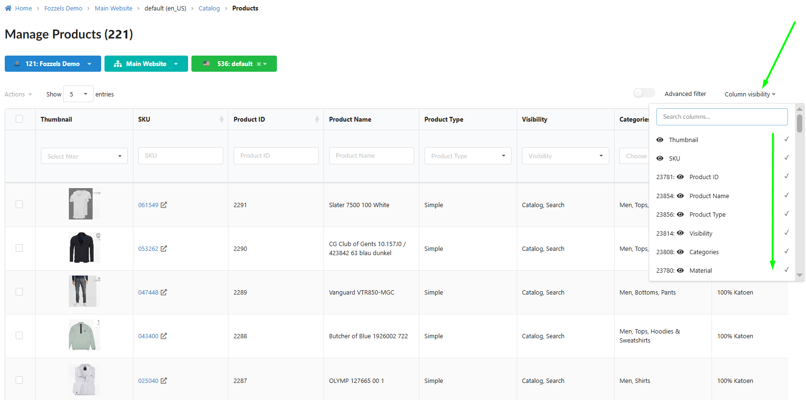
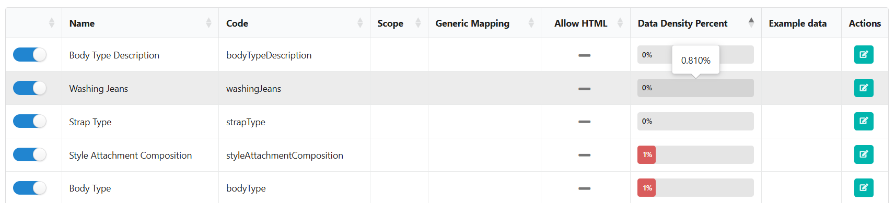
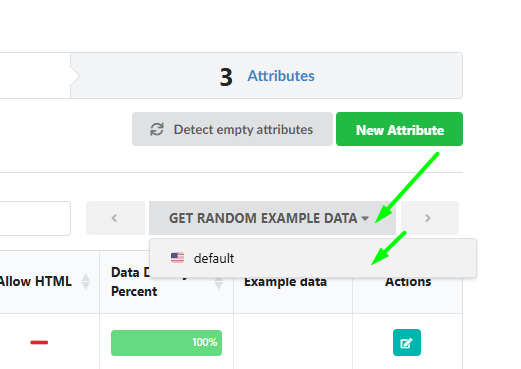
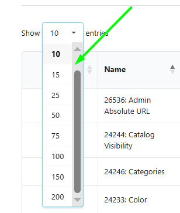
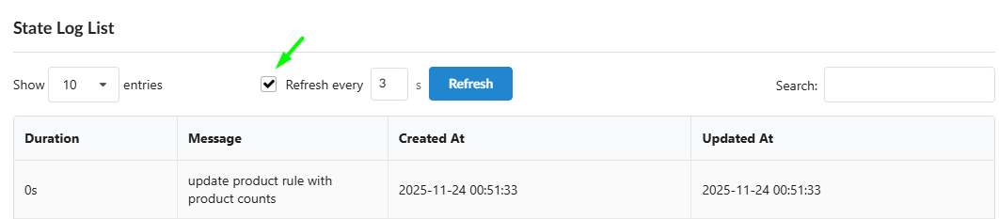
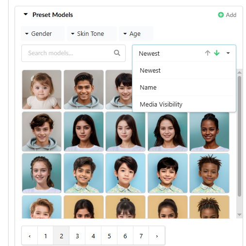
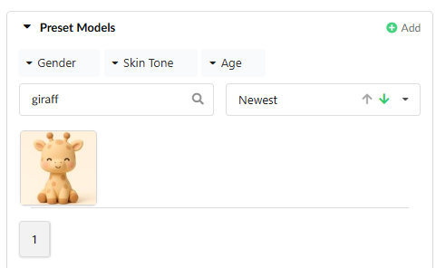

We strive to ensure that working with large volumes of data is not just fast, but also fully controllable and intuitive. Version 5.10 focuses on enhancing the quality of visual data and **significantly increasing the performance and convenience of using our Fozzels service.**

##

Boosting Performance and Data Quality

We've enhanced the UX to make managing large catalogs faster and working with content seamless.

### 1\. Catalog and Data Management

-   **Accelerated Catalog (New Defaults):** A new column visibility rule has been implemented in the Catalog. Approximately 20 of the most important attributes are now enabled by default. This significantly **simplifies the workflow** and **boosts the loading speed** and display performance of large catalogs.
    

-   **Attribute Accuracy (DDP Rounding):** The logic for displaying the Data Density Percent (DDP) has been updated. The DDP value is now rounded to **three decimal places**. This ensures accurate display of attributes with very low DDP (e.g., 0.040%), eliminating confusion caused by rounding to zero.

-
    

-   **Maximum Attribute Clarity:** The "Get random example data" block now displays the **full website and store name** (instead of abbreviations). You will always be confident about the specific data you are working with.
    

-   **Flexible Table Navigation:** Pagination options for attribute lists have been expanded: supporting 50, 75, 100, 150, and **"200"** elements. Easily manage massive datasets.
    

-   **Automated Catalog Log Refresh:** In the log tables that track product and attribute pool changes (**State Log List**), the automatic refresh function (**Refresh every X seconds**) is now **active by default**, enhancing the convenience of tracking active processes.
    
    2\. Generation and Workflows (UX)

-   **Instant Access to Settings:** An **"View attribute"** eye icon has been added to the Batch list table, next to the Attribute Name. This provides a quicker way to check the attribute settings and configuration.
    

-   **Column Control in "Save & Preview":** The **"Column visibility"** block has been added to the preview table (**Save & Preview**). This allows you to display only the necessary attributes, solving issues with overly large tables.
    

###
3\. Image Management and Visual Quality

-   **Clean Visual Catalog:** The system now automatically **ignores and does not display** invalid (broken) or empty image URLs across the catalog, reports, and generation lists. Say goodbye to broken images — your data now looks flawless.

-   **Enhanced Image Filtering (Image Flow):** New powerful tools have been added for sorting and filtering images in the Image Flow setup blocks:

-   Special filters allow switching between default and your own uploaded images (sorting by **Source**).

    -   Sorting by **Upload Date** and **Name** has been added.
        
        

-   **Terminology Clarity:** For increased clarity, "AI Model" in Image Flow settings has been renamed to **"Preset Model"**.

### 4\. Accelerated Mass Operations

-   **Full-Featured "Show Selected" (Catalog and Daily Report):** We have significantly improved the "Show Selected" function. Now, in both the **Catalog** and **Daily Report**, the table of selected items allows you to perform **all the same actions as the regular table**: view, filter, and apply **Mass Actions**.
    

-   **Reliability in Mass Actions:** We fixed a minor issue that occasionally caused the grid to remain empty if no items were selected. Working with mass actions is now even more reliable.

##
 Under the Hood: Stability and Modernity

-   **Targeted Integration Stabilization:** Necessary fixes have been implemented to improve the stability and functionality of integrations with platforms **WooCommerce, EK Retail, and Shopware**, ensuring reliable operation for clients with these specific setups.

Your experience is our priority. These updates are just a part of our continuous work to improve Fozzels. Thank you for being part of our community!
[Our Instagram](https://www.instagram.com/fozzelsai/)
