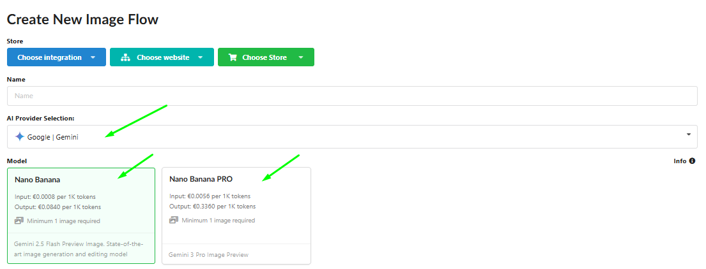
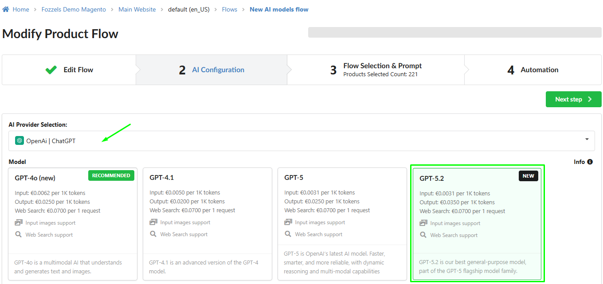
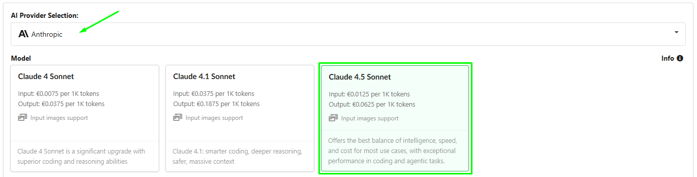
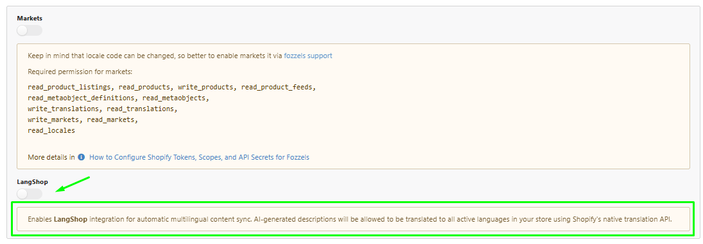
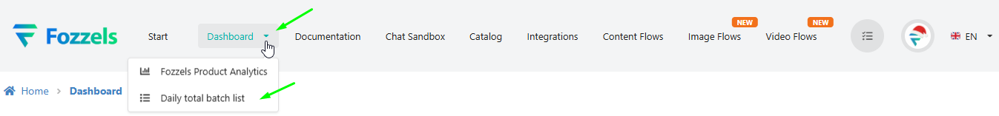
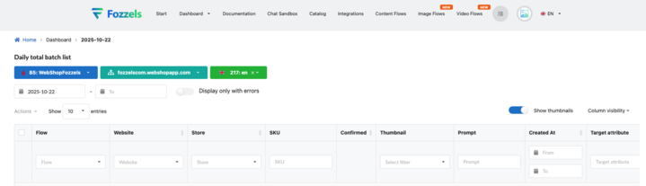
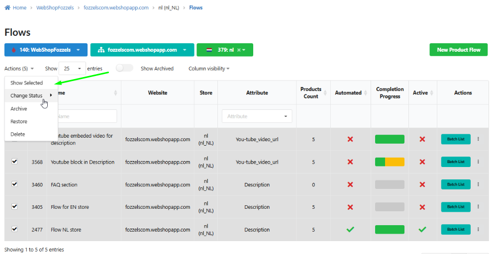

We are excited to present **Release 5.11**!

We just made our application even more powerful! We've worked hard, listening to your feedback, to deliver an update that doesn't just add new features, but **transforms your workflow** and makes your daily app usage seamless and enjoyable. Your time is valuable, and this update is designed to save it.

## **New Capabilities: Creativity and Intelligence Without Limits**

These features will completely change how you interact with the app, opening new horizons for productivity and convenience.

#### **1\. Incredible Image Quality, Powered by Gemini**

-   **Benefits:** We've upgraded our image generation tools to include **Nano Banana** (speed and efficiency) and **Nano Banana PRO** (studio-grade quality), utilizing advanced Gemini models. **Your visual content is now smarter and more detailed!**

-   **Where to Find It:** Open **Image Flows** (in the header) and create a new Flow. You will see the model selection under the **"AI Provider Selection"** field.
    

#### **2\. Content Intelligence Revolution: New AI Power!**

-   **Benefits:** We have integrated industry leaders for text content generation: **OpenAI GPT-5.2+** and **Anthropic Cloud 4.5**. You now have the complete freedom to choose **the world's best AI model**, ensuring the highest quality, creativity, and reliability of your content.

-   **Where to Find It:** Create a new Flow in the **Content Flows** section (in the header). You will find the new models in the **"AI Provider Selection"** dropdown list.
    _GPT-5.2_
    

    _Claude 4.5 Sonnet_
    

**3\. Breakthrough in Global E-commerce: LangShop in** **Shopify** **Support!**

-   **Benefits:** This is the biggest update for our Shopify users! Now, AI-generated content is **automatically translated and synced** with all active languages in your store. You can scale your business without manual translation and **reach customers all over the world**.

-   **Where to Find It:** When **Creating or Configuration Integration** for Shopify (in the Integrations section), proceed to step **1\. Configuration**. The **«LangShop»** option is located at the bottom of the page.
    

## **Enhancements: Control and Speed**

We have polished every corner of the application to make your daily usage even faster, more reliable, and intuitive.

#### **4\. Instant Access to Analytics!**

-   **Benefits:** We added a convenient sub-menu to the **«Dashboard»** link in the header. Now you can access the **"Daily Total Batchlist"** from _any_ page, **saving navigation time and keeping you in the context** of your work.

-   **Where to Find It:** Click on the arrow next to **«Dashboard»** in the header to see the dropdown menu.
    

#### **5\. Precise Data Control: Dashboard Filtering!**

-   **Benefits:** New filtering fields have been added to your **Daily total batch list** for **Integrations, Websites, and Specific Stores**. **Instantly isolate and analyze** results, seeing only the necessary data, which increases the accuracy of quality control.

-   **Where to Find It:** Go to the **Daily total batch list** (via Dashboard). The filters will appear directly above the data table.
    

#### **6\. Flow Management at the Speed of Light: Updated Mass Actions!**

-   **Benefits:** Save hours! We added **«Change Status»**, **«Delete»**, **«Archive»**, and for archived flows, **«Restore»** functionality to the Mass Actions menu. **Your flow management is now 80% faster and more organized**, giving you full control over the Flow lifecycle.

-   **Where to Find It:** On the **Flows** page. Select multiple flows and click the **«Actions (X)»** menu above the table.
    

**Try it today and feel how much more productive your work can be!**

We are grateful to you for being part of the Fozzels community. Your feedback is our main driving force for progress.
We **continue to work** to provide you with the best content automation tools. There is still much **new and important** to come!

Thank you for being with us!
