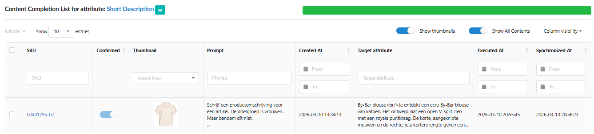
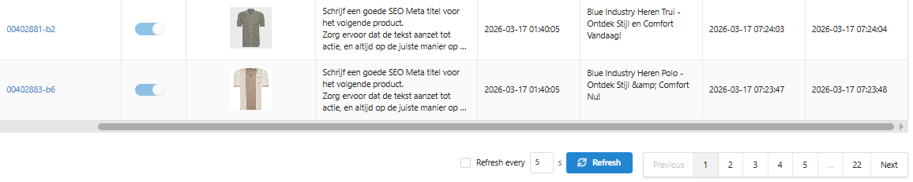
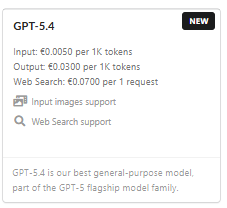
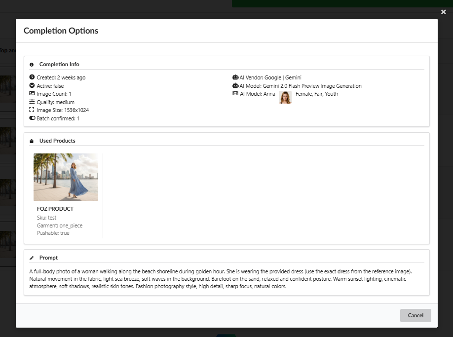
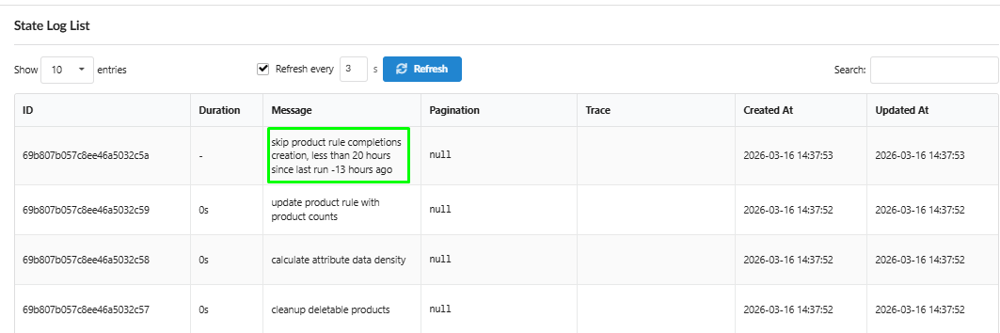

We’ve combined two major updates to make your content workflow more reliable and your synchronization capabilities limitless.

##  Globalization & SEO Excellence

-   **Shopify Metafields Localization (v5.16):** You can now generate and sync text-based **Metafields** for **Shopify Markets** and **Langshop**. This covers both default stores and additional language translations.

-   **Fix: SEO Meta Title Reset (v5.15):** We’ve resolved an issue where Meta Titles could reset to their original values. Your optimized SEO titles are now securely saved across all markets and languages.

-   **Shopify SEO Guard (v5.16):** To prevent data inconsistencies, the system now restricts standard SEO field synchronization for non-default stores (due to Shopify API architecture).

-   **Shopify API Compliance:** Our apps have been fully updated to meet the latest Shopify requirements. **Note:** If you received an email regarding the **April 1, 2026** deadline - don't worry, we’ve already handled it. Everything is set for stable operation.

##
WooCommerce: Smart Diagnostics (v5.16)

Integration setup is now transparent and foolproof:

-   **Connection Diagnostics:** Automatic verification of API credentials and permissions every time you save.

-   **Plugin Status Check:** Fozzels now detects if **ACF, Yoast SEO, AIOSEO, or WPML** are active and correctly configured.

-   **Conflict Detection:** The system warns you if multiple SEO plugins are active simultaneously to avoid sync errors.

-   **Outdated Connector Alerts:** Get notified if your Fozzels connector plugin needs an update, with a direct download link provided.

## Interface & Efficiency (v5.15 & v5.16)

-   **Inline Filters (v5.15):** The **Content Completion List** now features inline filtering. You can search and sort products directly within specific columns, not just by Target Attribute.
    

-   **Daily Report "Refresh" (v5.16):** Added a manual **Refresh** button and a customizable **auto-refresh interval** (e.g., every 3s, 5s, or 10s). Perfect for real-time monitoring of large batches.
    

-   **Flow Status Accuracy (v5.15):** Fixed the status indicators in the Flow List. The "Generated/Synchronized" counts now precisely reflect the actual state of your products.

## AI Power & Content Quality (v5.16)

-   **GPT 5.4 Support:** Integrated the latest and fastest AI model for top-tier content quality.

-   **Enhanced Discover Mode:** Our "Try it out" feature is now powered by **Claude**, using expanded prompts to deliver deep, structured, and high-quality sample descriptions.

-   **Advanced Completion Options:** Every saved generation now stores its full "technical passport" — all properties and settings used for that specific result are available for review.
    

## System Stability & Performance (v5.16)

-   **Flow Stability Fix (20h Window):** We’ve optimized the interval for re-running flows from 24 to **20 hours**. This ensures that even with slight pull schedule shifts, your daily generations will never be skipped.
    

-   **Image Flow Fixes:** Improved the stability of image processing and transfers between Fozzels and your store.
