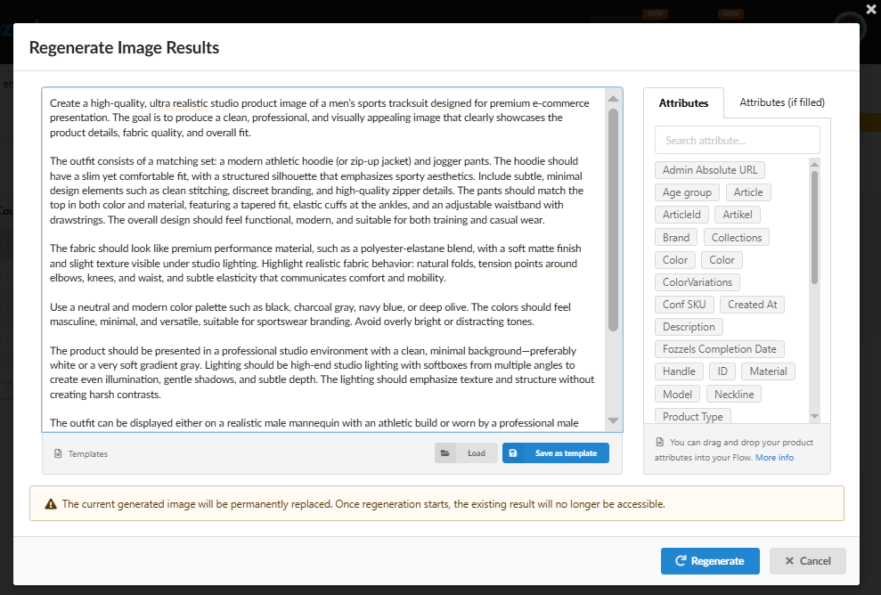
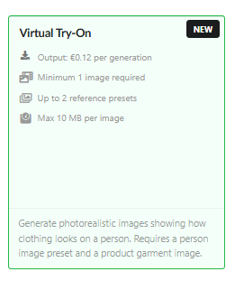
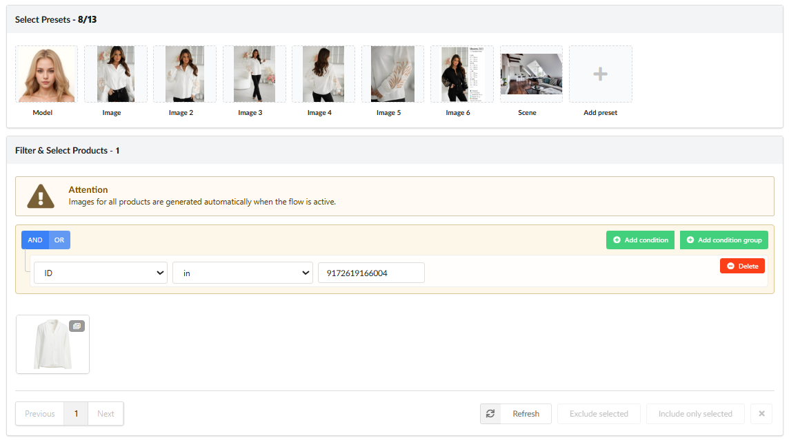
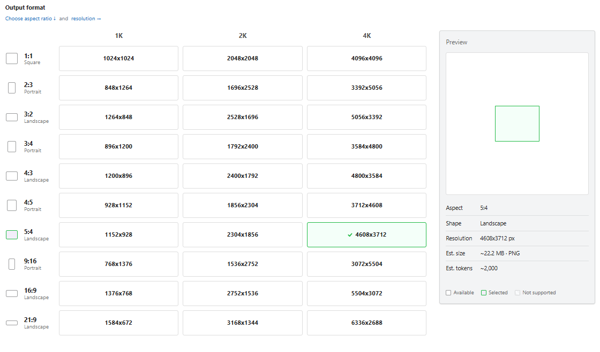

We have taken our technology to the next level by transforming visual flows into a **fully automated format**. This is an evolutionary step that today's businesses demand: **Automation - Personalization - Scaling**. This update turns Fozzels into an intelligent ecosystem where complex technologies work in synergy with your business data, ensuring speed without losing control.

### 1\. Automated Flows: Content Without Interruptions

We have expanded the system's capabilities by creating autonomous generation cycles that integrate into your daily business rhythm.

-   **Auto-Queueing & Self-Start**: The system automatically updates queues after each product catalog refresh, independently launching processes for new SKUs.

-   **Fully Automatic Generation**: You can activate a fully automatic generation mode, allowing the AI to continuously prepare content in the background for your subsequent review.

-   **Automation Control & Limits**: Set custom daily limits (Amount per day) to precisely control the pace of media library filling and resource expenditure.

-   **Important Note on Activation**: Automatic generation is activated **only for products that pass your configured filters**. If you activate such a flow, the system will begin work only with the selected set of products, not the entire catalog at once.

### 2\. Deep Personalization via Dynamic Prompting

We have implemented logic where every pixel is based on real product characteristics, guaranteeing 100% content alignment with your brand.

-   **Smart Attribute Mapping**: Use any technical product parameters (**Color, Brand, Material**, etc.) directly in the prompt field using Drag-and-Drop.

-   **Dynamic Templates**: A single prompt automatically adapts to thousands of products, substituting unique attribute values for each SKU to create precise visuals.

-   **Smart Regeneration Pop-up**: If a result needs adjustment, you can update the prompt or add new attributes directly in the regeneration pop-up without changing the main flow settings.

### 3\. Virtual Try-On and Visual Creativity: New Horizons for Your Imagination

We haven't just added new models - we've provided the tools to create a unique visual universe for your brand. This is a space where technological precision meets your creative vision.

-   **Gemini Virtual Try-On**: This is a true breakthrough in the Fashion segment. Now you can create photorealistic images of how clothes look on a real person using only a product photo and a selected model preset. The AI meticulously reproduces fabric texture, shadows, and natural fit, allowing for professional content creation without complex photo shoots.
    

-   **Limitless Creativity with Presets 2.0**: We have expanded the reference limit to 13 images simultaneously. This is your digital mood board: upload photos with specific lighting, angles, or color schemes. The AI synchronizes these details, creating a cohesive visual story that fully matches your brand's DNA.
    

-   **Interactive Visualization (Model-Specific Grids)**: For every model, including the advanced **Gemini 3.1 Flash** or **Nano Banana 2 or Pro**, the system automatically generates a convenient format grid. You can visually evaluate resolution and proportions, and immediately see an estimated resource cost before clicking "Generate".
    

-   **Creativity as a Strategy**: Now you can experiment with styles, backgrounds, and product presentations in minutes. This allows your brand to stay relevant, react instantly to trends, and create attention-grabbing content without spending weeks on preparation.

### 4\. Scaling and Safety "Guardrails"

Massive operations require reliable control tools to ensure processes remain transparent and secure.

-   **Surgical Filtering**: Use flexible catalog filters and then point-selectively exclude or add items using the **Exclude/Include selected** buttons.

-   **Batch List & Persistence**: A full log of all generations ensures transparency. Even if a product is deleted from your store, its generation result remains permanently in your Fozzels history.

-   **Smart Information Blocks**: We have added tooltips and warnings at every critical stage. This ensures you always understand the implications of bulk actions, such as the permanent replacement of an image during regeneration.

Try the power of the updated automated flows in Fozzels today!
