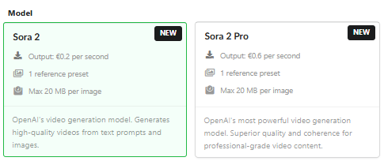
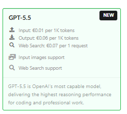
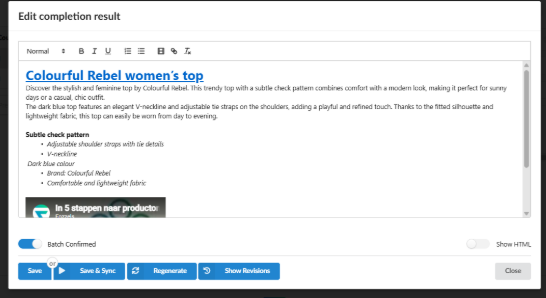
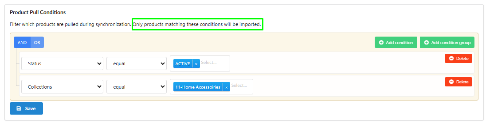

This release is all about power and control. We’ve integrated the world’s leading AI models and added the features you’ve been asking for most to make your content workflow truly seamless.

###
Video Revolution: Sora & Sora 2

We are thrilled to announce support for OpenAI’s most advanced video models, changing the game in Video Flow.

-   Cinematic Quality: Sora and Sora 2 models provide incredible detail and natural motion dynamics.

-   Video from AI References: Use images generated within Fozzels AI as a base (Source Image) for your videos. Perfect for creating consistent lookbooks and high-end brand campaigns.
    

###
Next-Gen Intelligence for Content: GPT 5.5

Your text content is now powered by OpenAI’s smartest model yet.

-   Deep Contextual Awareness: GPT 5.5 offers superior analysis of product attributes, producing natural and highly persuasive descriptions.

-   Conversion-Focused: Output is more structured and sales-oriented right out of the box.

### New Image Models (Grok & GPT)

-   xAI Grok Imagine: Featuring Image and Image Pro models for unique artistic styles and high-speed production.

-   OpenAI Visuals: Introducing GPT Image 1 Mini for rapid drafting and GPT Image 2 for premium photorealistic masterpieces.
    
    

### WHAT EVERYONE WAS WAITING FOR: Built-in Text Editor!

You can now edit and format generated descriptions directly within Fozzels. Take full control of your copy before synchronization:

-   Rich Text Tools: Use headings (H1-H3), lists (bulleted/numbered), bold, and italics to structure your content.

-   Embed Video: Add YouTube links - the video will appear as an embedded player directly on your product page.

-   One-Click Reset: Use the "Clear formatting" tool to instantly reset text to plain body style.

###
Smart Catalog Filtering (Shopify, Magento, Akeneo)

You decide exactly what to import into Fozzels.

-   Integration-Level Filtering: Filter products by categories, tags, or groups during the initial connection setup.

-   Clutter-Free Catalog: No more unnecessary content - work only with the items you need right now.

###

WordPress (WooCommerce) Breakthrough

-   Full Variation Support: We’ve gone deeper - full synchronization (both text and visuals) is now available for every individual product variation (color, size, etc.).
    
    

### "Product Count" Column

-   Queue Transparency: A new column in Image/Video Flow lists displays the total number of products waiting for generation, not just the count of completed results.
    

###
Fixes & Enhancements

-   AI Chatbot: Improved sensitivity and accuracy when mapping your specific integration attributes.

-   Dynamic Flow Toggles: Activation/Deactivation is now instant—no need to click "Save" to apply status changes.

-   Prompt Stability: The template library now remains stable even when saving complex custom prompts with intricate content.

_
Fozzels gets stronger thanks to your feedback. Let's keep building the future of e-commerce together!_
