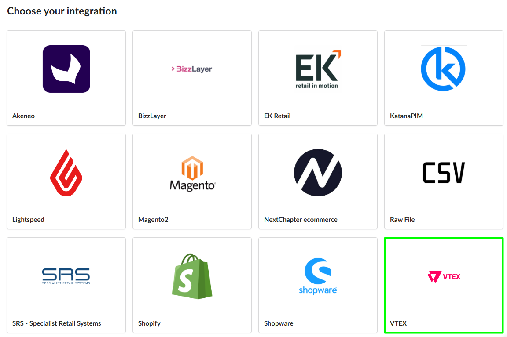
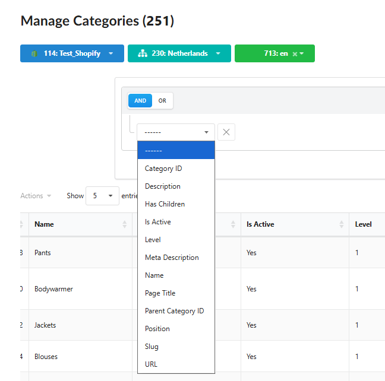
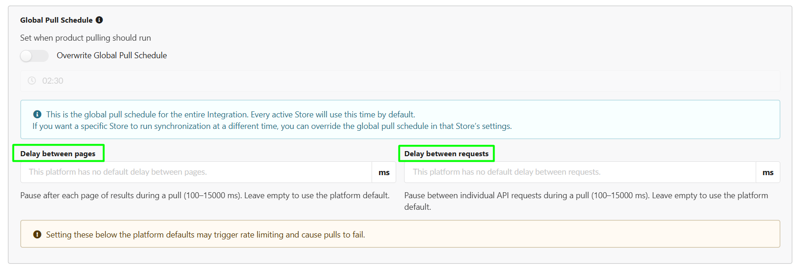
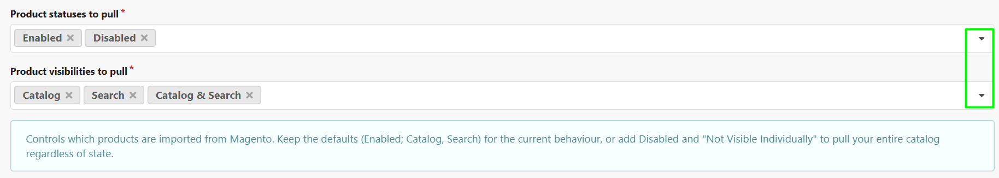
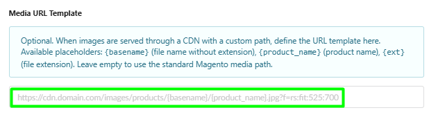

We are excited to introduce Fozzels vaersion 7.6! This release brings a brand-new platform integration, deeper category and image data accessibility, precise synchronization and API pull controls, and major upgrades to AI image generation workflows. Explore all the new features below.

1.  **New Integrations VTEX Integration** (Phase 1): We are launching initial support for the VTEX e-commerce platform! Connect your VTEX store to pull core catalog data, generate AI metadata and localized product descriptions, and sync them back seamlessly.
    

2.  **Data Attributes & Metadata Extended Category Parameters (Shopware, Magento, Shopify)**: You can now access deep category-level parameters - including Category IDs, Slugs/URLs, and structural identifiers - directly inside prompt workflows and attribute mappings for richer AI context.
    

3.  **Alt Texts Display in Image Preview Gallery (Magento 2)**: Hovering over or clicking a product thumbnail in catalog lists now displays its associated Alt text directly beneath the preview popover, making image metadata verification fast and effortless (fully supported for Magento 2).
    

4.  **Controls Global Pull Schedule & Flexible Pull Throttling:** Added advanced pull controls to the Integration Settings page across all supported platforms. **Pull Throttling**: Set custom delays between pages and individual API requests (from 100 to 15,000 ms) to manage API load and prevent rate-limiting errors on large catalogs.
    

5.  **Expanded Product Pull Filtering for Magento (Any State)**: Filter Magento catalog imports by status (Enabled, Disabled) and visibility (Catalog, Search, Catalog & Search, Not Visible Individually). Easily pull and optimize your entire catalog, including disabled items and drafts.
    

6.  **Custom Image Base URL / CDN Support for Magento:** Specify a custom media domain or CDN path (e.g., Cloudflare, AWS S3) for product image fetching, ensuring uninterrupted media processing regardless of where your storefront hosts images.
    

7.  **Assets Support for Multiple Reference Images:** You can now select multiple product photos along with multiple style presets (within the AI model's capacity limits) for a single generation task to achieve higher visual accuracy and realistic details.
    

8.  **Full Product Image Set Downloads**: Downloading generated media now exports the entire set of generated images associated with a product SKU, rather than limiting the download to just the first asset.
    

9.  Upgraded our core image generation models (**Gemini 3.1 Flash Image & Gemini 3 Pro Image)** to their latest stable releases for faster rendering, higher visual quality, and rock-solid stability.
    Thanks for being with Fozzels! We hope these updates make your daily content workflow even smoother. Feel free to reach out if you need any help with the new features!
