**Fozzels - WooCommerce** integration now officially supports **Advanced Custom Fields (ACF)**!

This feature allows you to synchronize unique and extended product characteristics (such as technical specifications, multi-language descriptions, or special parameters) that you add via ACF, enabling you to create more detailed and competitive product feeds for marketplaces.

Successful integration requires key configuration steps in both WordPress and Fozzels.

###

## **Part 1: Preparing Data in WordPress (ACF and REST API)**

Before activating ACF in Fozzels, ensure that your WordPress and ACF are configured to correctly transmit this special data via the REST API.

### Step 1: Checking and Configuring Permalinks

For the REST API to function correctly, the permalink structure must be different from the default (plain) structure.

1.  Log into your WordPress admin panel and navigate to **Settings** / **Permalinks**.
    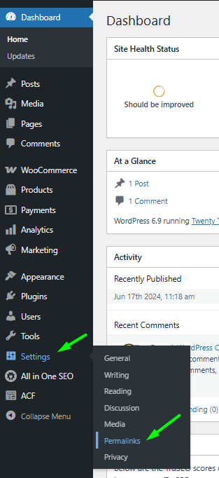

2.  Choose a structure that does not use parameters (the **"Post name"** structure is recommended).
    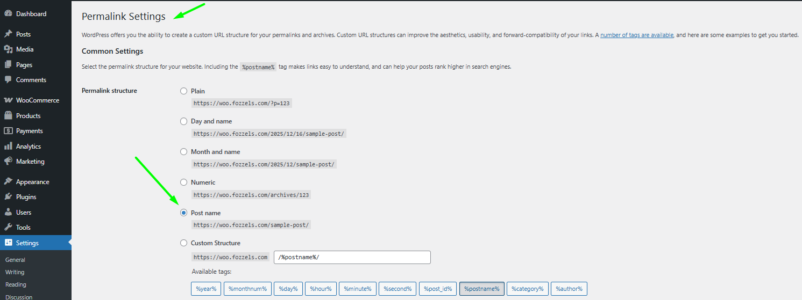

3.  Verify that **v3** is selected in the **Request Version** field.
    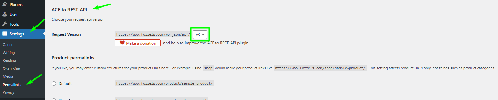

4.  Save the changes.
    

###
Step 2: Navigating to the ACF Field Group

1.  In the WordPress menu, go to **ACF** / **Field Groups**.
    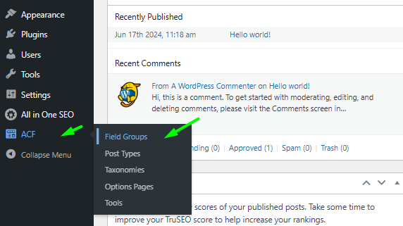

2.  Click on the name of the Field Group that contains the fields you need to synchronize for your WooCommerce products (e.g., **"Fozzels Description"**).
    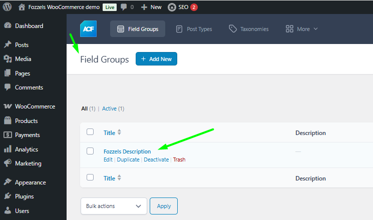

###
Step 3: Configuring the Field Group for API Access (Crucial Step)

In the **Field Group** editing window, verify the location rules and enable API access.

#### 3.1. Checking Location Rules

1.  On the **Location Rules** tab, ensure the rule is set to: **Post Type** _is equal to_ **Product**.
    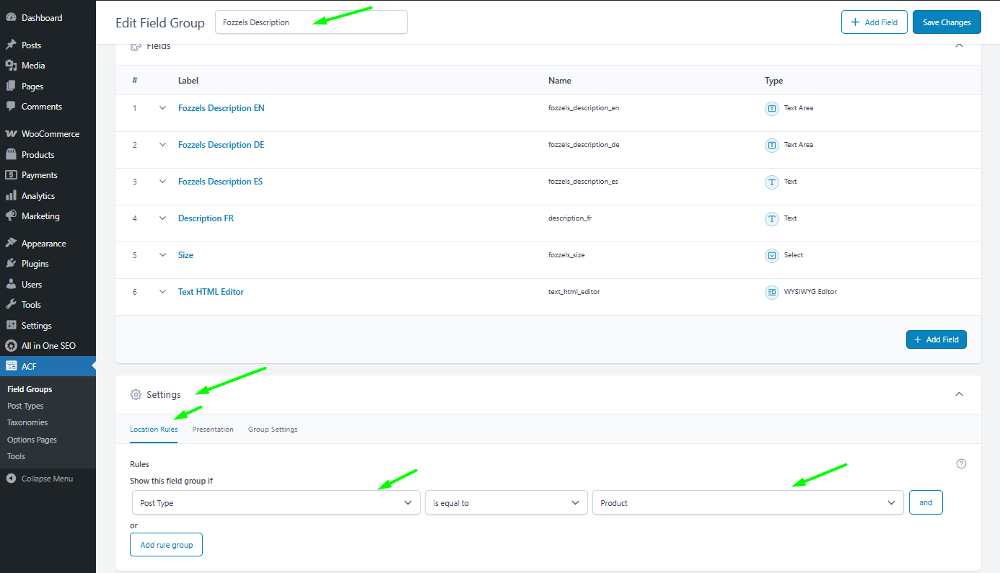

#### 3.2. Activating REST API and Group

1.  Navigate to the **Group Settings** tab.
    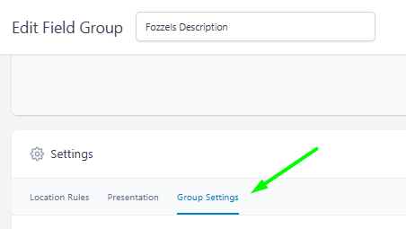

2.  Ensure both toggles are enabled (switched to **ON**):

-   **Active**

    -   **Show in REST API**
**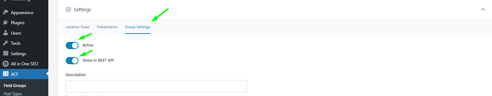**

3.  Save the changes by clicking **Update** or **Publish**.
    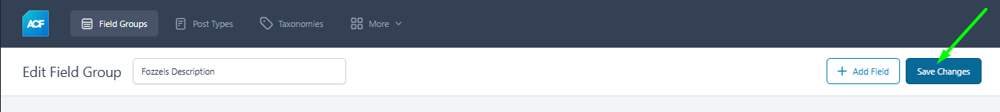

###
Step 4: Checking ACF REST API Version

If you are using an additional plugin to integrate ACF into the REST API (such as `ACF to REST API`), you must ensure the selected version is compatible with Fozzels.

1.  Go to **Settings** / **Permalinks** / **ACF to REST API**.

2.  Verify that **v3** is selected in the **Request Version** field.
    

    > **Fozzels Requirement:** The integration requires **v3 REST API support**.
    >
    >

3.  Save the settings.
    

## **Part 2: Activating ACF in Fozzels**

Once the preparation in WordPress is complete, activate the feature within your Fozzels integration settings.

1.  Log into your Fozzels account and go to edit your WooCommerce integration.

2.  In the **Configuration** section, find the **"Enable ACF (Advanced Custom Fields)"** toggle.

3.  **Activate it** (switch it to **ON**).
    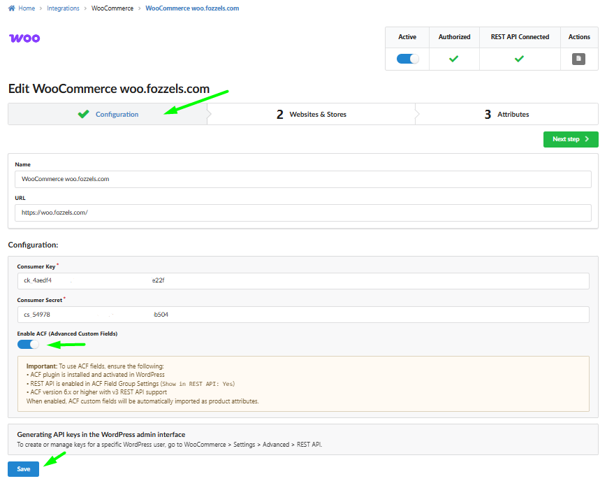

> **Important!** Note the requirements confirmed by Fozzels:
>
> -   ACF plugin is installed and activated in WordPress.
>
> -   REST API is enabled in ACF Field Group Settings (Show in REST API: Yes).
>
> -   ACF version 6.x or higher with v3 REST API support.
>

4.  Click **Save** at the bottom of the page.

## **Part 3: Using ACF Fields in the Flow and Catalog Update**

Fozzels treats ACF attributes as **regular product attributes**, and you work with them using the standard flow.

1.  After activating the **"Enable ACF"** toggle and clicking **"Save"**, you must **run the data import process**:

-   **If you are updating an existing integration:** Restart the product and attribute pool. This will refresh the data in the Fozzels catalog and import the new ACF fields.

    -   **If this is your first integration:** Simply run the product pool according to the general integration setup rules.
        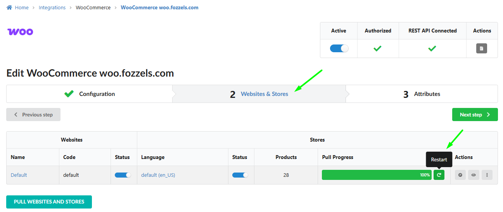

2.  After the pool successfully completes, navigate to section **3 Attributes,** check new attributes and their configurations**.**
**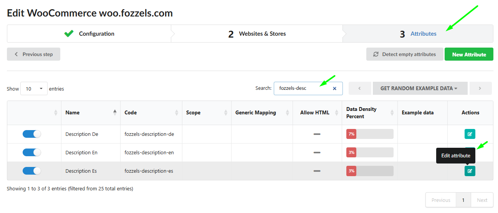**
    If you have any questions or need assistance with setting up the ACF integration, our support team is always happy to help! Please contact us viа **support@fozzels.com**.
