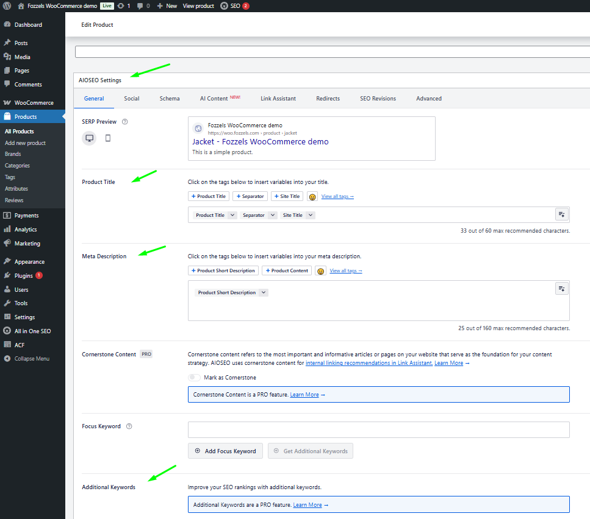
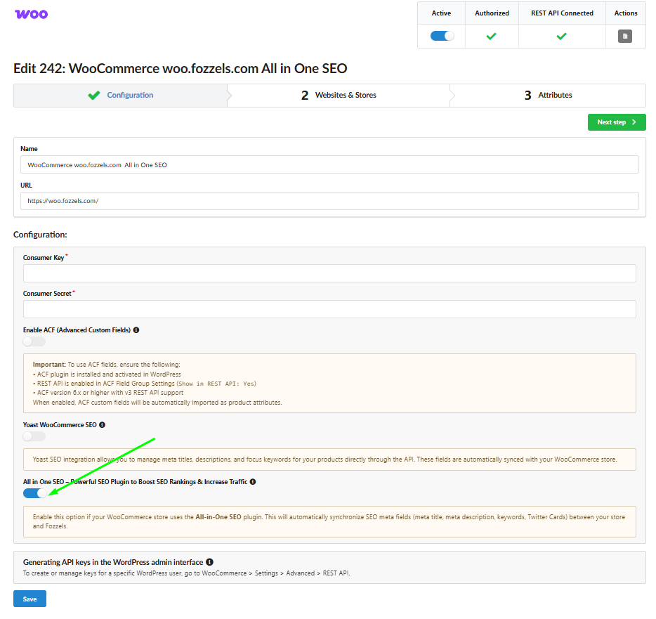

###

**All in One SEO (AIOSEO)** is the leading WordPress plugin designed to improve search rankings and drive organic traffic by automating critical SEO elements like meta tags and social previews.

We are thrilled to announce **full integration between Fozzels and AIOSEO for WooCommerce!** This powerful combination allows you to treat SEO fields as standard product attributes. You can now:

-   **Automate at Scale:** Generate unique, AI-optimized SEO titles and descriptions for thousands of products simultaneously.

-   **Social Media Mastery:** Automatically manage **Twitter Cards** and **Open Graph** data to ensure your products look perfect when shared on social platforms.

-   **Smart Workflows:** Use **Content Flows** to edit and transform SEO data just like any other product attribute.

-   **Seamless Sync:** Eliminate manual data entry by instantly pushing AI-generated content directly into your WooCommerce store via our dedicated API connector.

This guide explains how to connect **Fozzels**, **WooCommerce**, and **All in One SEO (AIOSEO)** to automate your store's metadata. By following these steps, your SEO fields will behave like standard product attributes, allowing you to generate and sync search-optimized content in bulk.

## Step 1: Verify and Activate AIOSEO in WordPress

Ensure the core SEO plugin is active on your WooCommerce site:

1.  Log in to your WordPress Admin Dashboard.

2.  Navigate to **Plugins** > **Installed Plugins**.
    

3.  Locate **All in One SEO** in the list:

    -   If disabled, click **Activate**.

    -   If active, you can click **Check this plugin** to verify its current health and settings.
        

4.  **Verify Fields:** Open any product under **Products**. Scroll down to the **AIOSEO Settings** block. You should see the standard fields for _Product Title_ and _Meta Description_.
    

###
Step 2: Install the "AIOSEO API Sync by Fozzels" Plugin

Standard AIOSEO settings only allow external tools to read data. To **sync** generated content back to your store, you must install our specialized connector:

1.  In your WordPress menu, go to **Plugins** > **Add Plugin**.

2.  Click **Upload Plugin** at the top of the page.
    

    

3.  Select the provided ZIP file (**AIOSEO API Sync by Fozzels**), click **Install Now**, and then **Activate**.
    

4.  This plugin enables the secure two-way transfer of SEO metadata via the WordPress API.

**\*\*\* You can download the necessary ZIP file for the 'AIOSEO API Sync by Fozzels' plugin, which is attached at the bottom of this article.**

### Step 3: Enable Support in Fozzels

Activate the integration within the Fozzels platform:

1.  Open your **Configuration Tab in your existing or new WooCommerce Integration** in Fozzels.

2.  Locate the section: **"All in One SEO – Powerful SEO Plugin to Boost SEO Rankings & Increase Traffic"**.

3.  Switch the toggle to **On and SAVE changes.**

### Step 4: Identification of SEO Attributes

Once activated, all SEO-related fields will automatically appear in your general Fozzels attribute list. They are easy to identify and pre-configured for immediate use:

-   **Technical Codes:** Every SEO attribute is labeled with a specific code starting with `_aioseo_` (e.g., `_aioseo_title`, `_aioseo_description`, `_aioseo_keywords`).

-   **Default Settings:** For your convenience, these attributes are automatically set to:

    -   **Active**

    -   **Allowed HTML**

    -   **Filterable**

-   **Social Media:** You can also manage social previews via attributes like `_aioseo_twitter_title` or `_aioseo_og_title`.
    

### Step 5: Content Flows and Synchronization

The biggest advantage of this integration is that SEO fields now behave like regular product data. You are no longer limited to basic syncing:

-   **Create Custom Flows:** You can build specific **Content Flows** for these attributes. Use your existing AI templates or create new ones to generate optimized SEO titles and descriptions.

-   **Standard Workflow:** Treat SEO attributes like any other product field—edit them, apply filters, or map them to different data sources within Fozzels.

-   **Instant Update:** Once your generation is complete, click **Sync to Store**. Fozzels will instantly populate the corresponding AIOSEO fields on your WooCommerce site with the new AI-generated content.
