This guide walks you through the complete process of connecting your Shopware 6 online store with Fozzels.
The integration consists of two parts:

# Part 1: Create an Integration in Shopware 6

    In this part, you will create an API integration inside your Shopware 6 administration panel. This generates the credentials that Fozzels needs to communicate with your store.

### 1\. Introduction

    Go to your Shopware 6 Administration panel. You can usually find it at [your store URL](https://shopware6.fozzels.com/admin).

### 2\. Click "Settings"

    Click on "Settings".

### 3\. Click on "System"

    Navigate to the system settings.

###
4\. Click "Users & permissions"

    Select the Integrations option from the System menu.

### 5\. Scroll down to "Roles" and click "Create role"

   On the Users & permissions page, scroll down to the Roles section and click the "Create role" button.

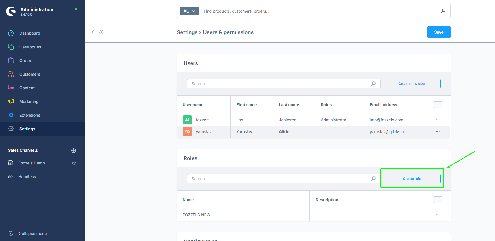

### 6. Fill in the role name

    On the "General" tab, enter a name for the role.

### 7\. Click on the "Permissions"

You will see the permissions table with all checkboxes unchecked. Enable the following permissions:

**Catalogues (View, Edit, Create, Delete):**

-   Categories
-   Dynamic product groups
-   Landing pages
-   Manufacturers
-   Products
-   Properties
-   Reviews

**Content:**

-   Media (View, Edit, Create, Delete)
-   Shopping Experiences (View, Edit)
-   Themes (View, Edit)

**Other** (View, Edit, Create, Delete):

-   Sales Channels

**Settings:**

-   Currencies (View, Edit, Create, Delete)
-   Custom fields (View, Edit, Create, Delete)
-   Languages (View, Edit, Create, Delete)

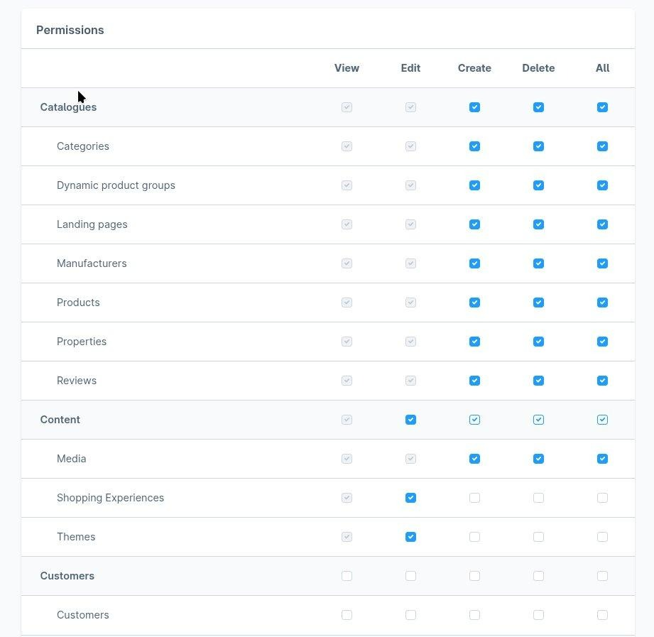
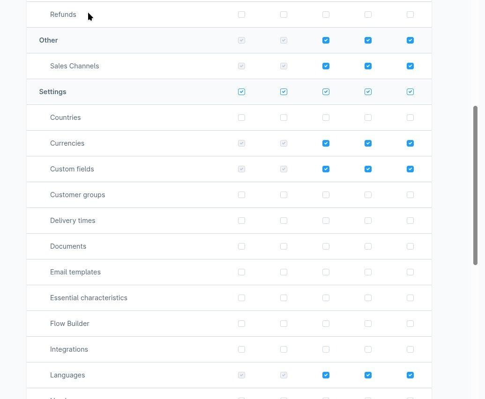

### 8. Save the role

    After setting all permissions, click "Save" to save the role.

###  **9.** Go to System > Integrations

**10.** **Click "Add integration"**

    Click the "Add integration" button. The "Create integration" dialog will appear:

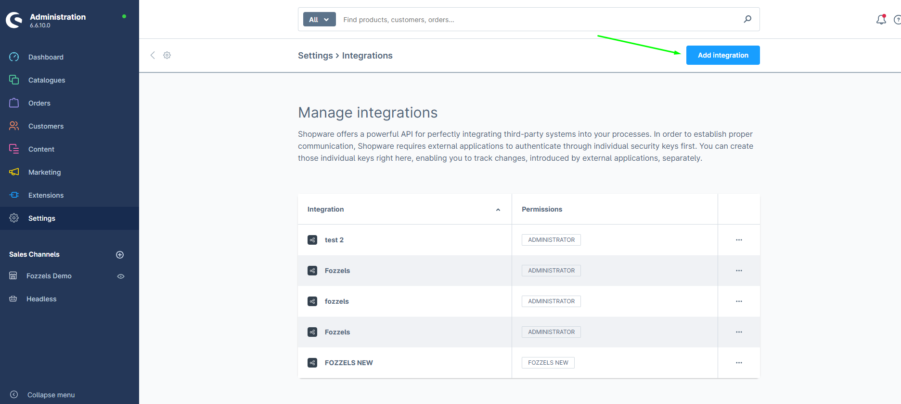

**11.** Fill in the integration details

    Enter a name for the integration. Then open the "Roles" dropdown and select the role you created in previously.

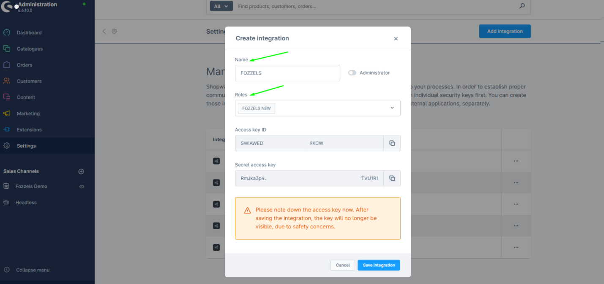

###
12\.  Copy the Access Key ID

    Click the copy icon next to the **Access Key ID** to copy it to your clipboard. Paste this key into a text document for safekeeping - you will need it in Part 2.

**13\.**  **Copy the Secret Access Key**

    Do the same for the **Secret access key**: click to copy the Secret access key to your clipboard. Then paste this code into some text document so that you can access and copy the code later.

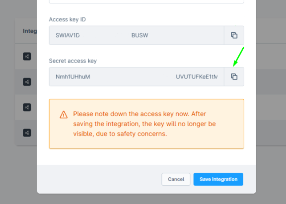

### 14\. Click "Save integration"

    Save the integration settings.

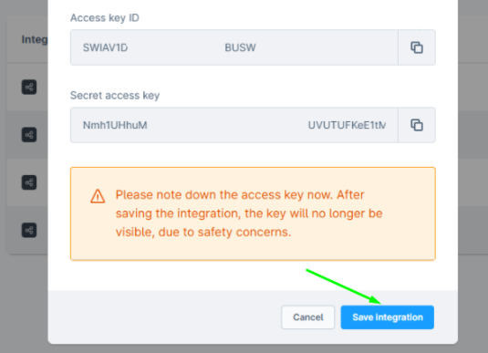

### 15\. Confirm the success message

    The integration is now created and active.

###

# Part 2: Connect Fozzels to Shopware 6

    Now that you have created the integration in Shopware, you will configure the connection on the Fozzels side using the credentials from Part 1.

### **1.** Go to [Fozzels.com](https://fozzels.com/)

###
**2.**  Click "Integrations"
    In the Fozzels menu, click on Integrations.

3\. Click "Create"
    Click the "Create" button to start setting up a new integration.

4\. Select the Shopware logo

    Choose Shopware as the integration type by clicking on the Shopware logo.

### 5\. Fill in the integration details

Fill in the following fields in order:

1\. Name — Enter a name for this integration, for example "Shopware 6".

2. URL — Enter your Shopware 6 online store URL (e.g., https://your-store.com).

3. Access Key ID — Paste the Access Key ID that you copied from Shopware in Part 1.

4. Secret Access Key — Paste the Secret Access Key that you copied from Shopware in Part 1.

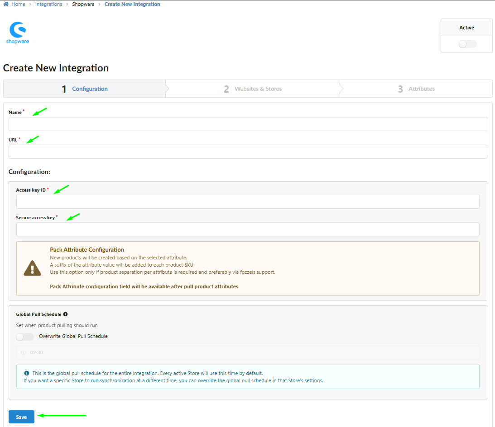

**6**. When all fields are filled in, click "Save". You should see a "Success" pop-up confirming the connection was saved.

### 

### 7\. Activate the integration
    Toggle the "Active" switch to on to activate the integration.

**8.** **Pull Websites and Stores**
    Click the "Pull Websites and Stores" button. Fozzels will retrieve all your sales channel data from Shopware.
   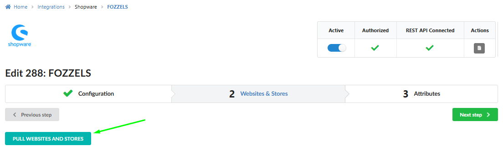
9\. Enable your store connection
    Toggle the Status switch to on for your store.

10. Enable store views / sales channels

    Enable the available store views or sales channels that you would like to use in Fozzels.
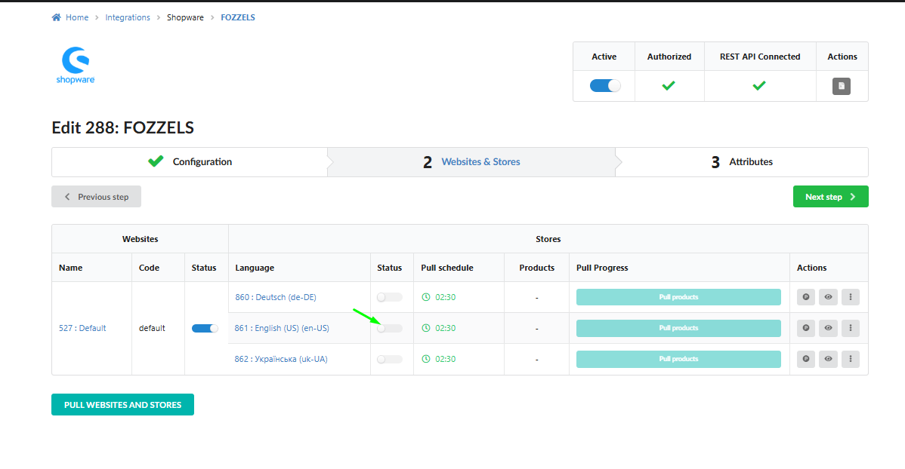

11. Pull Products

###     Click "Pull Products" to retrieve your product data from Shopware. This may take a while depending on the number of products.

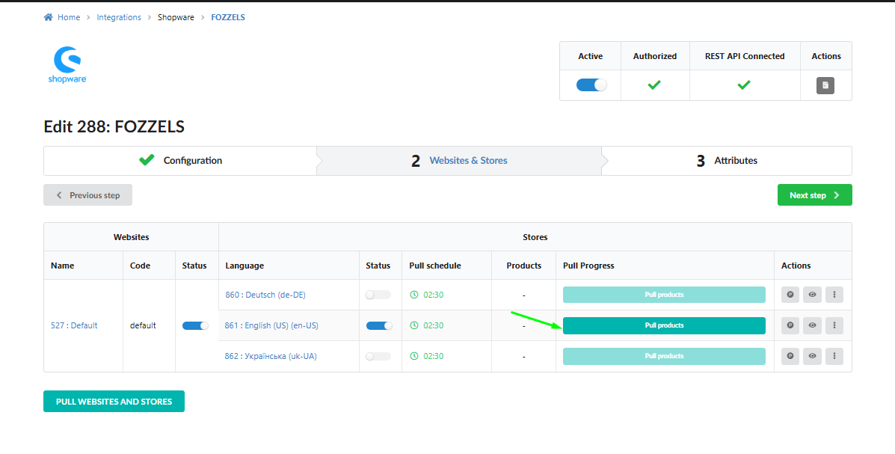
**12.** Click "Next step"
    Proceed to the next step to finalize the setup.
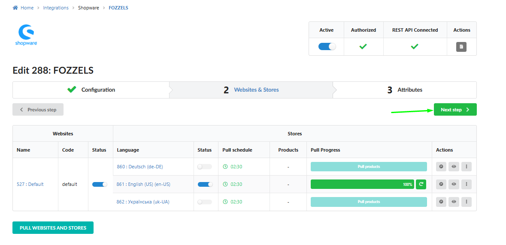

# Setup Complete

Congratulations! Your Shopware 6 store is now fully connected to Fozzels. You can use this integration to create product Flows and manage your product content directly from the Fozzels platform.

## Getting started

Here are some additional articles that may help you get started with Fozzels:

-   [Creating a New Content Flow and Initial Settings](/content-creation-flows/creating-a-new-content-flow-and-initial-settings)
-   [Prompt Creation & Filtering. Drag & Drop Prompt Editor](/content-creation-flows/prompt-creation-filtering-drag-drop-prompt-editor)

-   [When Do New Products Get Generated: The Pull Cycle Explained](/content-creation-flows/when-do-new-products-get-generated-the-pull-cycle-explained)
-   [Mass Actions and Operational Control in the Batch Lists / Daily Total Batch List](/content-creation-flows/mass-actions-and-operational-control-in-the-batch-lists-daily-total-batch-list)
-   [Flow Definition and Content Types (Text, Image, Video)](/content-creation-flows/flow-definition-and-content-types-text-image-video)

Or reach out to us directly - we are always happy to help!

###
