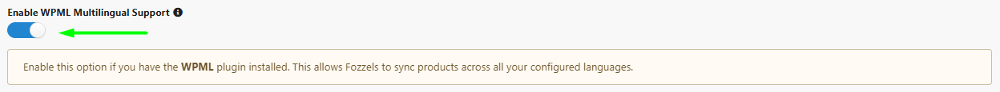
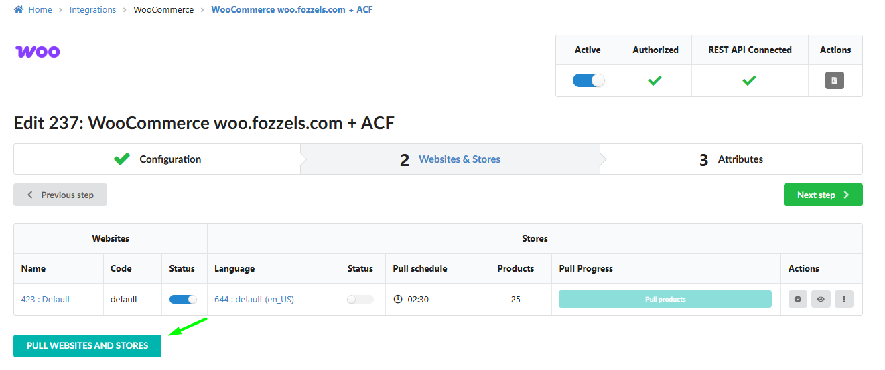
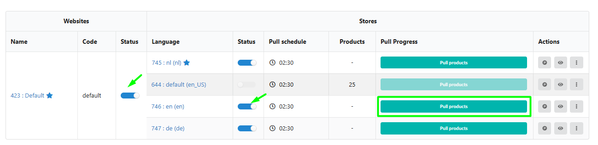
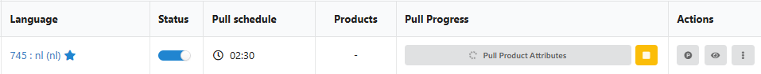

This guide covers the configuration and usage of the **WPML (WordPress Multilingual Plugin)** integration within Fozzels. This feature allows you to automate content generation and synchronization for every language locale of your store within a single integration.

## Feature Overview

Fozzels’ integration with WPML enables you to manage complex multilingual structures without the need for separate connections for each language.

**Key Benefits:**

-   **Locale Identification:** Automatic detection of all active website languages via API.

-   **Flexible Mapping:** Direct content to the correct language versions of your products, including:

-   **Standard fields** (Title, Description, Short Description);

-   **SEO Plugins** (**[Yoast SEO](https://fozzels.freshdesk.com/a/solutions/articles/103000388046)** or **[All in One SEO](https://fozzels.freshdesk.com/a/solutions/articles/103000386882)**);

-   **Custom Fields** (**[ACF - Advanced Custom Fields](https://fozzels.freshdesk.com/a/solutions/articles/103000385832)**).

-   **Workflow Efficiency:** Manage global catalogs from a single interface.

## Integration Setup in Fozzels

To activate multilingual support, follow this step-by-step algorithm:

### 1\. Enable Functionality

1.  Navigate to the **Integrations** section and select your WooCommerce integration.

2.  In the **Configuration** tab, locate the **WPML settings block**.

3.  Toggle on **"Enable WPML Multilingual Support"**.

4.  **Crucial:** Click the **"SAVE"** button to commit these changes to your configuration.
    

### 2\. Initialize Locales (Websites & Stores)

Once saved, you need to fetch the language list from your WordPress site:

1.  Switch to the **Websites & Stores** tab within your integration settings.

2.  Click the **"Pull Stores/Websites"** button. Fozzels will query your WordPress site to retrieve all configured languages.

3.  In the list that appears, **activate (toggle on)** the specific languages you intend to manage.
    
    

###
3\. Catalog Synchronization

This is the final and most important step to make products visible:

-   **RE-RUN THE PRODUCT PULL.** This is mandatory so the system can identify the relationships between different language versions of your products and **load them into your Fozzels catalogs** as individual objects for processing. Without this step, products for new locales will not appear in the system.

##
The Super-Power Combo: WPML + ACF + AIOSEO

Fozzels allows you to combine WPML with market-leading plugins for maximum automation. This is the "gold standard" for professional e-commerce:

-   **WPML + SEO ([Yoast](https://fozzels.freshdesk.com/a/solutions/articles/103000388046) or [AIOSEO](https://fozzels.freshdesk.com/a/solutions/articles/103000386882)):** Generate unique localized Keywords, Meta Titles, and Descriptions for every language version. _(Note: Use only one SEO plugin at a time to avoid conflicts)._

-   **WPML + [ACF (Advanced Custom Fields)](https://fozzels.freshdesk.com/a/solutions/articles/103000385832):** Sync localized content into custom fields (e.g., technical specifications, marketing blocks, or FAQs) separately for each language.

-   **The Ultimate Combo (WPML + ACF + AIOSEO):** The most powerful scenario. This allows you to automate professional descriptions, specialized technical data, and a full SEO core for the international market simultaneously.
