Bem-vindo à nossa base de conhecimento!
Este artigo ajudará você a configurar a recarga automática de conta e evitar interrupções de serviço.

Função de Recarga Automática
Se você deseja simplificar seu fluxo de trabalho, garantir serviço ininterrupto e economizar tempo em transações frequentes, configure a **função de Recarga Automática**.
Condição Crítica: Você deve definir e manter um método de pagamento padrão ativo no portal de faturamento. Caso contrário, o sistema tentará carregar sua conta automaticamente para continuar o serviço, mas falhará devido ao cartão ausente.

**Ativação e Configuração da Recarga Automática**

Antes de adicionar seu cartão, você deve definir as condições sob as quais a recarga automática deve ocorrer.
1. Faça login em sua conta Fozzels.

2. Na seção "Faturamento", selecione a aba "Pagamentos".

3. Clique no botão "Configurar Carregar Créditos" para abrir a janela "Configurações de Recarga".

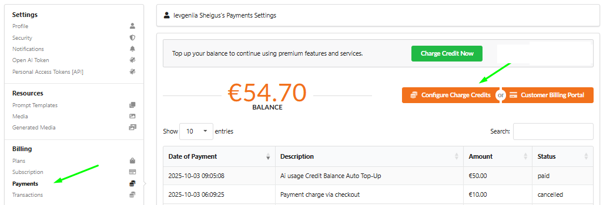

4. Defina as Condições: Insira os detalhes necessários:

-   Quando o saldo de crédito cair abaixo de: Insira o valor (por exemplo, €5) que dispara a recarga.
-   Trazer o saldo de crédito de volta para: Insira o valor (por exemplo, €50) para o qual seu saldo deve ser recarregado.
    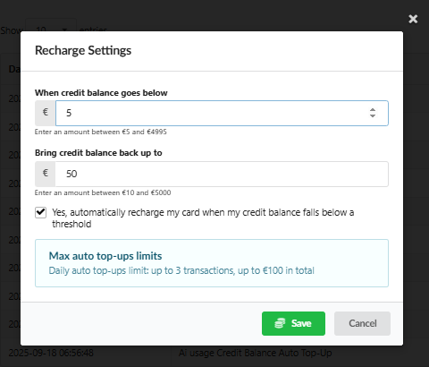

5. Ative a Recarga Automática! Marque a caixa: "Sim, recarregue automaticamente meu cartão quando meu saldo de crédito cair abaixo de um limite."

6. Certifique-se de verificar as limitações exibidas (por exemplo, "Limites de recarga automática: até 3 transações, até €100 no total") para evitar cobranças inesperadas.

7. Clique em "Salvar" para aplicar suas configurações de recarga.

Use o **portal de faturamento do cliente**, oferecido pelo **Stripe**, para gerenciar com segurança seus cartões e garantir um serviço ininterrupto.

Navegando para o Portal de Faturamento do Cliente no Fozzels

Na página "Configurações de Pagamento", clique no botão laranja "Portal de Faturamento do Cliente".
Você será redirecionado automaticamente para uma página dedicada e segura gerenciada por nosso parceiro, Stripe.
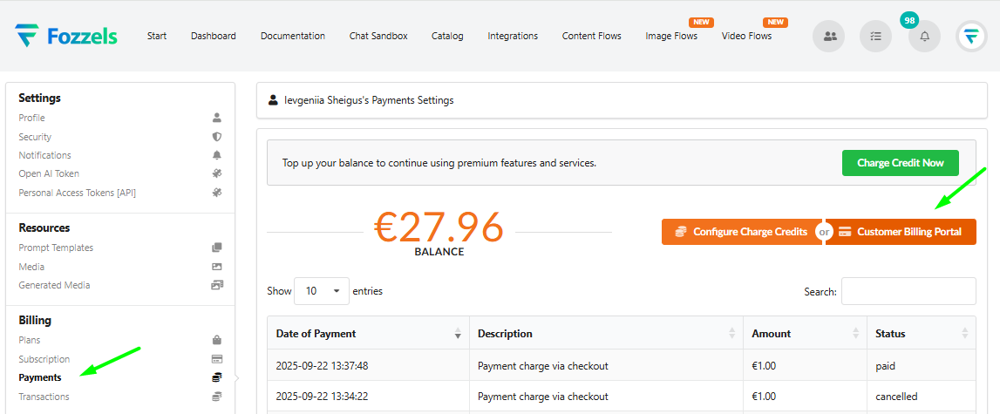

Adicionando um Novo Método de Pagamento

No portal de faturamento do Stripe, você encontrará todas as informações necessárias para gerenciar seus pagamentos.

1.  Na seção "Método de Pagamento", clique no link "+ Adicionar método de pagamento".
    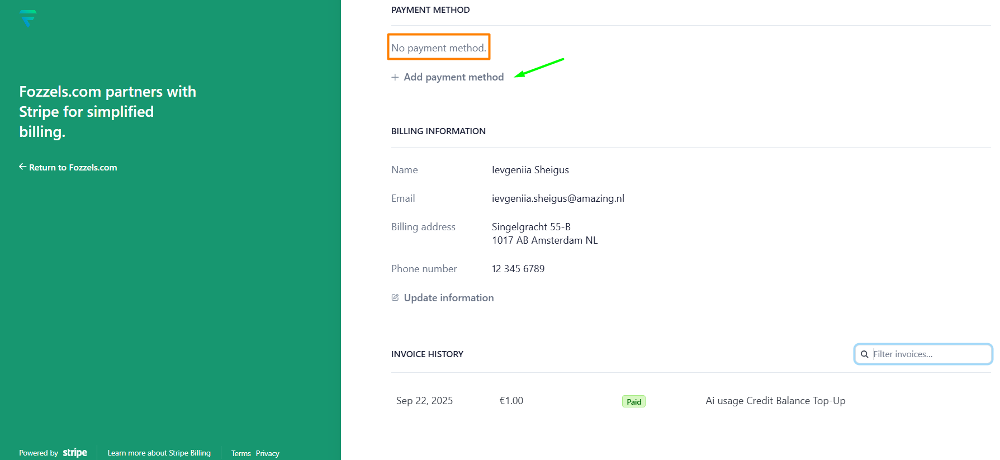

2.  Na página "Adicionar método de pagamento", selecione seu tipo de pagamento (por exemplo, Cartão, Google Pay, etc.).

3.  Preencha os detalhes do cartão necessários:
    -   Número do cartão
    -   Data de validade
    -   Código de segurança (CVV)
    -   País
        Para garantir segurança máxima, seus dados de pagamento são processados e protegidos por nosso parceiro, Stripe, em sua página segura, garantindo que esses dados nunca sejam armazenados nos servidores do Fozzels.

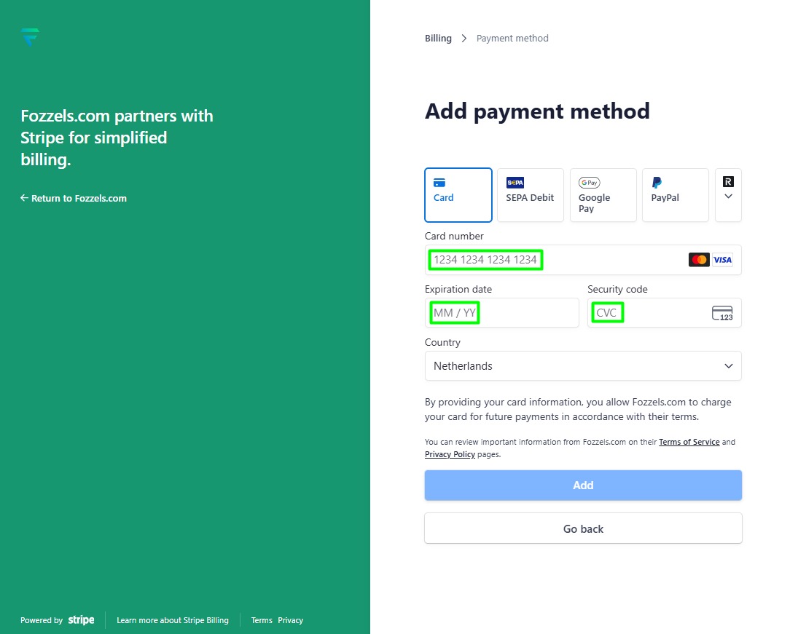

4. Após inserir informações válidas do cartão, a opção "Salvar minhas informações para checkout mais rápido" aparecerá.

Se você marcar esta caixa, seus dados de pagamento serão salvos pelo Stripe para pagamentos futuros. Isso permite que o Fozzels cobre seu cartão para transações subsequentes sem exigir que você insira novamente todos os detalhes do cartão, garantindo um processo de pagamento rápido e contínuo.
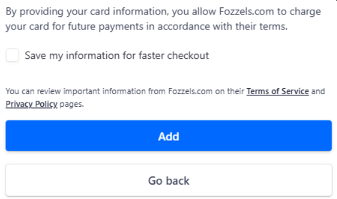

5. Clique no botão azul "Adicionar". O novo cartão aparecerá em sua lista de métodos de pagamento disponíveis.
O sistema define automaticamente o primeiro cartão que você adiciona como Padrão para todos os pagamentos futuros, a menos que você especifique o contrário.
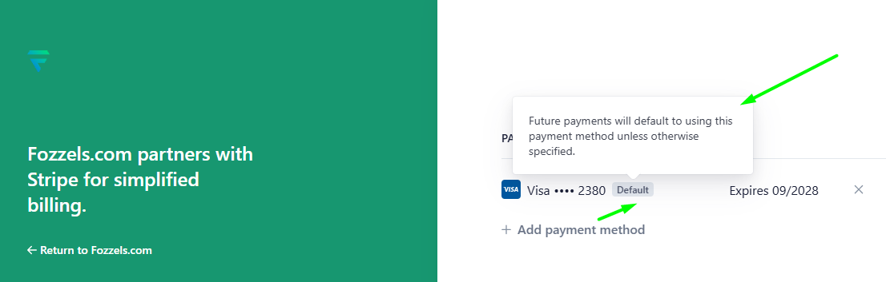

  Usar como método de pagamento padrão - Esta caixa de seleção aparecerá para cada cartão adicionado após o primeiro. Ela é marcada por padrão. Mantenha esta caixa marcada para tornar o novo cartão a prioridade para todos os pagamentos futuros, substituindo o cartão Padrão atual.
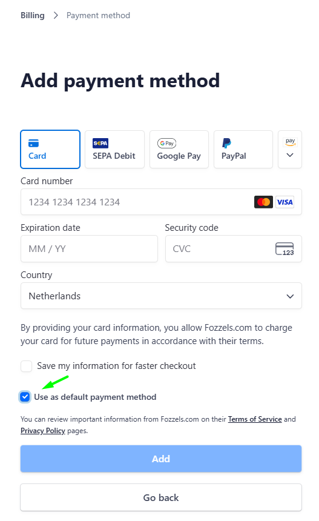

Definindo um Cartão como Padrão (Se Existirem Vários Cartões)

Se você tem vários cartões e precisa alterar seu cartão principal, siga estas etapas:

1.  Na seção "Métodos de Pagamento", localize o cartão que deseja definir como padrão.

2.  Clique no ícone de reticências (...) ao lado do cartão.

3.  No menu suspenso, selecione "Tornar padrão".
4.  O sistema usará então este cartão para renovações de assinatura automáticas e para cobrar seus uso de transações.

    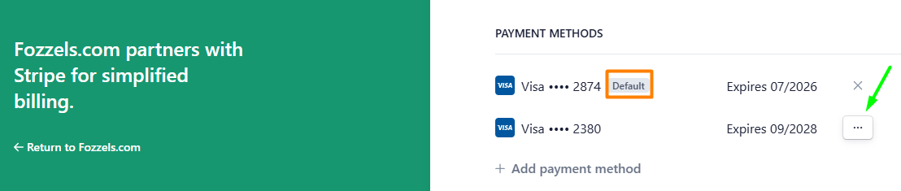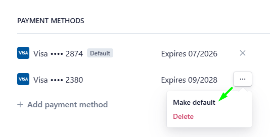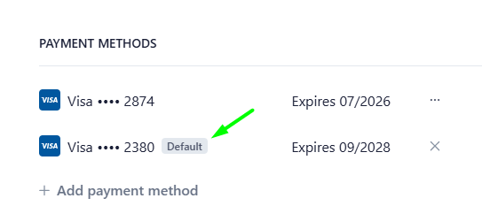
    _Como Deletar um Método de Pagamento_
    Para deletar um cartão salvo, a ação necessária depende se o cartão está configurado como método Padrão.
    -   Para o Cartão Padrão: Clique no ícone "X" localizado diretamente na entrada do cartão para iniciar a exclusão.

    -   Para Cartões Não-Padrão: Clique no ícone de reticências (...) ao lado do cartão e selecione "Deletar" no menu suspenso.
        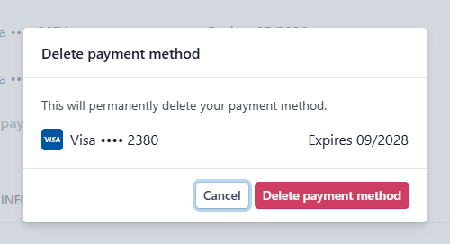
        Em ambos os casos, uma janela pop-up de confirmação aparecerá, pedindo que você confirme que deseja deletar permanentemente o método de pagamento. Clique no botão vermelho "Deletar método de pagamento" para finalizar a remoção.
        ⚠️ Nota Importante sobre Cartões Padrão
        Se você deletar o cartão Padrão atual, o sistema NÃO atribuirá automaticamente outro cartão como o novo Padrão. Você deve selecionaManualmente o cartão restante e escolher "Tornar padrão" no menu de reticências para garantir que sua assinatura permaneça ativa e os pagamentos futuros sejam processados sem problemas.
        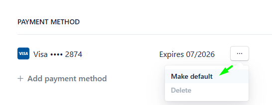
        Informação Importante!

Segurança: O Stripe garante que os detalhes do seu cartão de pagamento nunca sejam armazenados nos servidores do Fozzels, fornecendo proteção máxima.

Endereço de Cobrança: Suas informações de endereço de cobrança estão disponíveis na seção "Informações de Cobrança". Você pode atualizá-las clicando em "Atualizar informações".

Termos: Ao fornecer os detalhes do seu cartão, você concorda com os Termos de Serviço e Política de Privacidade do Fozzels.

Histórico de Faturas: Você pode revisar todas as transações anteriores na seção "Histórico de Faturas".
