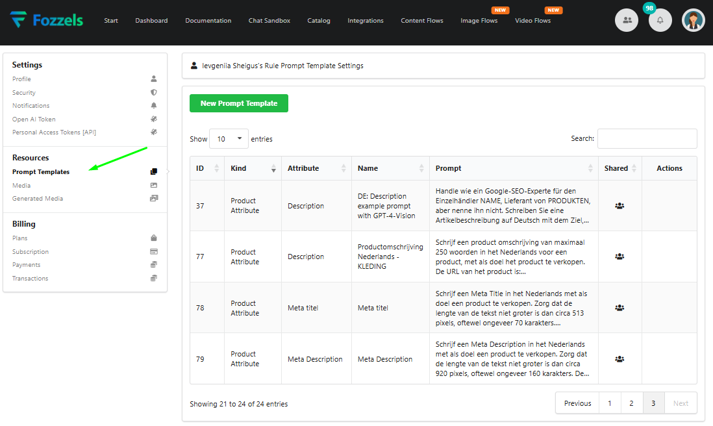
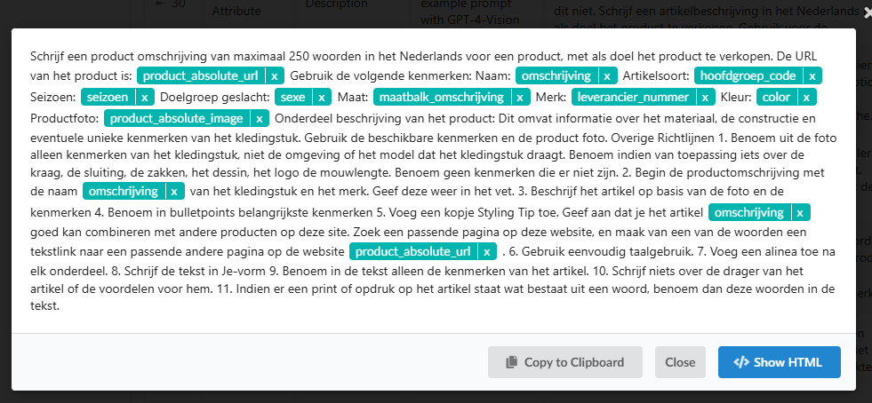
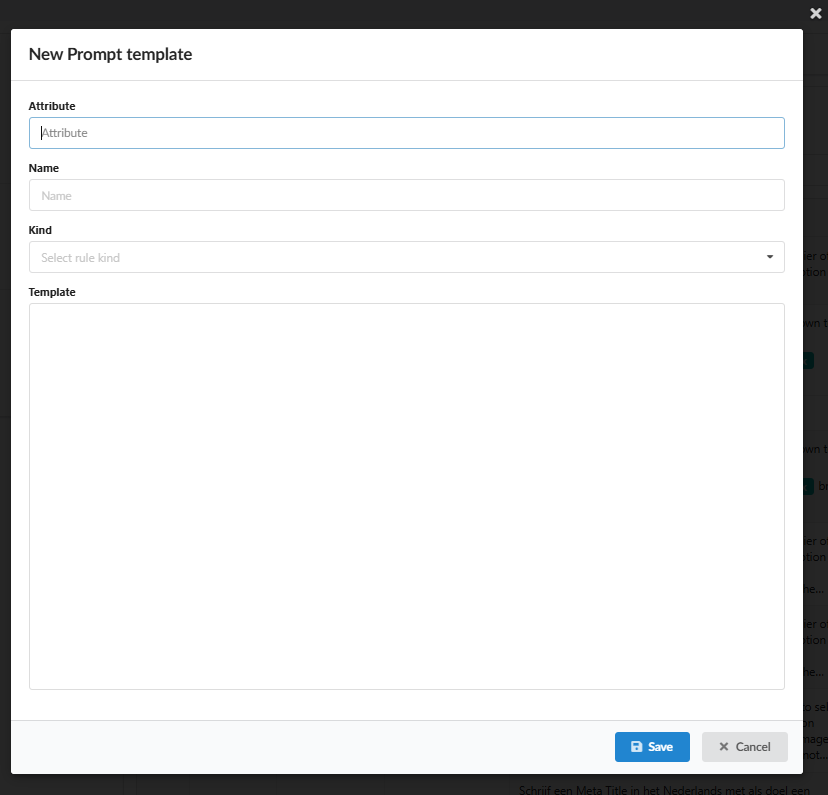

Modelos de Prompt são modelos de texto pré-configurados e reutilizáveis usados como entrada para a IA gerar tipos específicos de conteúdo de produto. Esses modelos são configurados independentemente dos fluxos de geração de conteúdo e formam uma parte central da lógica de automação. Eles são tipicamente usados para gerar descrições de produtos, meta títulos ou meta descrições.

Para acessar a área de gerenciamento, navegue até **Configurações → Modelos de Prompt**.

Tabela de Gerenciamento de Modelos

A tabela principal fornece uma visão geral de todos os modelos criados.
Cada entrada inclui: o identificador único (ID), o tipo de regra de modelo (Tipo, atualmente apenas Atributo de Produto está disponível), o atributo de produto ao qual o prompt é vinculado (Atributo, por exemplo, descrições, meta títulos), o nome do modelo (Nome), o texto do prompt real e um ícone Compartilhado, indicando se o modelo é visível e compartilhado entre outros usuários em seu projeto.

As ações disponíveis incluem: Visualizar, Editar e Deletar.

Localizando e Filtrando Modelos

Você pode encontrar rapidamente modelos específicos usando o campo **Buscar** localizado no canto superior direito.
Além disso, as colunas ID, Tipo, Atributo e Nome são classificáveis.
Clicar em um cabeçalho de coluna alterna a ordem de classificação (ascendente ou descendente).
Use os controles de paginação na parte inferior da tabela para navegar por várias páginas se sua lista de modelos for extensa.

Visualizando o Conteúdo Completo do Prompt

Clicar em qualquer célula dentro da coluna **Prompt** abre uma janela modal exibindo o texto completo e detalhado do prompt. Esta modal inclui:

-   O botão Mostrar HTML, que alterna a visualização do texto do prompt com formatação HTML aplicada.

-   O botão Copiar para Área de Transferência, que copia o texto completo do prompt para uso externo ou edição.

-   O botão Fechar, que fecha a janela modal.
    

Criando um Novo Modelo de Prompt

Para criar um novo modelo, clique no botão **Novo Modelo de Prompt** no topo da página. Isso abre uma janela modal com os campos de formulário necessários:

1.  **Atributo** (Obrigatório): Selecione o campo específico de conteúdo de produto (por exemplo, Descrição, Meta título) para o qual este prompt foi projetado para preencher. Isso vincula o prompt ao campo de conteúdo alvo correto.

2.  **Nome** (Obrigatório): Insira um nome claro e descritivo. A melhor prática é incluir o idioma e propósito (por exemplo, PT: Descrição curta para sapatos) para identificação fácil.

3.  **Tipo** (Obrigatório): Selecione o tipo de regra. Atualmente, apenas Atributo de Produto está disponível.

4.  **Modelo** (Obrigatório): Insira o conteúdo do prompt principal aqui. Este texto, combinado com variáveis dinâmicas (por exemplo, $marca, se $cor), forma a instrução enviada à IA para geração.
    

Lógica de Prompt e Melhores Práticas

-   **Variáveis Dinâmicas**: O texto do prompt deve utilizar lógica condicional e variáveis dinâmicas (por exemplo, tags if, {{vendor}}) para extrair dados específicos do produto, evitando codificação fixa.

-   **Estilo**: Certifique-se de que os requisitos de linguagem e estilo (por exemplo, tom, uso de listas de pontos, formato HTML) correspondam ao seu caso de uso.

-   **Segurança de Conteúdo**: O prompt deve ser bem formado e respeitoso para evitar rejeição potencial pelo serviço de IA (OpenAI).
