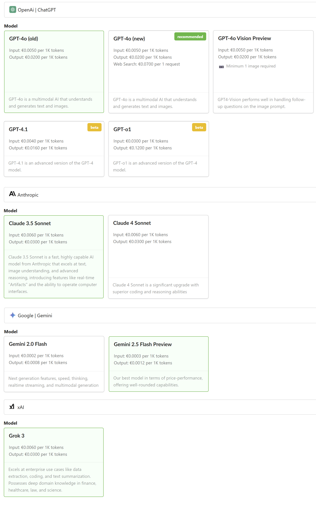
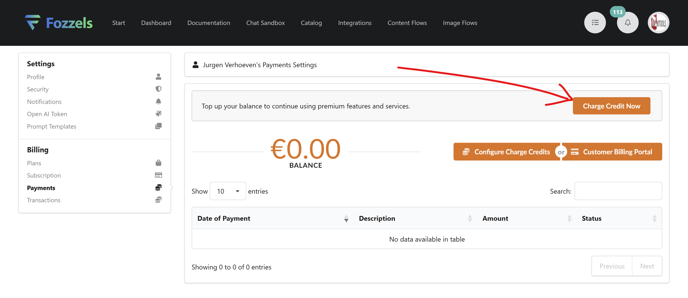
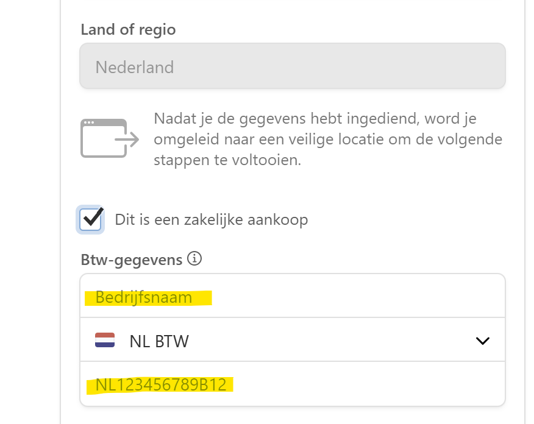
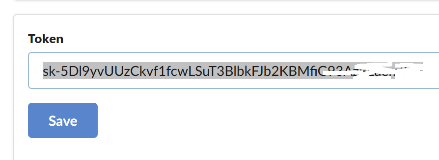

Alteramos a forma como o Fozzels processa pagamentos de "tokens" dos modelos de IA.

Pedimos a todos os nossos usuários que mudem esta configuração antes de 1º de agosto de 2025.

Por favor dedique cerca de 10 minutos para mudar esta configuração em sua conta Fozzels.

Conteúdos:

1.  Histórico
2.  Mudança
3.  Vantagens
4.  ## O que fazer, passo a passo

-   ### Configurar pagamento

-   ### Remova sua chave OpenAI atual

5.  ### Pronto

## Por que?

O Fozzels começou gerando automaticamente conteúdo para você usando os modelos de linguagem do OpenAI (GPT-4o, atualmente).

Após configurar uma nova conta do Fozzels, pedíamos aos nossos usuários que também configurassem uma conta OpenAI, adicionassem os dados do cartão de crédito lá, criassem uma chave de API do OpenAI e copiassem-colassem essa chave no Fozzels.

Tudo funcionou muito bem -- mas tinha algumas desvantagens:

1.  Levaria mais tempo para os usuários começar, porque eles precisavam abrir uma conta no OpenAI também e fazer "algo complicado" com cópia-colagem de chaves de API.
2.  Novas contas do OpenAI são limitadas em uso (limites de taxa, etc.), então os usuários do Fozzels não poderiam aproveitar a criação em lote de conteúdo de produto em grandes quantidades.
3.  Novas contas do OpenAI são limitadas em modelos; portanto, os usuários nem sempre poderiam usar o Fozzels para gerar imagens com IA, por exemplo.
4.  Não poderíamos facilmente oferecer aos nossos usuários acesso a modelos de IA de outros fornecedores, como Google (Gemini), Anthropic (Claude) ou xAi (Grok).

## Mudança

Para resolver esses problemas, o Fozzels alterou a forma como processamos pagamentos de "tokens" de IA.

Em vez de pagar a todos os fornecedores de IA separadamente, você agora pagará diretamente ao Fozzels pelo uso de IA -- e o Fozzels pagará pelo seu uso de IA aos fornecedores de IA para você. O Fozzels usa [Stripe](https://stripe.com/nl/payments), um dos maiores provedores de pagamento online do mundo, para processar transações financeiras.

## Vantagens

Fazer isso tem as seguintes vantagens:

1.  Integração mais rápida e fácil para novos usuários do Fozzels;
2.  Você sempre poderá gerar conteúdo para muitos produtos (sem mais limites de contas); porque o Fozzels tem contas "ilimitadas" nos fornecedores de IA;
3.  Você pode usar modelos de geração de imagens no Fozzels;
4.  Você pode escolher entre mais modelos de IA do que OpenAI (Google Gemini 2.5 Flash; xAi Grok 3; Anthropic Claude 4 Sonnet -- e mais virão);
5.  Você agora pode ativar "busca na web", o que significa que você pode deixar a IA procurar na internet, por exemplo, dados ausentes, e usar isso para gerar dados de produtos ou descrições.

Você pode escolher atualmente dos seguintes modelos de IA:

## O que fazer, passo a passo

### A) Configurar pagamento

1.  Por favor faça login em sua conta Fozzels e clique na sua **imagem de usuário** no canto superior direito.
2.  No menu suspenso, clique em **Configurações**.
3.  No menu Configurações à esquerda, clique em [**Pagamentos**](https://app.fozzels.com/user/settings/payments).
4.  Você verá a tela a seguir. Clique no botão "**Carregar Crédito agora**".
    

5.  Você verá uma janela pop-up, solicitando um valor. Insira qualquer valor que você gostaria de adicionar ao seu saldo. O padrão é €50, mas você pode mudar isso se quiser. Então clique no botão "**Carregar Agora**".
    

6.  Você será redirecionado para a página de pagamento Stripe, onde você pode inserir seus detalhes de pagamento.
    Por favor note que nenhum detalhe de pagamento é salvo no Fozzels; apenas no Stripe.
    Você pode usar os seguintes métodos de pagamento: iDEAL, Cartões de Crédito (VISA, American Express, Mastercard, Discover), Amazon Pay, Paypal, Revolut Pay e Bancontact.
    

7.  Por favor lembre-se -- se este pagamento é para sua conta corporativa -- de também inserir seu **nome da empresa** e **ID de VAT/NIF**.
    

8.  Após pagamento bem-sucedido, você será redirecionado de volta ao Fozzels e verá seu saldo atual na página de Pagamentos.
    

9.  Em seguida, \[_opcional_\], se você quiser "recarregar" automaticamente o saldo da sua conta quando seu saldo chegar a um valor baixo, você pode configurar isso clicando no botão "**Configurar Carregar Créditos**". Desta forma, a geração de conteúdo através dos Fluxos que você configurou, nunca será interrompida.
    Insira os valores que você gostaria de definir, ative a caixa de seleção "_Sim, recarregue automaticamente meu cartão quando meu saldo de crédito cair abaixo de um limite_" e clique no botão **Salvar**.
    

### B) Remova sua chave OpenAI atual

Após você ter configurado seus detalhes de pagamento, lembre-se de **remover** a chave de API OpenAI atual de sua conta.
Desta forma, o Fozzels usará nossas próprias chaves de API para todos os fornecedores de IA.

1.  Para ativar isso, clique em "**Token OpenAI**" no menu à esquerda.
    

2.  Selecione seu token no campo Token, **apague tudo no campo**, e clique no botão **Salvar**.
    

Você está agora pronto.

Eba! Muito bem.
Obrigado e divirta-se usando o Fozzels.
