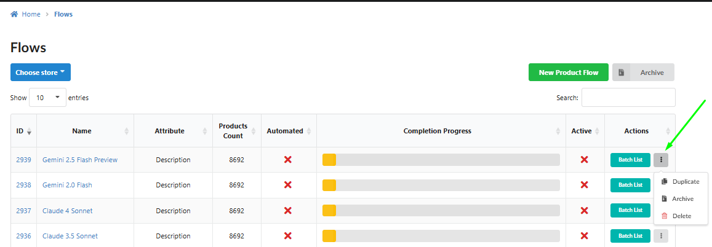
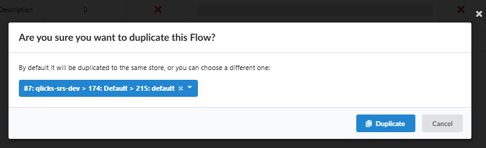
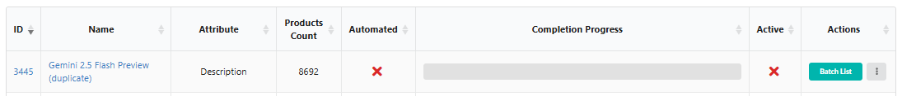
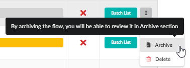
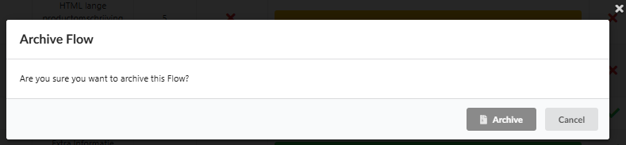
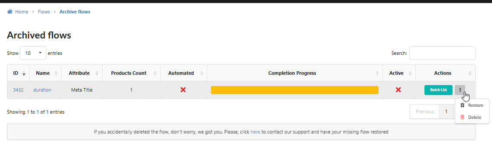
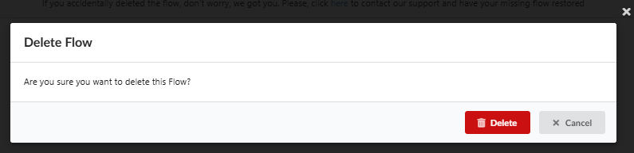

Este guia detalha métodos para gerenciar Fluxos de Conteúdo existentes, concentrando-se na duplicação para economizar tempo de configuração, e manutenção geral de fluxos (arquivamento e exclusão).

A Duplicação é um recurso essencial de economia de tempo que permite clonar um Fluxo de Conteúdo existente, incluindo todas as suas configurações complexas, filtros e prompts, e adaptá-lo rapidamente para outro idioma ou loja. **Arquivamento** permite remoção temporária de fluxos da lista ativa para possível uso futuro, enquanto **Exclusão** os remove permanentemente.

### 1\. Duplicando um Fluxo de Conteúdo

A Duplicação permite reutilizar configurações abrangentes (filtros, prompts, configurações de automação) para criar rapidamente novos fluxos, tipicamente para diferentes lojas ou idiomas de destino.

#### 1.1. Processo de Duplicação

1.  **Vá** para o menu de navegação principal e **selecione** **Fluxos**.

2.  **Localize** o Fluxo que você deseja duplicar (ativo ou inativo, executado ou não executado).

3.  **Clique** no menu de ações (três pontos **...**) ao lado do nome do fluxo.

4.  **Selecione** **"Duplicar"** no menu suspenso.

####
1.2. Seleção de Loja (Se Aplicável)

-   **Integração de Loja Única:** Se apenas uma loja está integrada, o Fluxo duplicado é criado imediatamente.

-   **Integração de Múltiplas Lojas:** Se múltiplas lojas estão vinculadas, um popup aparece. Você deve **selecionar a loja de destino** para a qual o novo Fluxo será criado e **clique em "Duplicar"**.
    

#### 1.3. Convenção de Nomenclatura de Fluxo

-   O Fluxo duplicado automaticamente terá o texto **(duplicado)** adicionado ao seu nome para distingui-lo claramente do Fluxo original.
    

#### 1.4. Configurações Herdadas (O que é Clonado)

O processo de duplicação copia _todas_ as configurações do Fluxo original, incluindo Texto de Prompt, Filtros de Produto, Atributo de Destino, Configuração de IA e até as **Configurações de Automação (incluindo a caixa de seleção de ativação)**.

-   **Ação Requerida:** Como a configuração de ativação é clonada, é **obrigatório verificar e validar todas as configurações** no novo Fluxo antes de executá-lo.

#### 1.5. Caso de Uso: Economia de Tempo para Configuração Multi-Loja

A Duplicação é inestimável para configurações multi-lojas (por exemplo, criar um fluxo para a loja NL com base na loja DE), economizando horas de tempo de configuração ao exigir apenas ajustes menores de prompt (como mudança de idioma) e verificação de filtro.

### 2\. Arquivando um Fluxo de Conteúdo

O Arquivamento permite ocultar temporariamente um Fluxo da lista ativa principal, geralmente para fluxos que estão completos ou pausados, sem perder permanentemente suas configurações ou dados gerados.

1.  **Vá** para a lista principal de **Fluxos**.

2.  **Clique** no menu de ações (três pontos **...**) ao lado do nome do fluxo.

3.  **Selecione** **"Arquivar"** no menu suspenso.

4.  Fluxos Arquivados são movidos para um local separado, acessível através do botão **"Arquivo"** na página principal Fluxos.

#### 2.1. Gerenciando Fluxos Arquivados

-   **Restaurar:** Na seção **Fluxos arquivados**, você pode restaurar um fluxo arquivado de volta à lista ativa principal clicando em **"Restaurar"**.

-   **Excluir:** Você também pode optar por excluir permanentemente um fluxo arquivado clicando em **"Excluir"**.
    

### 3\. Excluindo um Fluxo de Conteúdo

A Exclusão remove permanentemente um Fluxo do sistema.

1.  **Vá** para a lista principal de **Fluxos**.

2.  **Clique** no menu de ações (três pontos **...**) ao lado do nome do fluxo.

3.  **Selecione** **"Excluir"** no menu suspenso.

4.  **Confirme** a exclusão no popup resultante.
    

-   **Ação Permanente:** Uma vez que um Fluxo é excluído, **não pode ser restaurado**. Se você pode precisar do Fluxo novamente no futuro, use a função **Arquivamento** em vez disso.
