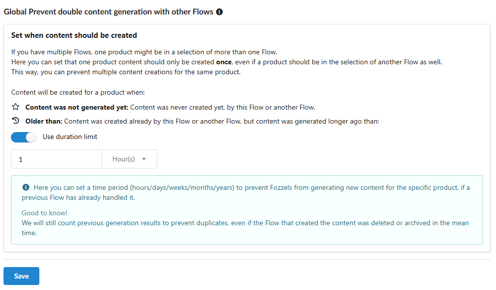
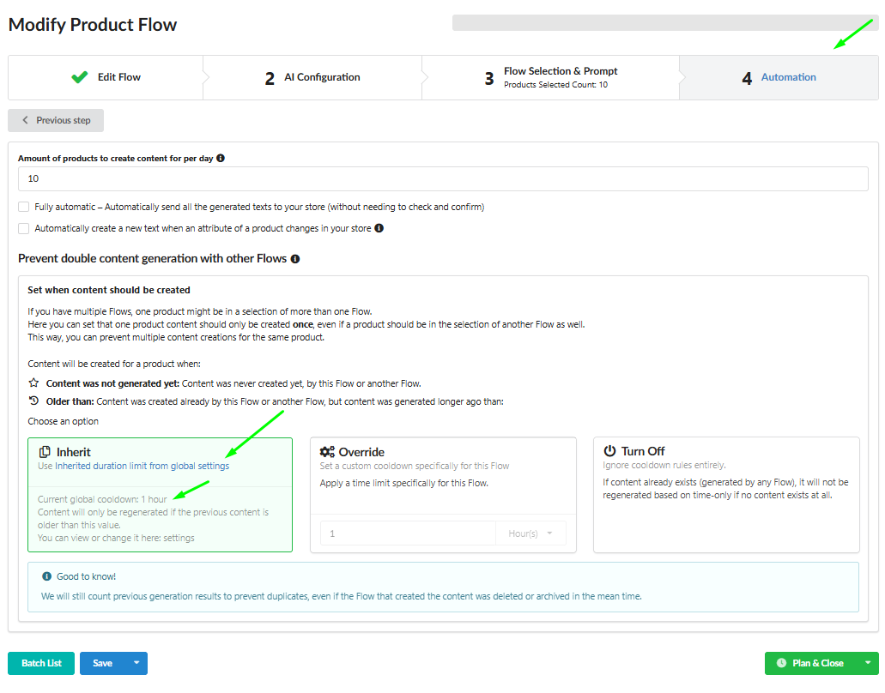
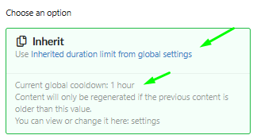

A **"Função para Prevenir geração duplicada de conteúdo com outros Fluxos"** é crucial para garantir que você não gere conteúdo duas vezes para o mesmo produto quando ele possa pertencer a múltiplos Fluxos. Isto ajuda a otimizar seu uso de IA (tokens) e custos.

## 1\. O Padrão Principal (Configuração Global)

Esta é a **Configuração Global** que se aplica a todos os seus Fluxos, a menos que especificado de outra forma. Você a define uma vez em: `Perfil` → `Configurações` → `Fluxo de Conteúdo`.

-   **Conteúdo ainda não foi gerado:** A geração é permitida **apenas se** o conteúdo para este produto ainda não foi criado por **nenhum** outro Fluxo anteriormente. Esta é a verificação mais rigorosa.

-   **Mais antigo que:** Você define um **limite de tempo** (por exemplo, 1 semana). A geração é permitida **se** o conteúdo existente já foi criado uma vez antes por outro Fluxo, mas **antes** da duração configurada.
    

## 1.1. Gerenciando as Configurações Globais (Etapas de Configuração)

**Seu Objetivo:** Definir ou modificar o Padrão Principal que todos os Fluxos configurados como `Herdar` seguirão.

**Etapas:**

1.  Navegue até **Configurações Globais** (`Perfil` → `Configurações` → `Fluxo de Conteúdo`).

2.  Você controla a Regra Global usando o alternador **"Usar limite de duração"**:

-   **Para ativar a regra de duração (Mais antigo que):** **Ative o alternador "Usar limite de duração"**, **insira o valor do período necessário** (por exemplo, 1 semana), e **Salve**.

-   **Para definir a regra mais rigorosa (Conteúdo ainda não foi gerado):** **Desative o alternador "Usar limite de duração"** e **Salve**.

-   _Resultado:_ Todos os Fluxos usando a opção **Herdar** aplicarão automaticamente esta nova restrição.

##
2\. Sobrescrevendo a Regra para um Fluxo Específico (Cenários Práticos)

Nas configurações de cada Fluxo individual (seção **4 Automação**), você decide se ele adere às Configurações Globais ou tem uma exceção:

-   Se você deseja que o Fluxo ignore todas as regras de duplicação (mesmo que a Regra Global esteja ativa), consulte A.

-   Se você deseja definir um Limite de Tempo Personalizado (Sobrescrever), consulte B.

-   Se você deseja desativar completamente todas as regras de duplicação global, consulte C.

####
**Cenário A: Permissão de Geração Completa (Sem Restrições) (Desativar)**

**Seu Objetivo:** Você deseja que o Fluxo ignore todas as regras de duplicação (mesmo que a Regra Global esteja ativa).

**Etapas:**

1.  Acesse as configurações do Fluxo desejado (por exemplo, `Modificar Fluxo de Produto`).

2.  Navegue até a seção **4 Automação**.

3.  No bloco **"Prevenir geração duplicada de conteúdo com outros Fluxos"**, selecione a opção **Desativar**.

4.  Salve as alterações.

-   _Resultado:_ Este Fluxo gerará conteúdo independentemente de já existir conteúdo de outros Fluxos.

####
**Cenário B: Definindo um Limite de Tempo Personalizado (Sobrescrever)**

**Seu Objetivo:** Você deseja que este Fluxo tenha um limite de tempo **diferente** da Configuração Global.

**Etapas:**

1.  Acesse as configurações do Fluxo desejado.

2.  Na seção **4 Automação**, selecione a opção **Sobrescrever**.

3.  Insira o valor do limite de tempo necessário (por exemplo, 1 hora) no campo que aparece.

4.  Salve as alterações.

-   _Resultado:_ O Fluxo usará **apenas** esta nova regra individual.

**Cenário C: Recomeçando (Removendo Todas as Restrições)**

**Seu Objetivo:** Você decidiu desativar completamente todas as regras de duplicação global, permitindo que todos os Fluxos criem conteúdo sem restrições baseadas em período.

**Etapas:**

1.  Navegue até **Configurações Globais** (`Perfil` → `Configurações` → `Fluxo de Conteúdo`).

2.  **Desative o alternador "Usar limite de duração"**.

3.  Clique no botão **Salvar**.

4.  _Resultado:_ Todos os Fluxos configurados como **Herdar** começarão a funcionar **sem restrições de duplicação**, pois a Regra Global está efetivamente desativada. Se você deseja que um Fluxo configurado como **Sobrescrever** também funcione sem restrições, **mude-o para Herdar** ou **desative a restrição usando Desativar**.

ou

