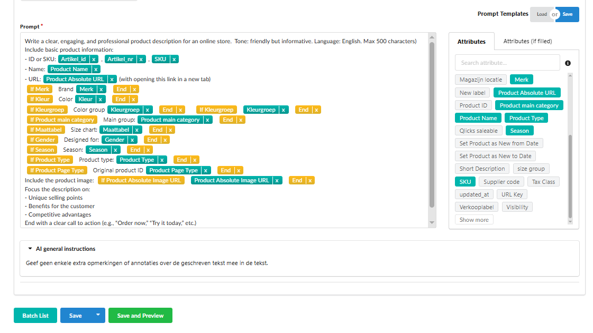
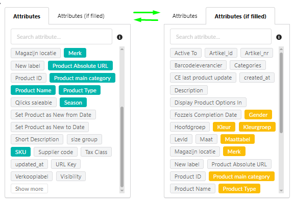
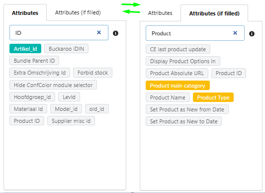
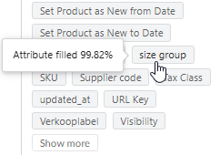
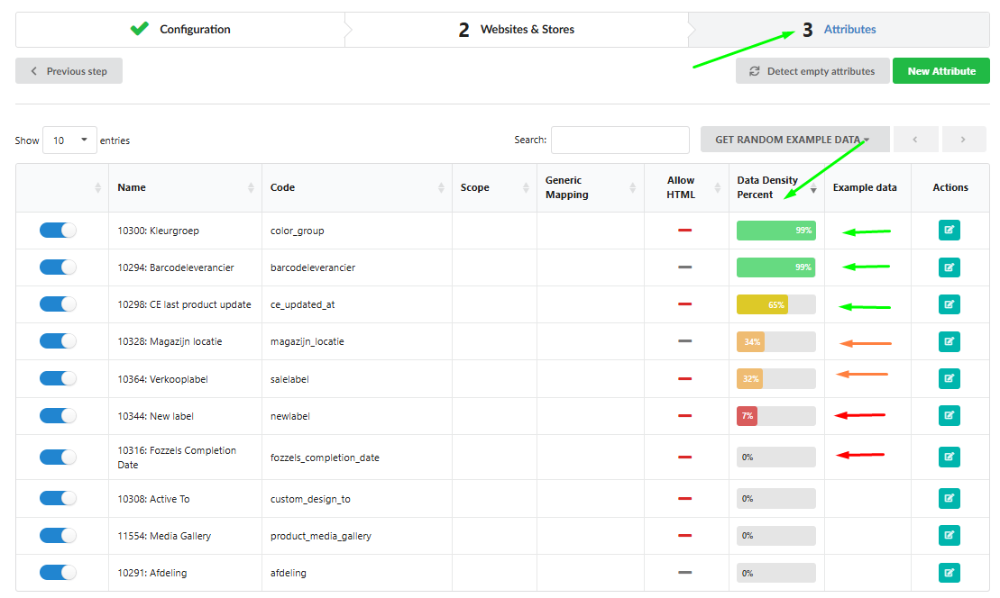
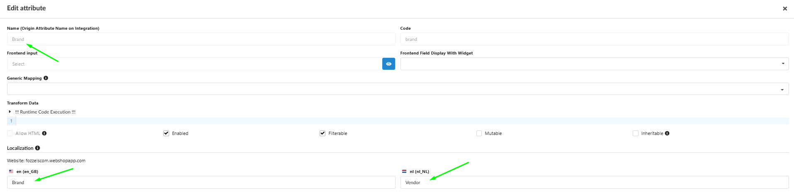
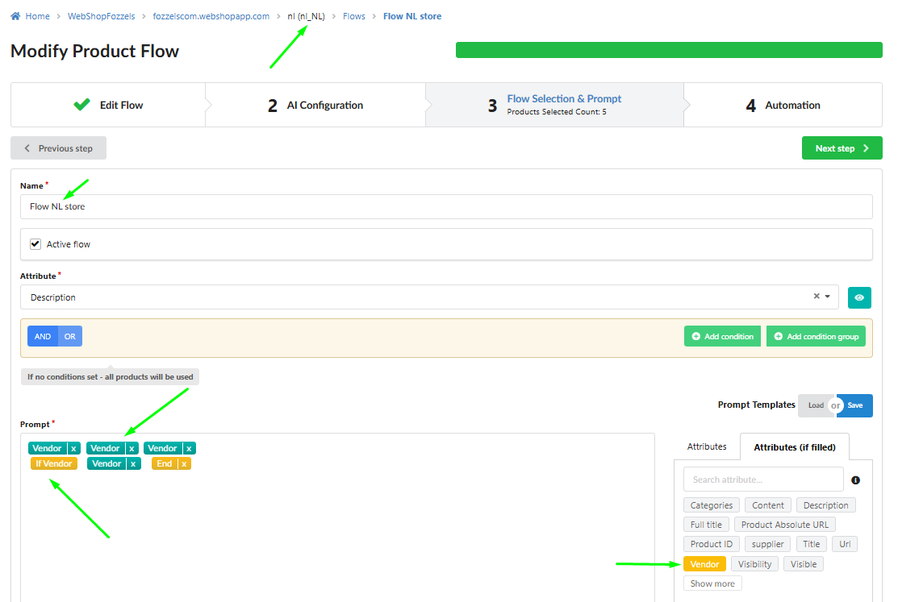

Este guia mostra como você configura o **Campo de Prompt -** a ferramenta principal para criar instruções dinâmicas para geração de texto de produto - usando atributos de produto disponíveis, lógica condicional e configurações de localização.

**1\. Componentes da Aba Configuração de Prompt**

A aba da interface é dividida em cinco seções principais para máxima eficiência na construção da lógica do seu prompt:
1\. **Campo de Prompt**. A área de texto central para escrever o prompt. Propósito - **escrever** o texto com lógica integrada de atributo/condição.

2\. **Seção Atributos**. Uma lista de todos os atributos de produto disponíveis para a loja selecionada. Propósito - **inserir** dados estáticos do produto (por exemplo, nome do produto, SKU).

3\. **Atributos (se preenchidos) Seção**. Uma lista de condições (**blocos if**) que podem ser usadas para conteúdo dinâmico. **Inserir** lógica de conteúdo dinâmico (por exemplo, _SE_ Cor é Azul _ENTÃO_ gerar conteúdo 'Apenas Azul').

4\. **Entradas de Pesquisa Separadas**. Você pode livremente **alternar** entre as seções de atributos e condições.

5\. Seção Modelos. O bloco **Modelo de Prompt** contém **Carregar** (para importar um modelo) e **Salvar** (para salvar o prompt atual como um modelo).
**2\. O Campo de Prompt (Lógica Central)**

O Campo de Prompt é onde você ESCREVE a lógica que forma o texto final.

Conteúdo Suportado
O campo suporta uma combinação de texto livre e blocos dinâmicos:

1\. **Inserir** atributos e condições (via clique ou arrastar e soltar).

2\. **Editar** texto livre de qualquer complexidade.

3\. **Usar** tags de formatação padrão e HTML (por exemplo, `<h1>`, `<ul>`, `<strong>`).

4\. **Combinar** texto regular com blocos dinâmicos perfeitamente.
Interação com Elementos

1\. **Inserir** elementos no texto por **CLICANDO** ou por **ARRASTANDO E SOLTANDO** para a posição do cursor.

2\. **Deletar** um elemento pressionando **Backspace** ou **CLICANDO** no **"x"** diretamente no elemento no campo.

3\. **Reutilizar** o mesmo atributo ou condição múltiplas vezes em diferentes partes do prompt.

Status do Elemento

Inativo (não no prompt) - Cinzento
Atributo Ativo - Verde
Condição Ativa (bloco if) - Amarelo-laranja

**3\. Densidade de Dados e Localização**

#### Percentual de Densidade de Dados
Cada atributo está vinculado a um **percentual de densidade de dados -** a percentagem de disponibilidade de dados em toda a integração.
**Passe o cursor** sobre o atributo para ver seu percentual de densidade de dados na dica de ferramenta.
**Use** atributos com alta densidade (mais próximos a 100%) para garantir geração de conteúdo bem-sucedida na maioria dos seus produtos.

Localização de Atributo
1\. **SELECIONE** a loja desejada para ver os nomes de atributos localizados nas listas (por exemplo, `product_name` para en-US, `product_naam` para nl-NL).

2\. Se um nome de atributo não estiver disponível para uma versão de idioma, o nome da loja padrão (marcado com um asterisco `*`) será usado.

3\. Você pode **alterar** o nome localizado nas configurações de integração → atributo → localidade.

Revisão e Salvamento

1\. O **Campo de Prompt** inicialmente vazio ao criar um novo Fluxo.

2\. Clique em **Salvar e Visualizar** para gerar e exibir um prompt único para cada produto na tabela de produtos, considerando os valores de atributo disponíveis e as condições aplicadas.
3\. **Nota:** embora adicionar atributos e condições não seja obrigatório, é fortemente **recomendado** para gerar textos para um conjunto de produtos, pois ajuda a personalizar o conteúdo e melhora a relevância.
Para dicas sobre como escrever prompts de alta qualidade e eficazes, leia o guia [aqui](https://fozzels.freshdesk.com/a/solutions/articles/103000368009) .
