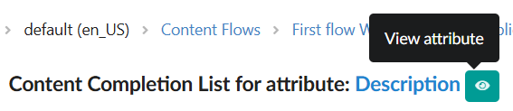
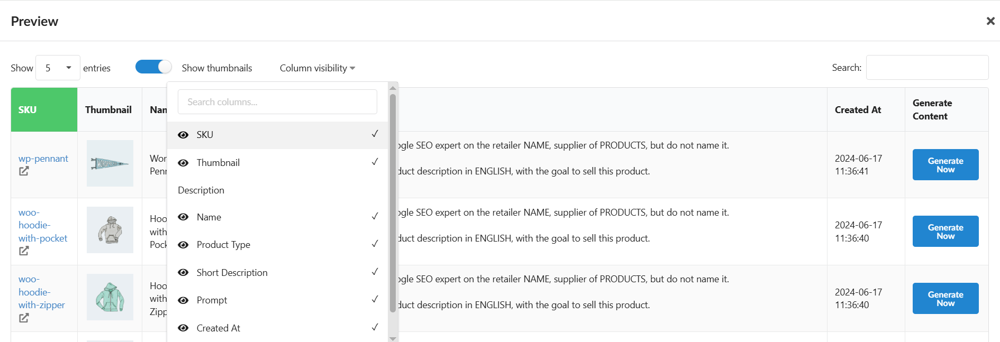
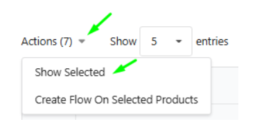

Nos esforçamos para garantir que trabalhar com grandes volumes de dados não seja apenas rápido, mas também totalmente controlável e intuitivo. A versão 5.10 se concentra em melhorar a qualidade dos dados visuais e **aumentar significativamente o desempenho e conveniência do uso do nosso serviço Fozzels.**

##

Impulsionando o Desempenho e a Qualidade dos Dados

Melhoramos a experiência do usuário para tornar o gerenciamento de catálogos grandes mais rápido e o trabalho com conteúdo perfeito.

### 1\. Gerenciamento de Catálogo e Dados

-   **Catálogo Acelerado (Novos Padrões):** Uma nova regra de visibilidade de coluna foi implementada no Catálogo. Aproximadamente 20 dos atributos mais importantes agora estão habilitados por padrão. Isso **simplifica significativamente o fluxo de trabalho** e **aumenta a velocidade de carregamento** e desempenho de exibição de catálogos grandes.
    

-   **Precisão de Atributos (Arredondamento DDP):** A lógica para exibir o Percentual de Densidade de Dados (DDP) foi atualizada. O valor DDP agora é arredondado para **três casas decimais**. Isso garante a exibição precisa de atributos com DDP muito baixo (por exemplo, 0,040%), eliminando confusão causada pelo arredondamento para zero.

-
    

-   **Máxima Clareza de Atributo:** O bloco "Obter dados de exemplo aleatório" agora exibe o **nome completo do site e da loja** (em vez de abreviações). Você sempre terá confiança sobre os dados específicos com os quais está trabalhando.
    

-   **Navegação de Tabela Flexível:** As opções de paginação para listas de atributos foram expandidas: suportando 50, 75, 100, 150 e **"200"** elementos. Gerencie facilmente conjuntos de dados massivos.
    

-   **Atualização Automática do Log de Catálogo:** Nas tabelas de log que rastreiam alterações no pool de produtos e atributos (**Lista de Log de Estado**), a função de atualização automática (**Atualizar a cada X segundos**) agora está **ativa por padrão**, aumentando a conveniência de rastrear processos ativos.
    
    2\. Geração e Fluxos de Trabalho (UX)

-   **Acesso Instantâneo às Configurações:** Um ícone de olho **"Visualizar atributo"** foi adicionado à tabela da lista de Lotes, ao lado do Nome do Atributo. Isso fornece uma maneira mais rápida de verificar as configurações e a configuração do atributo.
    

-   **Controle de Coluna em "Salvar e Visualizar":** O bloco **"Visibilidade de coluna"** foi adicionado à tabela de visualização (**Salvar e Visualizar**). Isso permite que você exiba apenas os atributos necessários, resolvendo problemas com tabelas excessivamente grandes.
    

###
3\. Gerenciamento de Imagem e Qualidade Visual

-   **Catálogo Visual Limpo:** O sistema agora **ignora automaticamente e não exibe** URLs de imagem inválidas (quebradas) ou vazias em todo o catálogo, relatórios e listas de geração. Diga adeus às imagens quebradas — seus dados agora parecem impecáveis.

-   **Filtragem de Imagem Aprimorada (Fluxo de Imagem):** Ferramentas poderosas foram adicionadas para classificar e filtrar imagens nos blocos de configuração de Fluxo de Imagem:

-   Filtros especiais permitem alternar entre imagens padrão e suas próprias imagens carregadas (classificação por **Origem**).

    -   A classificação por **Data de Upload** e **Nome** foi adicionada.
        
        

-   **Clareza de Terminologia:** Para maior clareza, "Modelo de IA" nas configurações de Fluxo de Imagem foi renomeado para **"Modelo Preset"**.

### 4\. Operações em Massa Aceleradas

-   **"Mostrar Selecionados" Com Todos os Recursos (Catálogo e Relatório Diário):** Melhoramos significativamente a função "Mostrar Selecionados". Agora, tanto no **Catálogo** quanto no **Relatório Diário**, a tabela de itens selecionados permite que você execute **todas as mesmas ações da tabela comum**: visualizar, filtrar e aplicar **Ações em Massa**.
    

-   **Confiabilidade em Ações em Massa:** Corrigimos um pequeno problema que ocasionalmente fazia a grade permanecer vazia se nenhum item fosse selecionado. Trabalhar com ações em massa agora é ainda mais confiável.

##
 Nos Bastidores: Estabilidade e Modernidade

-   **Estabilização de Integração Direcionada:** Correções necessárias foram implementadas para melhorar a estabilidade e funcionalidade de integrações com as plataformas **WooCommerce, EK Retail e Shopware**, garantindo operação confiável para clientes com essas configurações específicas.

Sua experiência é nossa prioridade. Essas atualizações são apenas uma parte do nosso trabalho contínuo para melhorar o Fozzels. Obrigado por fazer parte da nossa comunidade!
[Nosso Instagram](https://www.instagram.com/fozzelsai/)
