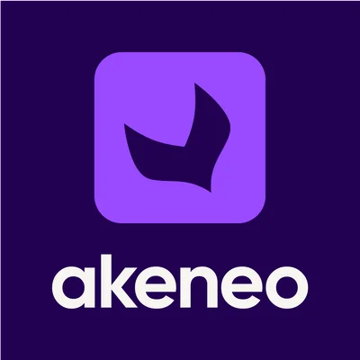

## **Destaques da Versão**

### **1\. Integração Akeneo PIM**

Expandimos nosso ecossistema para suportar **Akeneo**, um sistema de Gerenciamento de Informações de Produto líder mundial.

-   **Escalabilidade Corporativa:** Conecte perfeitamente seu Akeneo PIM ao Fozzels para automatizar o enriquecimento de conteúdo para milhares de SKUs, mantendo a integridade dos dados do produto principal.

-   **Sincronização Perfeita:** Mapeie estruturas de atributos complexas diretamente para nossos fluxos de IA para um fluxo de trabalho de dados unificado.
    

### **2\. Eficiência de Custos: Cache Inteligente de Mídia**

Reengenhamos nossa arquitetura de processamento de imagem para maximizar seu ROI.

-   **Pague Uma Vez, Itere Frequentemente:** Anteriormente, regenerar conteúdo poderia disparar custos repetidos de redimensionamento de imagem. Com nosso novo **Cache Inteligente**, uma imagem é processada uma vez e reutilizada para todas as solicitações subsequentes.

-   **Proteção de Orçamento:** Você não é mais cobrado por processamento repetido do mesmo ativo, independentemente de quantas vezes você ajuste seus prompts de texto ou regenere descrições.

### **3\. Qualidade Aprimorada de Conteúdo e Interface do Usuário**

Gerenciar a saída de IA agora é mais intuitivo e transparente.

-   **Visualização Visual por Padrão:** A janela "Editar Resultado" agora renderiza HTML por padrão. Veja seus cabeçalhos, listas e acordeões exatamente como aparecerão em sua loja virtual.

-   **Realçador de Conteúdo Suspeito:** Para garantir dados limpos, o sistema sinaliza automaticamente comentários indesejados de IA ou tags técnicas (por exemplo, "desculpa", "nota", "<code>") em laranja, apontando exatamente o que precisa de sua atenção.

### **4\. Estabilidade de Plataforma e Atualizações de IA**

-   **Fluxos de IA Estáveis:** Migramos todos os sistemas para os modelos **Gemini 2.5 Flash** e **Gemini 3 Pro Image** estáveis mais recentes. Esta transição garante confiabilidade 24/7 e elimina erros de "Modelo não encontrado".

-   **Ações em Massa:** Gerencie seus Fluxos de Imagem e Vídeo com mais eficiência com ações em massa (deletar, ativar ou alterar status) diretamente da exibição da lista.

-   **Precisão de URL do Shopify:** Corrigimos a vinculação da loja virtual para garantir que URLs de produtos sempre apontam para a loja específica selecionada em seu catálogo.
