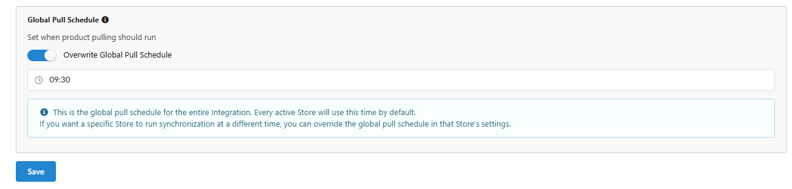
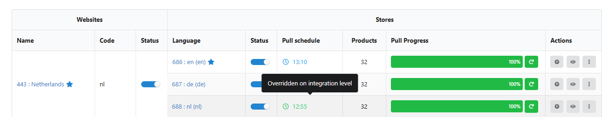
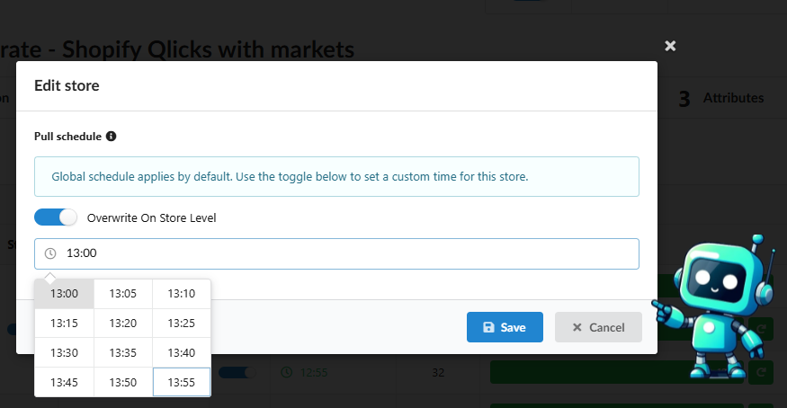
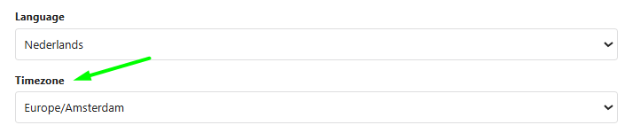
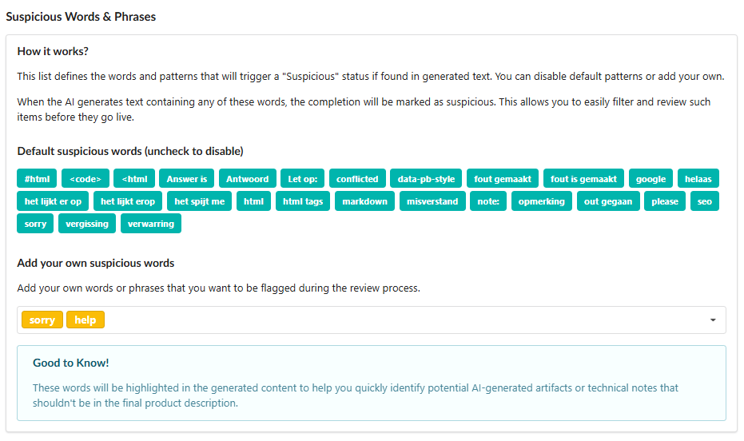
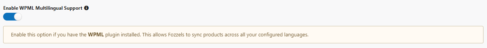

A versão de hoje trata-se de sua liberdade e confiança. Introduzimos ferramentas que permitem ao Fozzels trabalhar em sua agenda, proteger a integridade dos seus dados e escalar sem esforço seu negócio globalmente.

### 1\. Máquina de Tempo de Conteúdo: Histórico de Revisões e Controle de Versão

Nunca mais tenha medo de perder uma grande ideia ou sua descrição de produto original.

-   **Histórico Completo de Versões:** O Fozzels agora arquiva cada iteração do seu conteúdo - seja gerado por IA ou editado manualmente pela sua equipe.

-   **Fonte da Verdade:** A primeira versão em seu histórico é sempre o valor do atributo original que extraímos de sua loja. Você sempre tem seu conteúdo "baseline" a apenas um clique de distância.

-   **Comparação no Estilo GitHub:** Adicionamos um modo de comparação dedicado em que as alterações são destacadas. Veja exatamente o que foi adicionado, removido ou modificado entre quaisquer duas versões.

-   **Restauração Instantânea:** Encontrou a versão que você gosta? Simplesmente clique em "Aplicar" para defini-la como resultado final e prepará-la para sincronização.
    

### 

###

###

### 2\. Seu Negócio, Seu Tempo: Agendas de Pull Personalizadas e Fusos Horários

Adaptamos a plataforma para se adequar ao seu ritmo local e às demandas do mercado internacional.

-   **Agendas de Pull Personalizadas:** Você não está mais vinculado a um tempo de sincronização fixo. Defina sua frequência de pull de dados no nível de integração global ou customize para lojas individuais — perfeito para gerenciar marcas em diferentes fusos horários.

-   **Interface Localizada:** Pare de calcular deslocamentos UTC. Defina seu fuso horário preferido em seu perfil, e cada log, agendamento e timestamp em toda a interface do Fozzels refletirá sua hora local.

### 

###

### 

###

### 

###

### 

###

### 3\. Qualidade Inegociável: Suite Avançada de Conteúdo Suspeito

Atualizamos nosso "escudo intelectual" para garantir que suas páginas de produtos permaneçam profissionais e livres de artefatos de IA.

-   **Destaque na Interface:** Frases "suspeitas" ou tags técnicas de IA agora são destacadas diretamente nos resultados para detecção e correção instantânea.

-   **Listas de Acionadores Personalizadas:** Você define as regras. Personalize sua própria lista de palavras ou construções indesejadas no nível de integração.

-   **Filtragem Inteligente:** O Relatório Diário agora apresenta um filtro dedicado para "Conteúdo Suspeito", permitindo que você isole, corrija e sincronize itens sinalizados em massa em segundos.
    

### 4\. Expansão Global: Suporte WPML para WooCommerce

Gerenciar sites WordPress multilíngues é agora mais fácil do que nunca.

-   **Configuração de Um Toque:** Ative o suporte WPML em suas configurações, e o Fozzels detectará automaticamente todas as localidades e idiomas do site.

-   **Localização Simultânea:** Gere conteúdo único e localizado para cada versão de idioma simultaneamente em uma única integração.
    

###

### 5\. Automação de SEO: Palavras-chave AIOSEO

Aprofundamos nossa integração com o plugin **All in One SEO (AIOSEO)** para WooCommerce. O Fozzels agora pode gerar e sincronizar automaticamente **Palavras-chave**. Sua estratégia de SEO de ciclo completo (Título, Descrição e Palavras-chave) agora é 100% automatizada.

* * *

###

### Melhorias e Estabilidade

Nos bastidores, estamos garantindo que a plataforma permaneça à prova do futuro:

-   **Preparação para Shopify 2026:** Atualizamos proativamente nossa infraestrutura para garantir compatibilidade total com as mudanças obrigatórias da API Shopify em vigor a partir de 1º de abril de 2026. Suas lojas estão seguras.

-   **Otimização de Modelo:** Atualizações de integrações para Gemini 2.5 Flash e Nano Banana para se alinhar com os padrões mais recentes da API do provedor.

-   **Correção de Listas de Lotes:** Resolvemos um problema de carregamento para "Fluxos Obsoletos" em Listas de Lotes - gerenciar seus dados históricos agora é perfeito.
