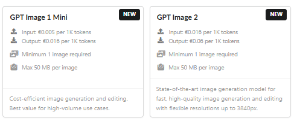
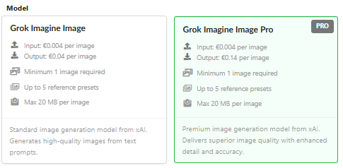
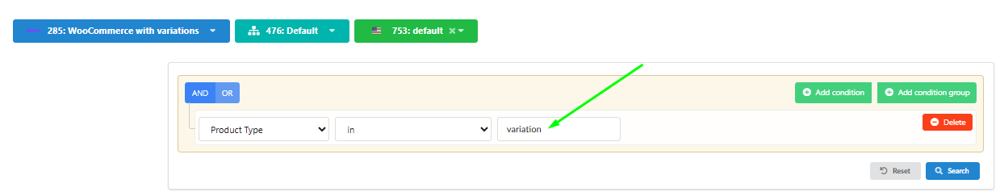

Esta versão é tudo sobre poder e controle. Integramos os modelos de IA mais avançados do mundo e adicionamos os recursos que você mais pediu para tornar seu fluxo de trabalho de conteúdo verdadeiramente perfeito.

### Revolução de Vídeo: Sora & Sora 2

Temos o prazer de anunciar suporte para os modelos de vídeo mais avançados da OpenAI, mudando o jogo no Video Flow.

-   Qualidade Cinemática: Os modelos Sora e Sora 2 fornecem detalhes incríveis e dinâmica natural de movimento.

-   Vídeo de Referências de IA: Use imagens geradas dentro da IA do Fozzels como base (Source Image) para seus vídeos. Perfeito para criar lookbooks consistentes e campanhas de marca de ponta.
    

### Inteligência de Próxima Geração para Conteúdo: GPT 5.5

Seu conteúdo de texto agora é alimentado pelo modelo mais inteligente da OpenAI.

-   Consciência Contextual Profunda: GPT 5.5 oferece análise superior de atributos de produto, produzindo descrições naturais e altamente persuasivas.

-   Focado em Conversão: A saída é mais estruturada e orientada para vendas direto da caixa.

### Novos Modelos de Imagem (Grok & GPT)

-   xAI Grok Imagine: Apresentando modelos Image e Image Pro para estilos artísticos únicos e produção de alta velocidade.

-   Visuais OpenAI: Apresentando GPT Image 1 Mini para esboço rápido e GPT Image 2 para obras-primas fotorrealistas premium.
    
    

### O QUE TODOS ESTAVAM ESPERANDO: Editor de Texto Integrado!

Agora você pode editar e formatar descrições geradas diretamente dentro do Fozzels. Tenha controle total sobre sua cópia antes da sincronização:

-   Ferramentas de Texto Rico: Use títulos (H1-H3), listas (com marcadores/numeradas), negrito e itálico para estruturar seu conteúdo.

-   Incorporar Vídeo: Adicione links do YouTube - o vídeo aparecerá como um reprodutor incorporado diretamente em sua página de produto.

-   Redefinição com Um Clique: Use a ferramenta "Limpar formatação" para redefinir instantaneamente o texto para o estilo de corpo simples.

### Filtragem Inteligente de Catálogo (Shopify, Magento, Akeneo)

Você decide exatamente o que importar para o Fozzels.

-   Filtragem no Nível de Integração: Filtre produtos por categorias, tags ou grupos durante a configuração de conexão inicial.

-   Catálogo Sem Desordem: Sem mais conteúdo desnecessário - trabalhe apenas com os itens que você precisa agora.

### 
Avanço do WordPress (WooCommerce)

-   Suporte Completo de Variação: Fomos mais fundo - sincronização completa (texto e visuais) agora está disponível para cada variação individual do produto (cor, tamanho, etc.).
    
    

### Coluna "Contagem de Produtos"

-   Transparência de Fila: Uma nova coluna em listas de Image/Video Flow exibe o número total de produtos aguardando geração, não apenas a contagem de resultados concluídos.
    

### Correções & Aprimoramentos

-   Chatbot de IA: Melhorada a sensibilidade e precisão ao mapear seus atributos de integração específicos.

-   Alternâncias de Fluxo Dinâmico: Ativação/Desativação agora é instantânea—não é necessário clicar em "Salvar" para aplicar mudanças de status.

-   Estabilidade de Prompt: A biblioteca de modelos agora permanece estável mesmo ao salvar prompts personalizados complexos com conteúdo intricado.

_Fozzels fica mais forte graças ao seu feedback. Vamos continuar construindo o futuro do e-commerce juntos!_
