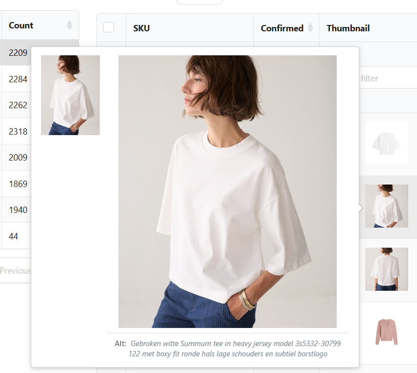
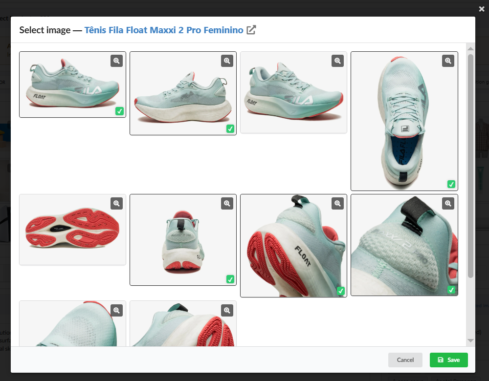
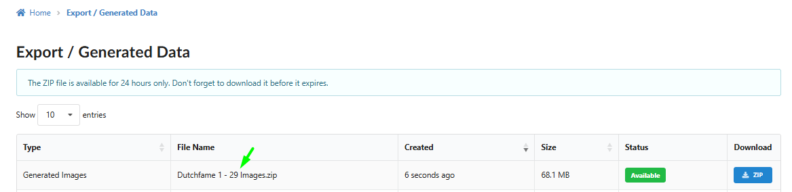

Estamos empolgados em apresentar a versão 7.6 do Fozzels! Esta versão traz uma nova integração de plataforma, acessibilidade mais profunda de dados de categoria e imagem, sincronização precisa e controles de pull de API, e atualizações significativas para fluxos de geração de imagens de IA. Explore todos os novos recursos abaixo.

1.  **Novas Integrações Integração VTEX** (Fase 1): Estamos lançando suporte inicial para a plataforma de e-commerce VTEX! Conecte sua loja VTEX para puxar dados de catálogo principal, gerar metadados de IA e descrições de produto localizadas, e sincronizá-los de volta perfeitamente.
    

2.  **Atributos de Dados & Metadados Parâmetros Estendidos de Categoria (Shopware, Magento, Shopify)**: Agora você pode acessar parâmetros profundos de nível de categoria - incluindo IDs de Categoria, Slugs/URLs e identificadores estruturais - diretamente dentro de fluxos de prompt e mapeamentos de atributos para contexto de IA mais rico.
    

3.  **Exibição de Textos Alt em Galeria de Visualização de Imagem (Magento 2)**: Passar o mouse sobre ou clicar em uma miniatura de produto em listas de catálogo agora exibe seu texto Alt associado diretamente abaixo do popover de visualização, tornando a verificação de metadados de imagem rápida e fácil (totalmente suportado para Magento 2).
    

4.  **Controles Cronograma de Pull Global & Regulação de Pull Flexível:** Adicionado controles avançados de pull à página de Configurações de Integração em todas as plataformas suportadas. **Pull Throttling**: Defina atrasos personalizados entre páginas e requisições de API individuais (de 100 a 15.000 ms) para gerenciar a carga de API e prevenir erros de limite de taxa em catálogos grandes.
    

5.  **Filtragem Expandida de Product Pull para Magento (Qualquer Estado)**: Filtre importações de catálogo Magento por status (Habilitado, Desabilitado) e visibilidade (Catálogo, Pesquisa, Catálogo & Pesquisa, Não Visível Individualmente). Facilmente puxe e otimize seu catálogo inteiro, incluindo itens desabilitados e rascunhos.
    

6.  **URL de Base de Imagem Personalizada / Suporte CDN para Magento:** Especifique um domínio de mídia personalizado ou caminho CDN (por exemplo, Cloudflare, AWS S3) para fetching de imagem de produto, garantindo processamento de mídia ininterrupto independentemente de onde seu storefront hospeda imagens.
    

7.  **Suporte de Ativos para Múltiplas Imagens de Referência:** Você pode agora selecionar múltiplas fotos de produto junto com múltiplos presets de estilo (dentro dos limites de capacidade do modelo de IA) para uma única tarefa de geração para alcançar maior precisão visual e detalhes realistas.
    

8.  **Downloads Completos de Conjunto de Imagem de Produto**: Baixar mídia gerada agora exporta o conjunto inteiro de imagens geradas associadas ao SKU de um produto, ao invés de limitar o download apenas ao primeiro ativo.
    

9.  Atualizamos nossos modelos principais de geração de imagem (**Gemini 3.1 Flash Image & Gemini 3 Pro Image)** para seus lançamentos estáveis mais recentes para renderização mais rápida, qualidade visual superior e estabilidade inquebrantável.
    Obrigado por estar com Fozzels! Esperamos que essas atualizações tornem seu fluxo de trabalho de conteúdo diário ainda mais suave. Sinta-se livre para entrar em contato se precisar de ajuda com os novos recursos!
