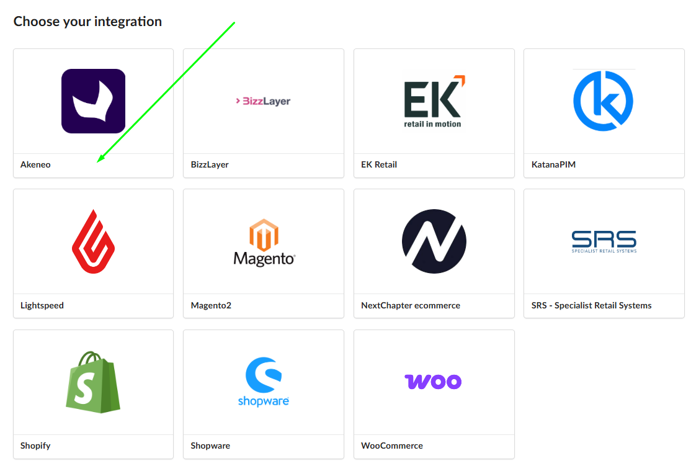
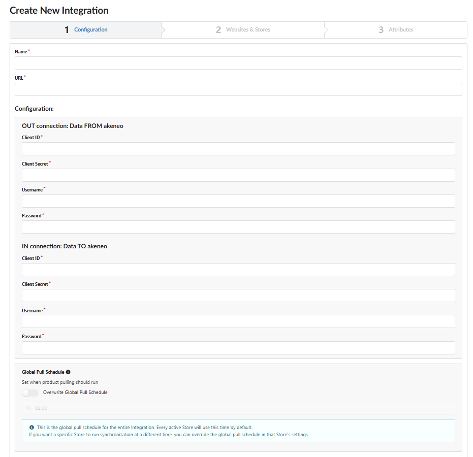

Este guia explica como estabelecer uma conexão bidirecional entre seu PIM Akeneo e Fozzels. A integração requer a criação de duas conexões separadas no Akeneo - uma para permitir que Fozzels envie dados para o Akeneo, e outra para permitir que o Akeneo exporte dados para Fozzels. Após ambas as conexões serem criadas, você as vincula à sua conta Fozzels usando as credenciais geradas.

**Pré-requisitos**

-   Uma conta Akeneo ativa com acesso de administrador
-   Uma conta Fozzels ativa
-   Acesso à área de configurações de Conexão no Akeneo

**Parte 1: Configuração do Akeneo (Criando Conexões)**

Etapa 1: Faça Login e Navegue até as Configurações de Conexão

1.  Abra um navegador e faça login no seu **painel Akeneo** usando suas credenciais de administrador.
2.  Na barra lateral esquerda, navegue até **Connect → Connection settings**.

Etapa 2: Crie a Conexão "Data Source" (Fozzels IN)

Esta conexão permite que Fozzels envie dados **para dentro** do Akeneo.

1.  Clique no botão **Create** no canto superior direito.
2.  Preencha os seguintes campos:
    -   **Label:** `Fozzels IN`
    -   **Code:** `fozzels_in`
    -   **Flow Type:** selecione `Data source`
3.  Clique em **Save**.
4.  Role para baixo até a seção **Permissions**. No menu suspenso **Role**, selecione `Administrator`.
5.  Clique em **Save** novamente.
6.  Mantenha esta página aberta — você precisará dos **Client ID**, **Secret**, **Username** e **Password** exibidos na tela.

> **Dica:** Copie cada credencial para um arquivo de texto temporário para não perdê-las ao navegar para longe.

Etapa 3: Crie a Conexão "Data Destination" (Fozzels OUT)

Esta conexão permite que o Akeneo exporte dados **para** Fozzels.

1.  Volte para **Connect → Connection settings** e clique em **Create**.
2.  Preencha os seguintes campos:
    -   **Label:** `Fozzels OUT`
    -   **Code:** `fozzels_out`
    -   **Flow Type:** selecione `Data destination`
3.  Clique em **Save**.
4.  Em **Permissions**, defina o **Role** para `Administrator`.
5.  Clique em **Save**.
6.  Copie o **Client ID**, **Secret**, **Username** e **Password** para esta conexão.

> **Importante:** Cada conexão gera seu próprio conjunto único de credenciais. Certifique-se de copiar e rotular ambos os conjuntos separadamente — você precisará colar cada um no campo correto no Fozzels.

**Parte 2: Ativação do Fozzels**

Etapa 4: Inicie uma Nova Integração

1.  Faça login em sua **conta Fozzels**.
2.  Navegue até a guia **Integrations**.
3.  Clique em **Create New Integration**.
4.  Selecione **Akeneo**.
    

Etapa 5: Preencha os Campos de Configuração

Na página de configuração de integração, preencha os seguintes campos:

-   **Name:** insira um nome descritivo para esta integração (por exemplo, `Akeneo Connection`)
-   A **URL** do seu site
-   **OUT connection (Data FROM Akeneo):** cole as credenciais da conexão **Fozzels OUT** que você criou na Etapa 3
-   **IN connection (Data TO Akeneo):** cole as credenciais da conexão **Fozzels IN** que você criou na Etapa 2

Etapa 6: Salve a Integração

1.  Clique no botão **Save** na parte inferior da página.

Sua conta Fozzels agora está conectada ao Akeneo. Os dados podem fluir em ambas as direções com base nas conexões que você configurou.

Se tiver algum problema durante a configuração, entre em contato com nossa equipe de suporte - ficaremos felizes em ajudar.
