AVISO IMPORTANTE

A partir de 1º de janeiro de 2026, a Shopify está oficialmente mudando suas regras para o gerenciamento de aplicativos. O método antigo de criar "Aplicativos Privados" diretamente no painel de administração da loja será descontinuado. Todas as novas conexões e atualizações das integrações existentes agora devem ser realizadas através da Plataforma Shopify Dev.

1.  Autorização

1.1. Faça login no Painel Oficial de Desenvolvimento Shopify: [https://dev.shopify.com/dashboard](https://dev.shopify.com/dashboard)

2.  Acessando o Menu de Criação de Aplicativo

2.1. Uma vez conectado ao painel:

-   Selecione a seção Aplicativos na barra lateral esquerda.

-   No canto superior direito, clique no botão Criar aplicativo (dependendo do tipo da sua conta, sua interface pode parecer ligeiramente diferente. Se você não vir este botão, role para o final da página. Deverá haver um link clicável rotulado **"Criar aplicativo")**
    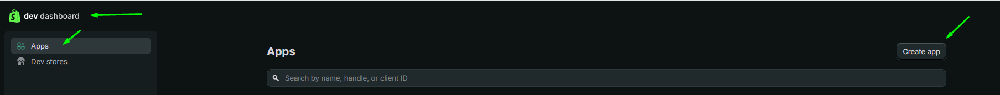

###

3.  Escolhendo o Método de Criação e Nomenclatura

3.1. Na tela de seleção:

-   Escolha a segunda opção à direita — Iniciar a partir do Painel Dev.
    Este método permite gerar credenciais de API rapidamente sem usar uma interface de linha de comando.

-   No campo Nome do aplicativo, digite um nome descritivo (por exemplo, Fozzels\_APP).

-   Clique no botão Criar.
    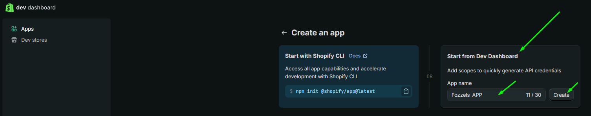

4.  Configuração de Versão e Configurações Obrigatórias

        4.1. Após clicar em Criar, você será redirecionado para a página Criar uma versão.
 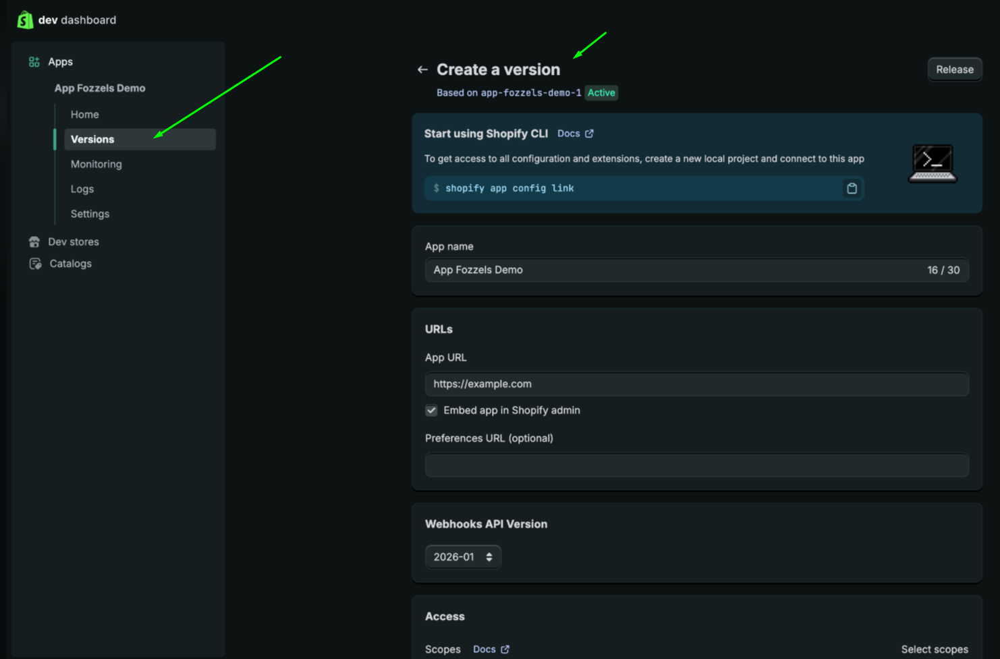

4.2. Nome e URL do Aplicativo

-   Digite o nome do aplicativo

-   Digite a URL da sua loja (por exemplo, [https://your-store-name.myshopify.com](https://your-store-name.myshopify.com)).

4.3. Configuração obrigatória

-   Incorporar aplicativo no painel de administração Shopify: deve estar habilitado.
    Isso garante que a interface Fozzels apareça dentro do seu painel de administração Shopify.
    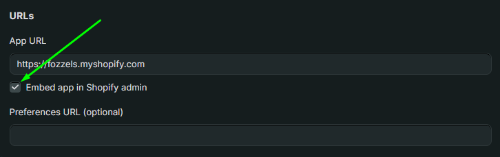

5.  Configurando Acesso à API (Escopos)

5.1. Role para baixo até a seção Acesso para definir quais dados o Fozzels pode gerenciar.

5.2. No bloco Escopos:

-   Clique no link Selecionar escopos no canto superior direito.
    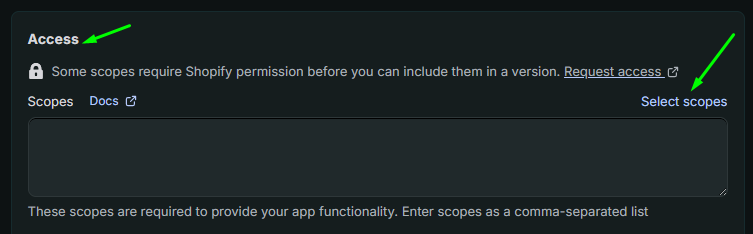

6.  Selecionando Permissões

6.1. Na janela modal Selecionar escopos:

-   Use a barra de pesquisa para encontrar permissões específicas.
    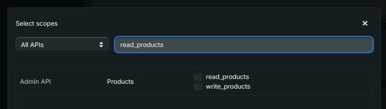

    6.2. Permissões necessárias
    Esta lista é obrigatória para todos os tipos de loja, incluindo lojas que usam Shopify Markets e Language Pages.

Produtos: read\_product\_listings, read\_products, write\_products, read\_product\_feeds.

Metadados: read\_metaobject\_definitions, read\_metaobjects.

Traduções: read\_translations, write\_translations.

Locales: read\_locales.

    Markets: read\_markets, write\_markets.
    ou copie/cole isto

    read\_locales,read\_markets,write\_markets,read\_metaobject\_definitions,read\_metaobjects,read\_product\_feeds,read\_product\_listings,read\_products,write\_products,read\_translations,write\_translations
    6.3. Clique em Concluído após selecionar todos os escopos necessários.
    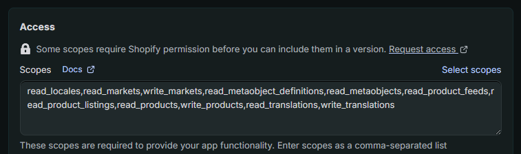
    7\. Lista de Verificação Pré-Lançamento: Configuração de Aplicativo

-   Antes de clicar no botão Lançar, verifique o seguinte:

-   URL do Aplicativo: uma URL de loja válida está inserida (por exemplo, [https://store-name.myshopify.com](https://store-name.myshopify.com)).

-   Versão da API: a Versão da API de Webhooks está definida para a versão estável mais recente (por exemplo, 2025-10).

-   Interface Incorporada: "Incorporar aplicativo no painel de administração Shopify" está habilitado (obrigatório para Fozzels).

-   Escopos Obrigatórios: todas as permissões necessárias estão presentes:

-   Produtos: read\_product\_listings, read\_products, write\_products, read\_product\_feeds

-   Metadados: read\_metaobject\_definitions, read\_metaobjects

-   Traduções: read\_translations, write\_translations

-   Locales: read\_locales

-   Markets: read\_markets, write\_markets

-   Verificação de Escopo: todas as permissões incluem o acesso de leitura e escrita necessário onde aplicável.

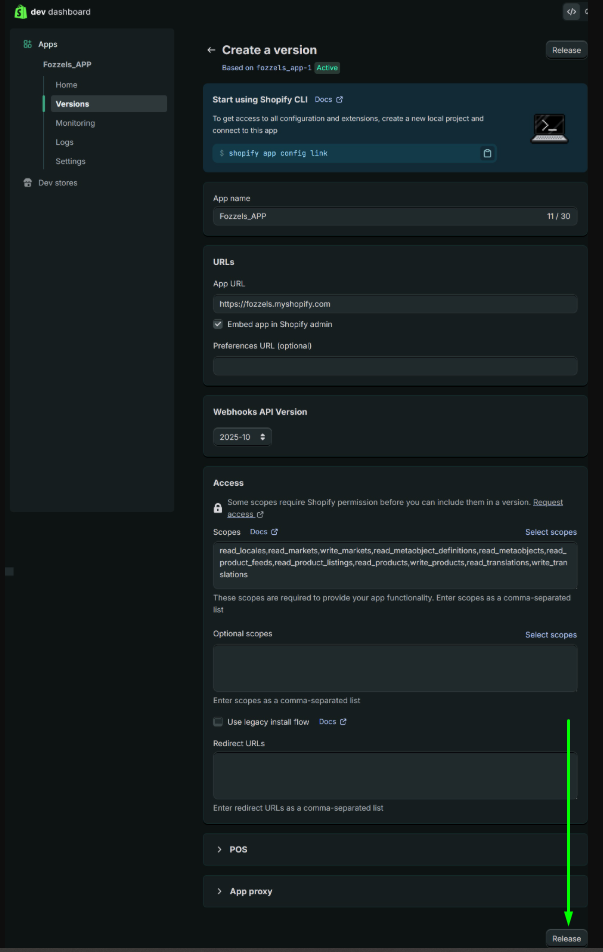

8\. Lançando a Versão

8.1. Para ativar a configuração:

-   Localize o botão Lançar no canto superior direito da página Criar uma versão.

-   **Clique em Lançar.**

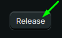

8.2. Na janela pop-up:

-   Nome da versão (opcional): por exemplo, v1.
    Se deixado em branco, o Shopify gerará um nome automaticamente.

-   Mensagem de versão (opcional): por exemplo, "Configuração inicial para Fozzels".

8.3. **Clique no botão Lançar** no canto inferior direito para finalizar.

O status da versão será alterado para **Active**.

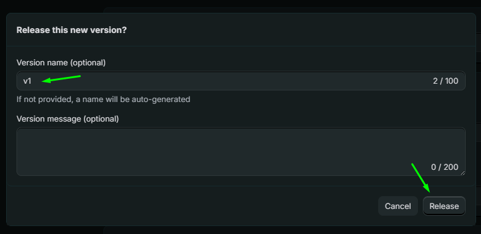

###
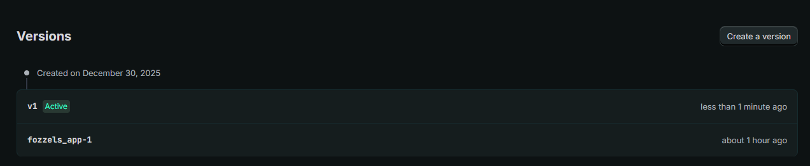

9.  Recuperando Credenciais de API

9.1. No Painel Dev Shopify, vá para **Settings** na barra lateral esquerda.

9.2. Na seção **App credentials** (Chaves de API), copie o seguinte:

-   Client ID (API Key)

-   Client Secret (Chave de Secret da API)

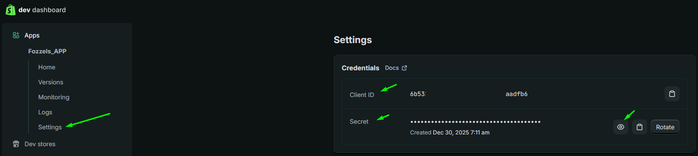

10.  A Lançando a Instalação

10.1. Após o lançamento, VÁ para a guia Home do aplicativo.

    10.2. Certifique-se de estar na guia Home.
Se sua conta possui apenas um site e você planeja usar o Fozzels exclusivamente para esse site, simplesmente clique em **Instalar aplicativo**. O aplicativo será instalado automaticamente.
Se você tiver uma conta de parceiro ou gerenciar vários sites, você precisará configurar as configurações de distribuição para o aplicativo Fozzels.

10.3. Na barra lateral esquerda, abra a guia Distribution.

    10.4. Clique em Selecionar método de distribuição e escolha **Distribuição personalizada**.
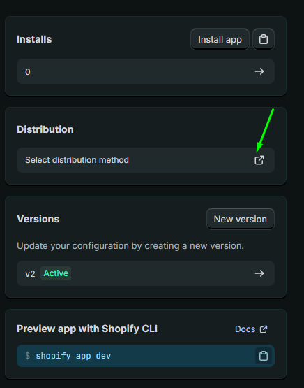
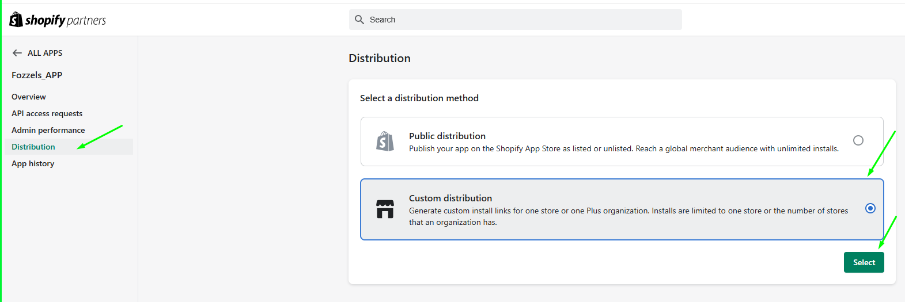
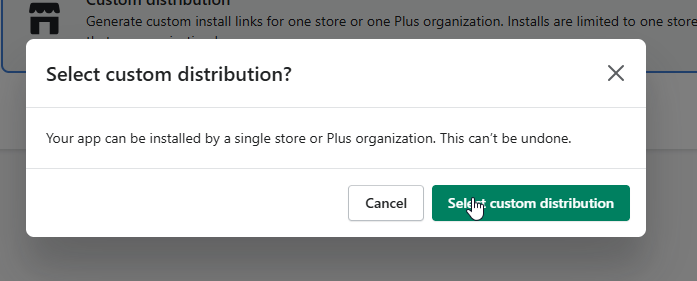

10.6. Após a autorização, você voltará à página de Distribuição Personalizada.

-   Digite seu domínio da loja (por exemplo, seu-loja.myshopify.com).

-   Clique em Gerar link.

-   Confirme a ação na janela pop-up.

10.7. Você será redirecionado para a página Instalar aplicativo no painel de administração da sua loja.

-   Clique em Instalar.

-   Confirme a mensagem "Este aplicativo é exclusivo para sua loja".

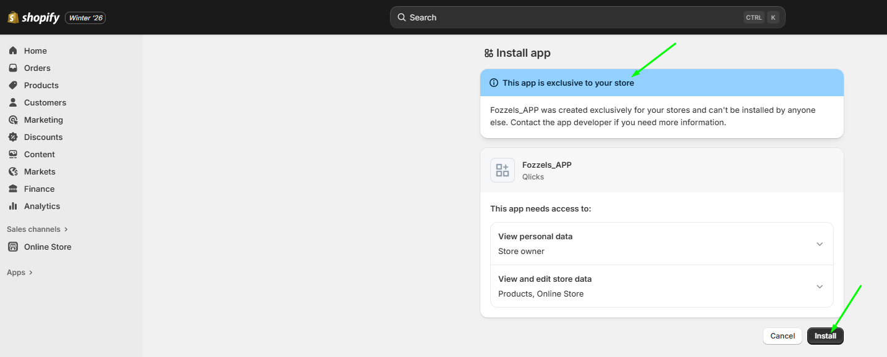

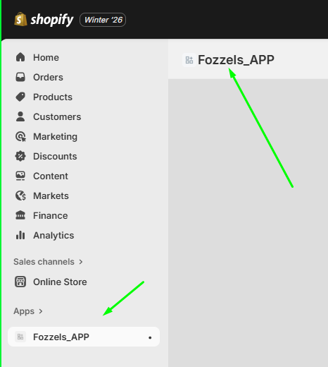

10.8. Para completar a sincronização, volte para sua conta Fozzels para inserir as credenciais e finalizar a conexão.

11.  Criar Integração no Fozzels.

11.1. Configuração de Conexão

-   Faça login em sua conta Fozzels: [https://app.fozzels.com](https://app.fozzels.com)

-   Vá para a seção Integração.

-   Clique em Nova Integração.

-   Escolha Shopify como plataforma.

-   Escolha o tipo de conexão Aplicativo Personalizado.

-   Digite o nome da integração.

-   Digite a URL da webstore Shopify.

Nota:
Para os campos URL e Nome do Host do Aplicativo, sempre use o domínio .myshopify.com, não a URL da loja pública.
Exemplo: teststore.myshopify.com

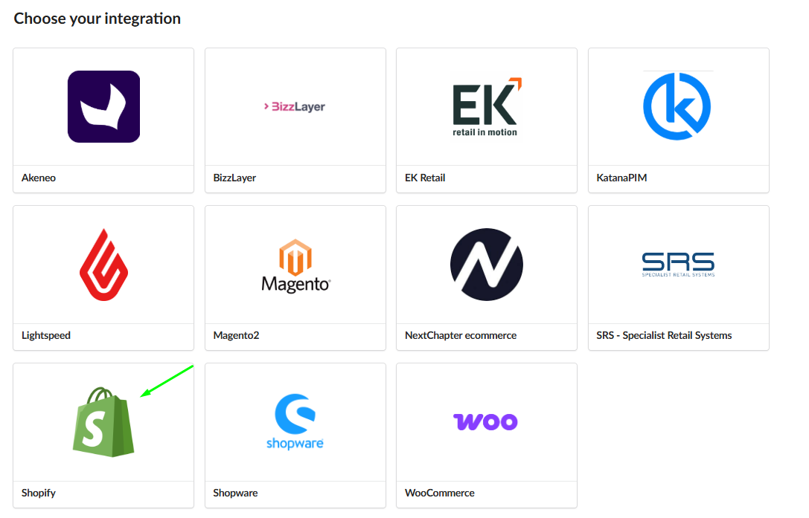

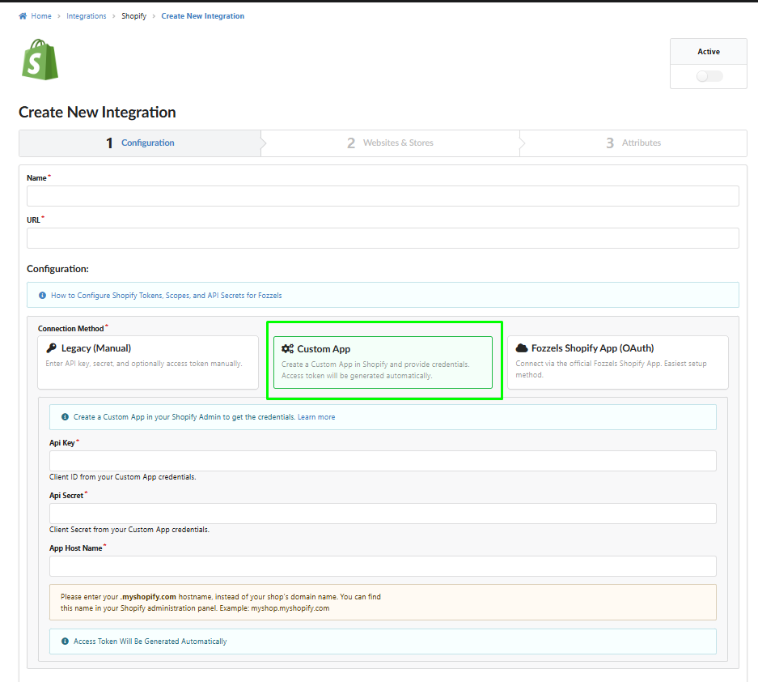

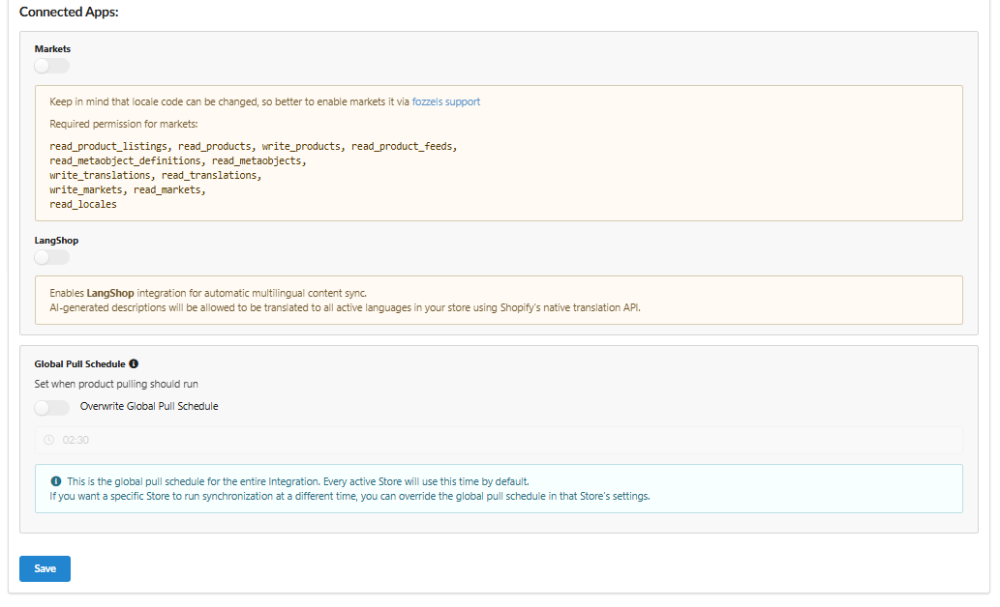

12.  Inserir Credenciais de API no Fozzels

12.1. Copie e cole as credenciais no Fozzels:

-   API Key → campo de chave API

-   API Secret Key → campo de Secret API

-   App Host Name → campo de Nome do Host do Aplicativo

13.  Configurações Adicionais e Geração de Token de Acesso

13.1 **Ative os toggles Markets ou LangShop** se você precisar sincronizar conteúdo em vários mercados ou idiomas.

13.2 Clique no botão Salvar. O campo Token de Acesso estará disponível após sua geração.
13.3 Mova para a guia Websites & Stores.
13.4 Ative sua integração.
13.5 Clique no botão Pull Websites & Stores para obtê-los.
13.6 O sistema gerará automaticamente o Token de Acesso após autorização bem-sucedida.

14. Ativação e Sincronização

14.1. Ative Websites e Languages usando os toggles. O idioma padrão é marcado com uma estrela.

14.2. Clique em Pull Products para começar a importar produtos e atributos. O progresso será mostrado na barra de progresso.

14.3. Vá para a guia Attributes para visualizar, ativar, desativar ou editar atributos importados. Leia mais sobre o gerenciamento de atributos [aqui](https://fozzels.freshdesk.com/a/solutions/articles/103000368952) .

Após criar com sucesso a integração, você pode **começar** a criar flows e **gerar** seu **[primeiro conteúdo](https://fozzels.freshdesk.com/a/solutions/articles/103000367976)** !
