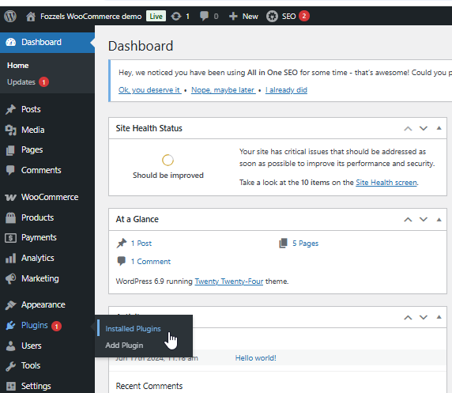
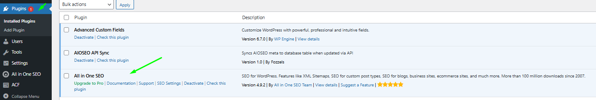
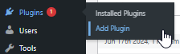
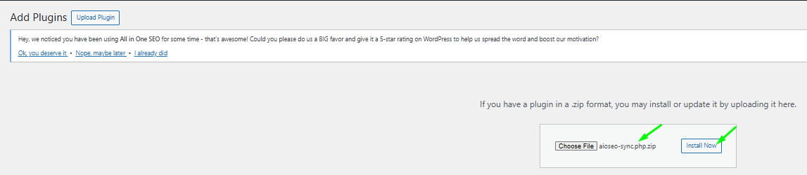
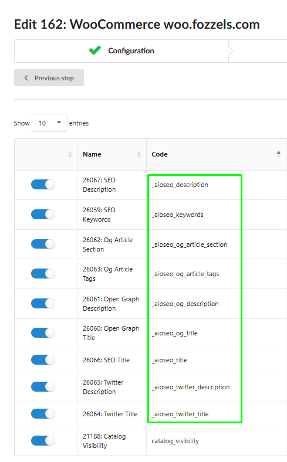

###

**All in One SEO (AIOSEO)** é o principal plugin WordPress projetado para melhorar o ranking de busca e aumentar o tráfego orgânico automatizando elementos críticos como meta tags e visualizações sociais.

Estamos muito empolgados em anunciar a **integração completa entre Fozzels e AIOSEO para WooCommerce!** Esta poderosa combinação permite que você trate campos de SEO como atributos de produto padrão. Agora você pode:

-   **Automatizar em Escala:** Gere títulos de SEO e descrições únicos e otimizados por IA para milhares de produtos simultaneamente.

-   **Domínio de Mídia Social:** Gerencie automaticamente dados de **Twitter Cards** e **Open Graph** para garantir que seus produtos se pareçam perfeitos quando compartilhados em plataformas sociais.

-   **Fluxos Inteligentes:** Use **Content Flows** para editar e transformar dados de SEO assim como qualquer outro atributo de produto.

-   **Sincronização Perfeita:** Elimine entrada manual de dados ao enviar instantaneamente conteúdo gerado por IA diretamente para sua loja WooCommerce via nosso conector de API dedicado.

Este guia explica como conectar **Fozzels**, **WooCommerce** e **All in One SEO (AIOSEO)** para automatizar metadados de sua loja. Seguindo estas etapas, seus campos de SEO se comportarão como atributos de produto padrão, permitindo que você gere e sincronize conteúdo otimizado para busca em massa.

## Etapa 1: Verifique e Ative AIOSEO no WordPress

Certifique-se de que o plugin de SEO principal está ativo em seu site WooCommerce:

1.  Faça login em seu Painel de Administração WordPress.

2.  Navegue até **Plugins** > **Installed Plugins**.
    

3.  Localize **All in One SEO** na lista:

-   Se desabilitado, clique em **Activate**.

    -   Se ativo, você pode clicar em **Check this plugin** para verificar seu status e configurações atuais.
        

4.  **Verifique os Campos:** Abra qualquer produto em **Products**. Role para baixo até o bloco **AIOSEO Settings**. Você deve ver os campos padrão para _Product Title_ e _Meta Description_.
    

###
Etapa 2: Instale o Plugin "AIOSEO API Sync by Fozzels"

Configurações padrão do AIOSEO apenas permitem que ferramentas externas leiam dados. Para **sincronizar** conteúdo gerado de volta para sua loja, você deve instalar nosso conector especializado:

1.  Em seu menu WordPress, vá para **Plugins** > **Add Plugin**.

2.  Clique em **Upload Plugin** no topo da página.
    

3.  Selecione o arquivo ZIP fornecido (**AIOSEO API Sync by Fozzels**), clique em **Install Now** e depois em **Activate**.
    

4.  Este plugin habilita a transferência segura bidirecional de metadados de SEO via API do WordPress.

**\*\*\* Você pode fazer download do arquivo ZIP necessário para o plugin 'AIOSEO API Sync by Fozzels', que está anexado ao final deste artigo.**

### Etapa 3: Ative o Suporte no Fozzels

Ative a integração dentro da plataforma Fozzels:

1.  Abra sua **Guia de Configuração em sua integração WooCommerce existente ou nova** no Fozzels.

2.  Localize a seção: **"All in One SEO – Powerful SEO Plugin to Boost SEO Rankings & Increase Traffic"**.

3.  Mude o toggle para **On e SALVE as alterações.**

### Etapa 4: Identificação de Atributos de SEO

Uma vez ativados, todos os campos relacionados a SEO aparecerão automaticamente em sua lista de atributos geral do Fozzels. Eles são fáceis de identificar e pré-configurados para uso imediato:

-   **Códigos Técnicos:** Cada atributo de SEO é rotulado com um código específico começando com `_aioseo_` (por exemplo, `_aioseo_title`, `_aioseo_description`, `_aioseo_keywords`).

-   **Configurações Padrão:** Para sua conveniência, estes atributos estão automaticamente definidos como:

-   **Active**

-   **Allowed HTML**

-   **Filterable**

-   **Mídia Social:** Você também pode gerenciar visualizações sociais via atributos como `_aioseo_twitter_title` ou `_aioseo_og_title`.
    

### Etapa 5: Content Flows e Sincronização

A maior vantagem desta integração é que campos de SEO agora se comportam como dados de produto regular. Você não está mais limitado apenas a sincronização básica:

-   **Crie Flows Personalizados:** Você pode construir **Content Flows** específicos para estes atributos. Use seus templates de IA existentes ou crie novos para gerar títulos e descrições de SEO otimizados.

-   **Fluxo de Trabalho Padrão:** Trate atributos de SEO como qualquer outro campo de produto — edite-os, aplique filtros ou mapeie-os para diferentes fontes de dados dentro do Fozzels.

-   **Atualização Instantânea:** Assim que sua geração for concluída, clique em **Sync to Store**. O Fozzels preencherá instantaneamente os campos AIOSEO correspondentes em seu site WooCommerce com o novo conteúdo gerado por IA.
