Este guia detalha como estabelecer uma conexão segura e bidirecional de API entre sua loja Lightspeed eCom e Fozzels gerando a Chave de API necessária e o Secret dentro do Gerenciador Lightspeed.
A integração Lightspeed requer a criação de uma Nova Chave de API dedicada e a definição de permissões específicas de Leitura e Escrita (Escopos) para permitir que Fozzels extraia dados de produtos com segurança e envie conteúdo gerado por IA de volta para seu catálogo.

### Parte 1: Configuração Lightspeed (Gerando Credenciais de API)

Você deve acessar sua conta Lightspeed para criar e ativar o par de chaves de API necessário.

#### **Etapa 1: Faça Login e Navegue até Configurações de API**

1.  **Abra** um navegador e **faça login** no Lightspeed eCom Back Office (Gerenciador Lightspeed Retail) usando suas credenciais de administrador.

2.  No menu principal Lightspeed, **vá** até a seção "Settings".

3.  **Encontre** e **selecione** "API Keys" ou "Developers".
    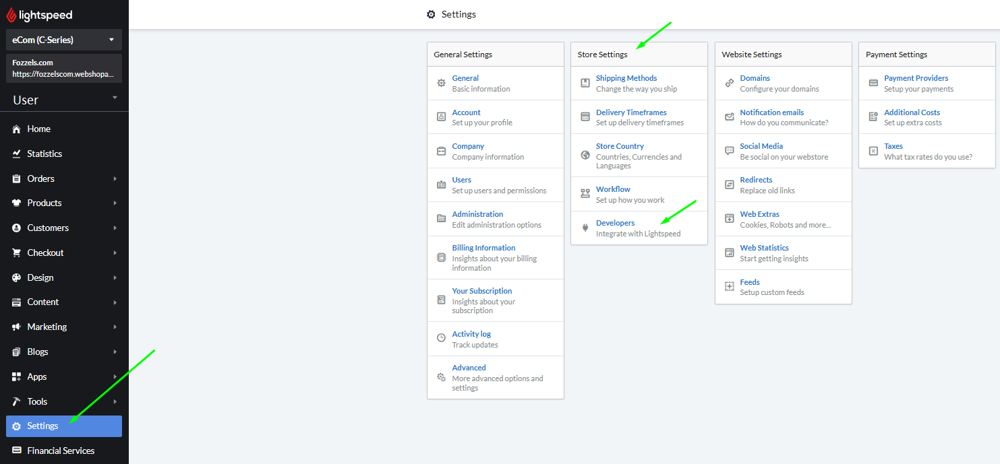

####
**Etapa 2: Crie uma Nova Chave de API**

1.  **Clique** no botão "Add API Key" ou "New Key".

2.  **Nomeie** a integração claramente (por exemplo, Fozzels Integration).

#### 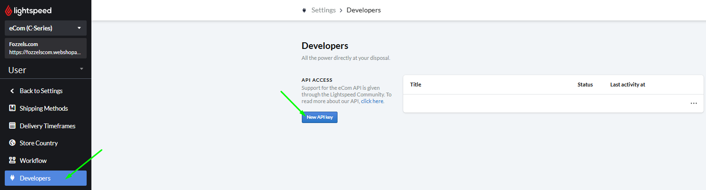

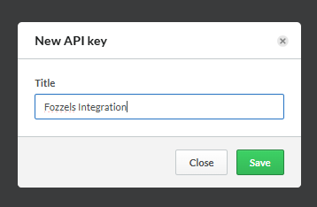

####

####
**Etapa 3: Defina Permissões (Escopos)**

A página de configurações para a nova conexão será aberta automaticamente. Você **deve** selecionar as permissões necessárias para o Fozzels.
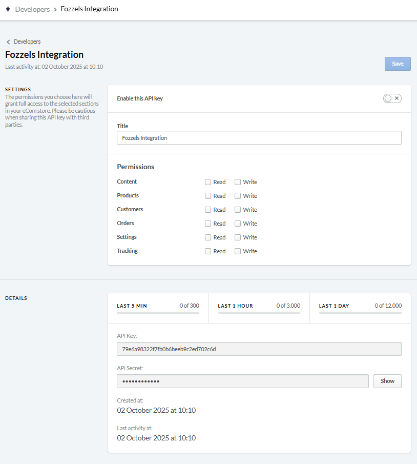

1.  **Certifique-se** de que as permissões de leitura e escrita sejam concedidas para as seguintes seções:
    -   Content  → read and write

-   Products → read and write

-   Settings → read and write

Nota: Conceder acesso "Write" permite que o Fozzels atualize dados em sua loja Lightspeed, garantindo sincronização bidirecional.)

####
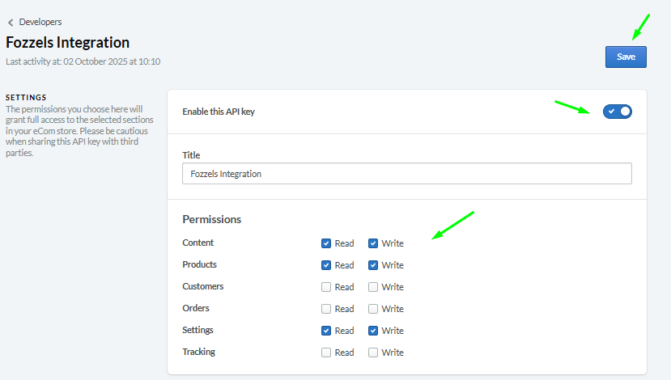**Etapa 4: Ativação e Cópia das Chaves**

1.  No canto superior direito da página de configurações de permissões, **Ative** o toggle (Habilitar esta chave de API).

2.  **Clique** no botão "Save".

3.  **Role** para o bloco "Details".

4.  Para visualizar o **API Secret (Secret Key)**, **Clique** no botão "Show".

5.  **Copie** ambas as chaves (**API Key** e **API Secret**) para a próxima etapa.

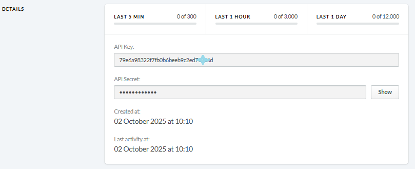
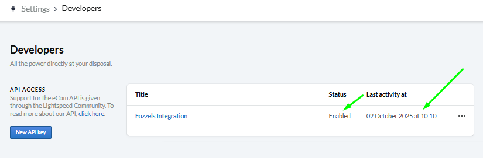
Resultado Esperado: A lista Developers agora mostrará uma entrada para a conexão Fozzels criada e ativada com sucesso.)

### Parte 2: Ativação de Fozzels e Sincronização de Dados

Transfira as chaves copiadas para a plataforma Fozzels e inicie a sincronização.

#### **Etapa 5: Inicie uma Nova Integração**

1.  **Faça login** em sua conta Fozzels.

2.  **Vá para** a página Integrations.

3.  **Clique** no botão "New Integration".
    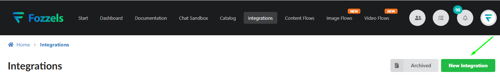

4.  **Selecione** "Lightspeed" da lista de serviços disponíveis.
    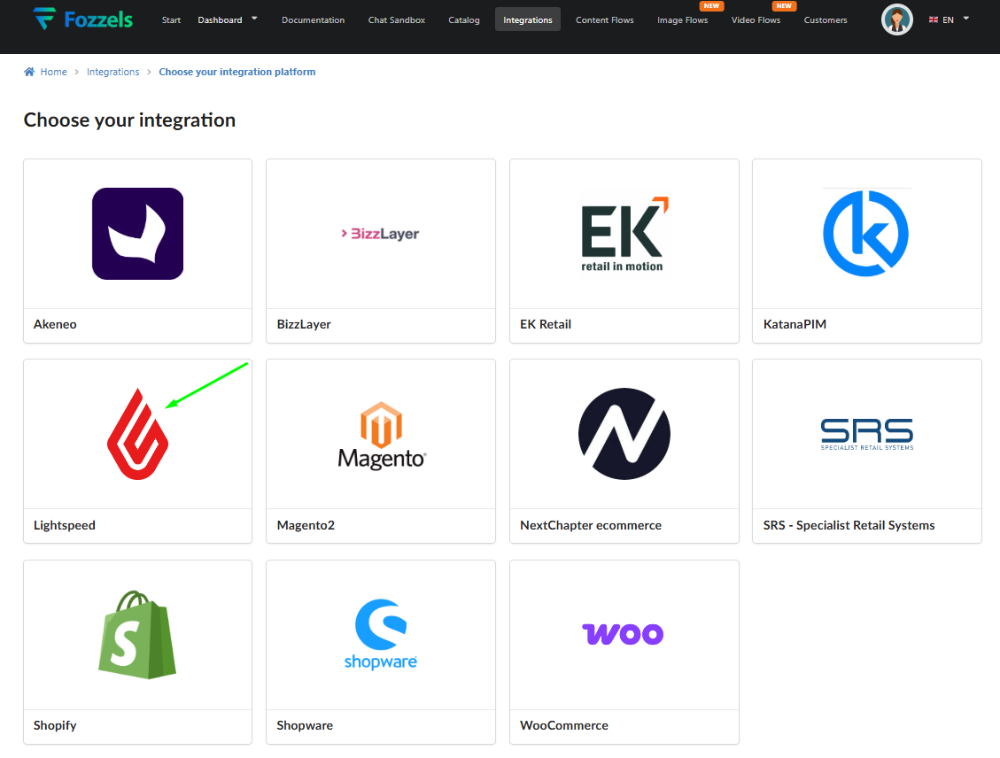

#### **Etapa 6: Preencha os Campos de Configuração**

Na página "Create New Integration", **Preencha** os seguintes campos:

1.  **Name:** **Digite** um nome claro para esta integração (por exemplo, Lightspeed\_INT).

2.  **URL:** **Digite** a URL de sua loja Lightspeed.

3.  **API Key:** **Cole** a Chave de API copiada do Lightspeed.

4.  **API Secret:** **Cole** o Secret de API copiado do Lightspeed.

5.  **Language:** **Escolha** o idioma principal de seu site.

6.  **Cluster:** **Selecione** o cluster apropriado (região) onde sua loja Lightspeed está hospedada.

#### 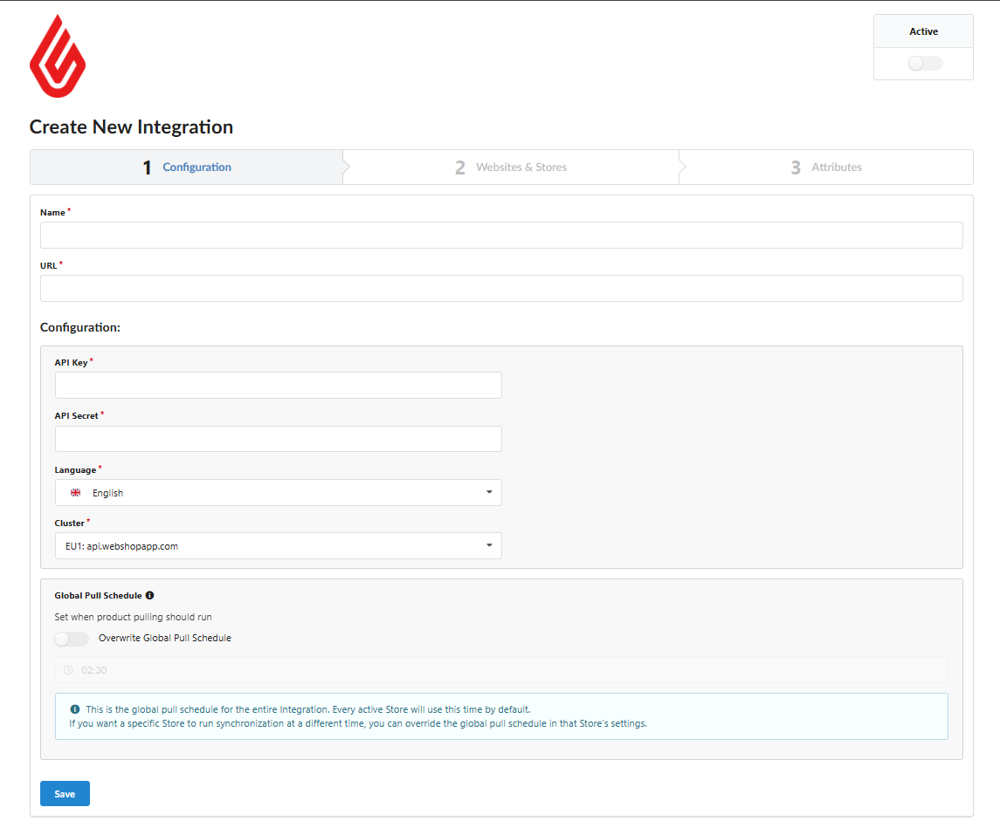

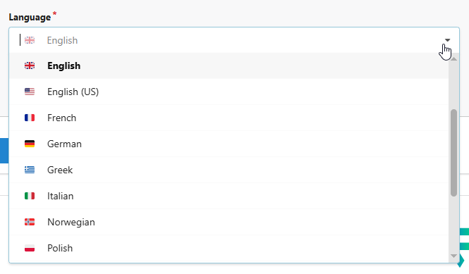

**Etapa 7: Ative e Salve a Integração**

1.  **Ative** a integração alternando o toggle "Active" **On** no canto superior direito.

2.  **Clique** no botão "Save".

#### **Etapa 8: Configuração de Websites & Stores e Pull de Dados**

Agora você prosseguirá para a guia "Websites & Stores" (Etapa 2) no Fozzels.

1.  **Clique** no botão "Pull Websites and Stores".

2.  **Ative** os sites e lojas necessários alternando os toggles de **Status** correspondentes para **On**.
    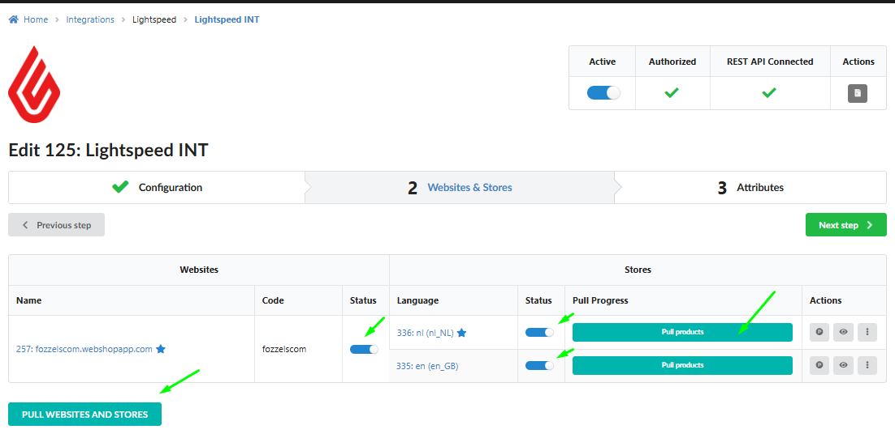

3.  Para cada loja necessária, **Clique** no botão **"**Pull products**"**. Esta ação inicia o carregamento inicial dos dados de produto no Fozzels.
    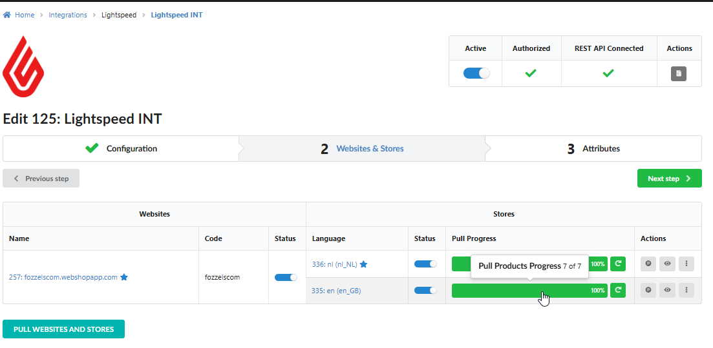

Assim que o processo de carregamento de produtos for concluído, o Fozzels está pronto! Você pode prosseguir para a guia "Attributes" para configurar suas regras de sincronização. Para instruções detalhadas sobre trabalhar com atributos de produtos e personalizar campos de dados, leia: 3.1. Importing and Catalog Overview.
