Este guia o leva pelo processo completo de conexão de sua loja online Shopware 6 com Fozzels.
A integração consiste em duas partes:

# Parte 1: Crie uma Integração no Shopware 6

Nesta parte, você criará uma integração de API dentro do seu painel de administração Shopware 6. Isso gera as credenciais que o Fozzels precisa para se comunicar com sua loja.

### 1\. Introdução

Acesse seu painel de administração do Shopware 6. Você normalmente pode encontrá-lo em [your store URL](https://shopware6.fozzels.com/admin).

### 2\. Clique em "Configurações"

Clique em "Configurações".

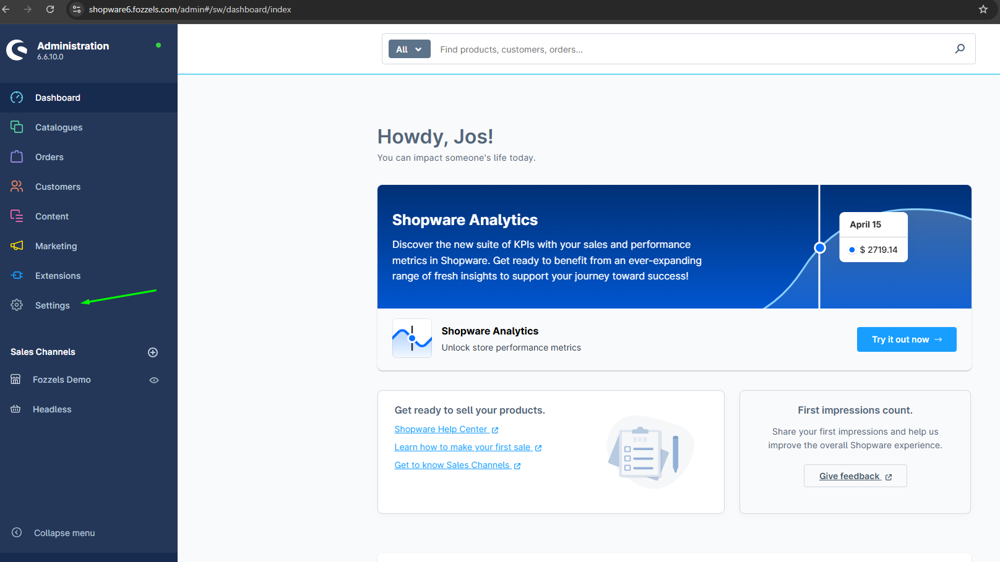

### 3\. Clique em "Sistema"

Navegue até as configurações do sistema.

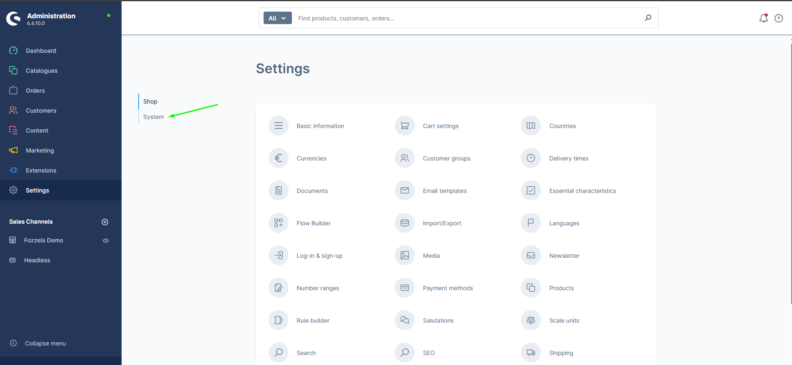

###
4\. Clique em "Usuários e permissões"

Selecione a opção Integrações no menu Sistema.

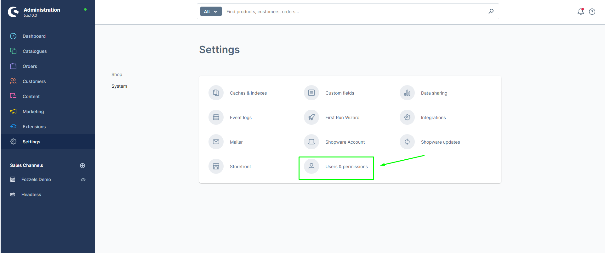

### 5\. Role para baixo até "Funções" e clique em "Criar função"

   Na página Usuários e permissões, role para baixo até a seção Funções e clique no botão "Criar função".

### 6. Preencha o nome da função

Na aba "Geral", insira um nome para a função.

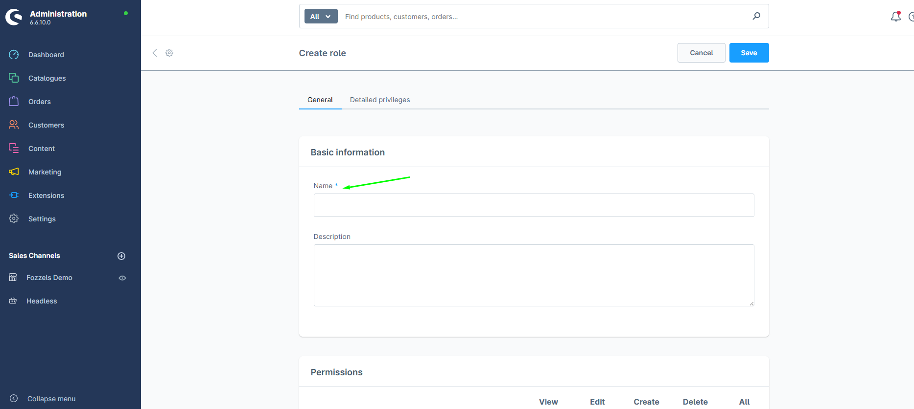

### 7\. Clique em "Permissões"

Você verá a tabela de permissões com todas as caixas desmarcadas. Ative as seguintes permissões:

**Catálogos (Visualizar, Editar, Criar, Deletar):**

-   Categorias
-   Grupos de produtos dinâmicos
-   Páginas de destino
-   Fabricantes
-   Produtos
-   Propriedades
-   Avaliações

**Conteúdo:**

-   Mídia (Visualizar, Editar, Criar, Deletar)
-   Experiências de compra (Visualizar, Editar)
-   Temas (Visualizar, Editar)

**Outro** (Visualizar, Editar, Criar, Deletar):

-   Canais de vendas

**Configurações:**

-   Moedas (Visualizar, Editar, Criar, Deletar)
-   Campos personalizados (Visualizar, Editar, Criar, Deletar)
-   Idiomas (Visualizar, Editar, Criar, Deletar)

### 8. Salve a função

Após definir todas as permissões, clique em "Salvar" para salvar a função.

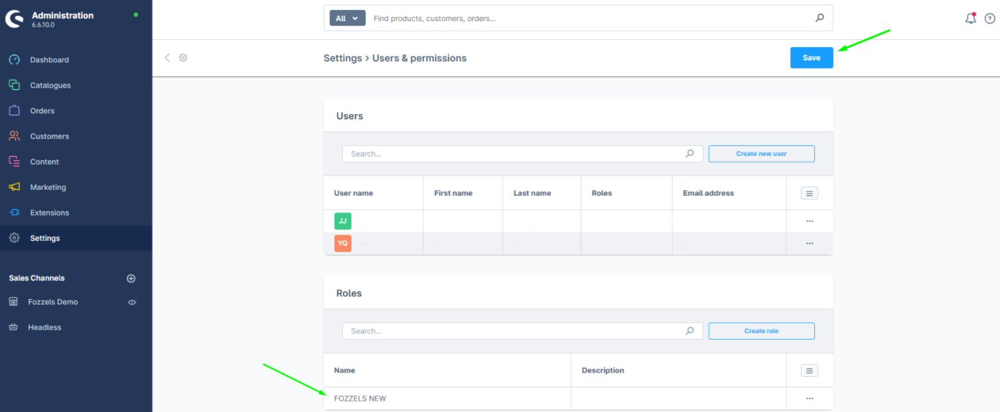

###  **9.** Vá para Sistema > Integrações
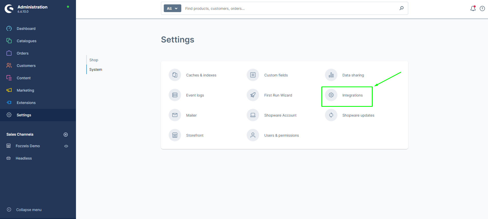
**10.** **Clique em "Adicionar integração"**

Clique no botão "Adicionar integração". A caixa de diálogo "Criar integração" aparecerá:

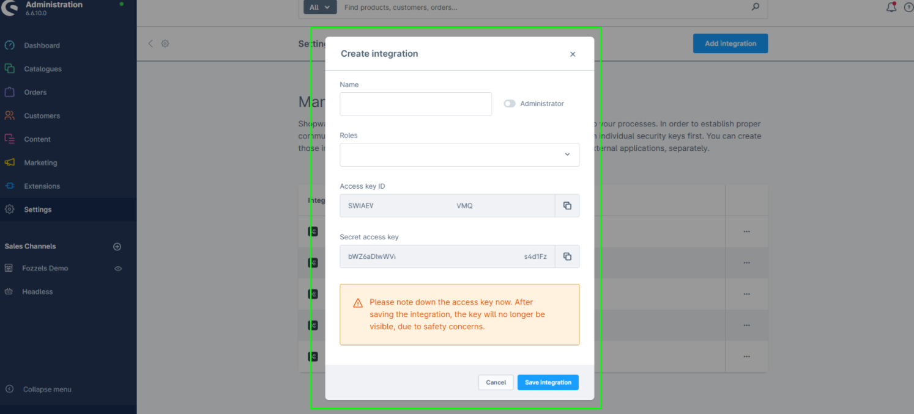

**11.** Preencha os detalhes da integração

Insira um nome para a integração. Em seguida, abra o menu suspenso "Funções" e selecione a função que você criou anteriormente.

###
12\.  Copie a ID da chave de acesso

Clique no ícone copiar ao lado da **ID da chave de acesso** para copiá-la para sua área de transferência. Cole esta chave em um documento de texto para manter em segurança - você precisará dela na Parte 2.

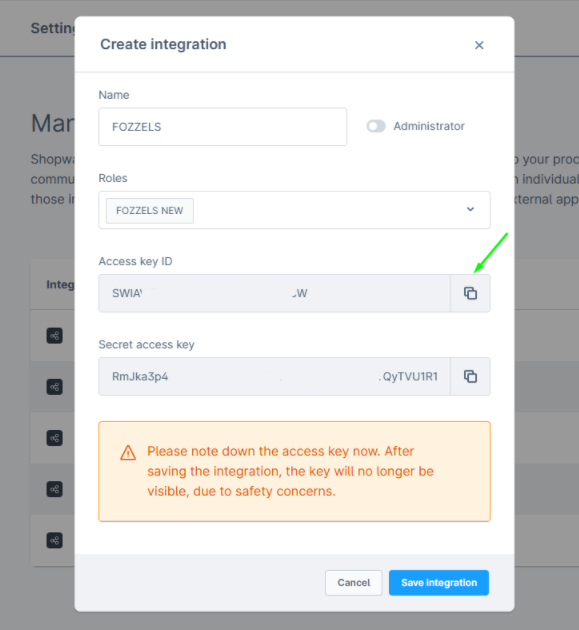

**13\.**  **Copie a chave de acesso secreta**

Faça o mesmo para a **chave de acesso secreta**: clique para copiar a chave de acesso secreta para sua área de transferência. Em seguida, cole este código em um documento de texto para que você possa acessar e copiar o código mais tarde.

### 14\. Clique em "Salvar integração"

Salve as configurações de integração.

### 15\. Confirme a mensagem de sucesso

A integração agora está criada e ativa.

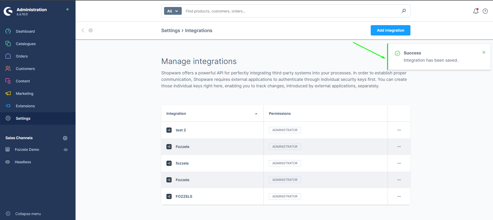

###

# Parte 2: Conecte Fozzels ao Shopware 6

Agora que você criou a integração no Shopware, você configurará a conexão no lado do Fozzels usando as credenciais da Parte 1.

### **1.** Vá para [Fozzels.com](https://fozzels.com/)

###
**2.**  Clique em "Integrações"
    No menu Fozzels, clique em Integrações.
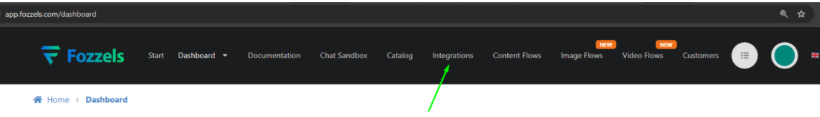
3\. Clique em "Criar"
    Clique no botão "Criar" para começar a configurar uma nova integração.
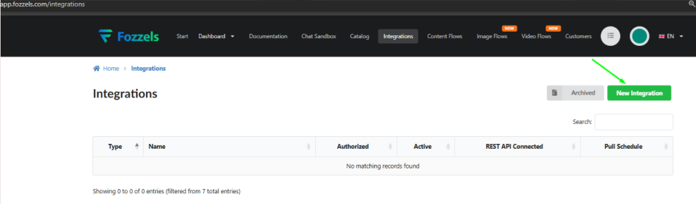
4\. Selecione o logotipo do Shopware

Escolha Shopware como o tipo de integração clicando no logotipo do Shopware.

### 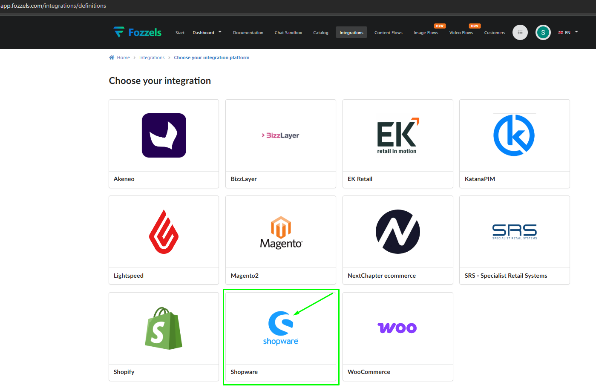5\. Preencha os detalhes da integração

Preencha os seguintes campos em ordem:

1\. Nome — Insira um nome para esta integração, por exemplo "Shopware 6".

2. URL — Insira a URL de sua loja online Shopware 6 (por exemplo, https://your-store.com).

3. ID da chave de acesso — Cole a ID da chave de acesso que você copiou do Shopware na Parte 1.

4. Chave de acesso secreta — Cole a chave de acesso secreta que você copiou do Shopware na Parte 1.

**6**. Quando todos os campos estiverem preenchidos, clique em "Salvar". Você deverá ver uma pop-up de "Sucesso" confirmando que a conexão foi salva.

### 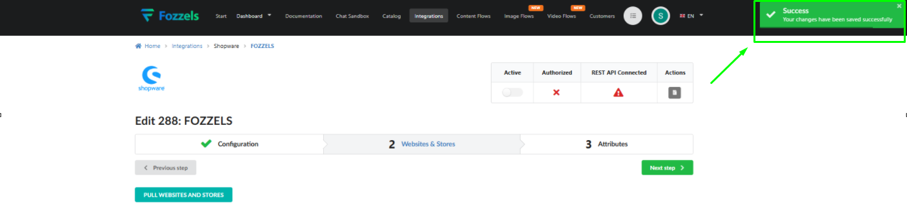

### 7\. Ative a integração
    Alterne o botão "Ativo" para ativar a integração.
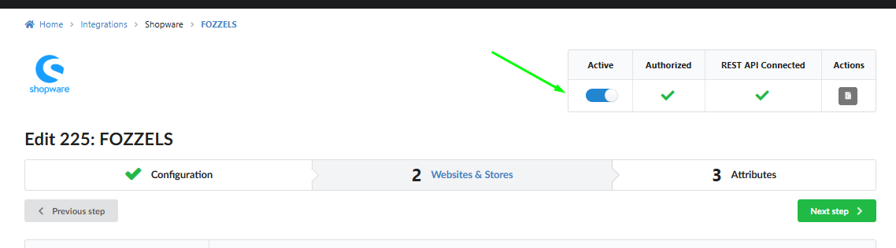
**8.** **Puxe sites e lojas**
    Clique no botão "Puxar sites e lojas". Fozzels recuperará todos os dados do canal de vendas do Shopware.
   
9\. Ative a conexão da sua loja
    Alterne o botão Status para ligar para sua loja.
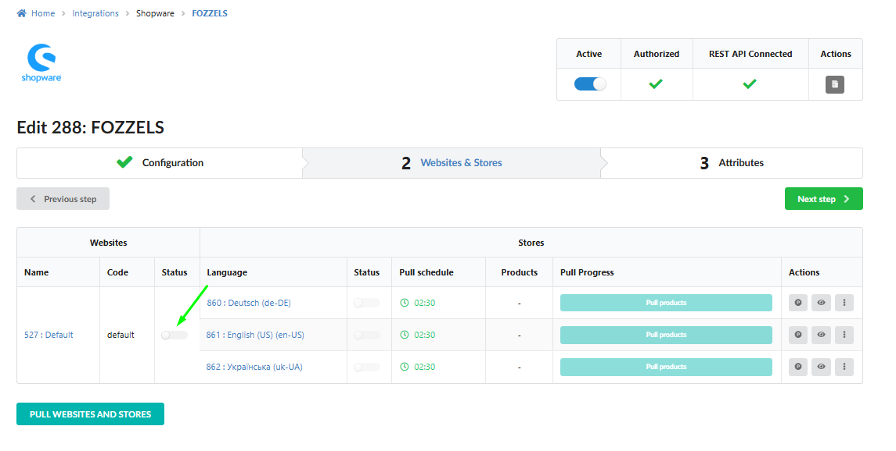

10. Ative visualizações de loja / canais de vendas

    Ative as visualizações de loja disponíveis ou canais de vendas que você deseja usar no Fozzels.

11. Puxe produtos

###     Clique em "Puxar produtos" para recuperar os dados do produto do Shopware. Isso pode levar um tempo dependendo do número de produtos.

**12.** Clique em "Próxima etapa"
    Prossiga para a próxima etapa para finalizar a configuração.

# Configuração concluída

Parabéns! Sua loja Shopware 6 está agora totalmente conectada ao Fozzels. Você pode usar esta integração para criar fluxos de produto e gerenciar o conteúdo do seu produto diretamente na plataforma Fozzels.

## Começando

Aqui estão alguns artigos adicionais que podem ajudá-lo a começar com Fozzels:

-   [Criando um novo fluxo de conteúdo e configurações iniciais](/content-creation-flows/creating-a-new-content-flow-and-initial-settings)
-   [Criação de prompt e filtragem. Editor de prompts de arrastar e soltar](/content-creation-flows/prompt-creation-filtering-drag-drop-prompt-editor)

-   [Quando novos produtos são gerados: o ciclo de puxar explicado](/content-creation-flows/when-do-new-products-get-generated-the-pull-cycle-explained)
-   [Ações em massa e controle operacional em listas de lotes / lista de lotes diária total](/content-creation-flows/mass-actions-and-operational-control-in-the-batch-lists-daily-total-batch-list)
-   [Definição de fluxo e tipos de conteúdo (texto, imagem, vídeo)](/content-creation-flows/flow-definition-and-content-types-text-image-video)

Ou entre em contato conosco diretamente - estamos sempre felizes em ajudar!

###
